# Year of the Linux Desktop

After decades of trying to ignore or straight up bashing Linux, 
Microsoft has finally embraced the loveable penguin. So much so that it ships a
Linux kernel on your Windows OS by default! What does this mean for the sake of
development? Is it finally the year of the Linux desktop?

<!-- more -->

My first job was as a lab instructor/developer for the Computer Science
department at Texas State University, starting in the summer of 2012. My boss was what I would call
_The *nix Dude_. You know who I'm talking about. Socks with sandals, utility
clothing (pockets in pockets for pockets), and of course, a glorious beard
that would make Albus Dumbledore proud. He pretty much personified the
_*nix Guy_ from the classic [Dilbert comic](https://web.archive.org/web/20200314010928/dilbert.com/strip/1995-06-24).
Between him and a few select others I was constantly told about how this year
would finally be the year Linux became popular on the desktop and how it would
signal the end of Microsoft's dominance on the PC. I then decided to try Ubuntu
on my personal machine, and after about three months decided this was all wishful
thinking and promptly reinstalled Windows. But every time I went to a Linux
meetup or conference the phrase "year of the Linux desktop" was always being
uttered. Personally, like many, I thought it was never going to happen. However,
I think I can proudly say that 2019 is in fact, the year of the Linux desktop....
just not how anyone envisioned it.

## Year-of-the-Linux-Desktop.exe
If a decade ago you had told any \*nix evangelist that, in 2019, Microsoft Windows
would ship a version of their operating system with a Linux kernel built in you
would have probably gotten one of two responses:

1. "We won! Microsoft has crumbled to Linux!"
2. "Linux sold out! *expletive* M$ will ruin Linux!"

With Microsoft's long track record of bashing Linux (pun intended) it seemed
impossible that the two would ever be able to co-exist. But when Steve Balmer
left Microsoft and Satya Nadella took over as CEO it appears that Microsoft entered
a sort of Renaissance period. This is a whole topic that could be covered in a
separate blog post, but in summary Microsoft started adopting technologies and
patterns that it never had before. So when Microsoft announced the
[Windows Subsystem for Linux (or WSL for short)](https://docs.microsoft.com/en-us/windows/wsl/about)
it took many people by surprise. Microsoft seemed to be embracing Linux and
responding to the need for useful development tools on its platform. While a
majority of the world uses either Windows or OS X as their primary operating
system for day to day life, the vast majority of software is deployed in Linux.
I personally have run a dual boot system for years so when I wanted to do regular
activities such as streaming video or playing games I would boot into my Windows
drive, but when I wanted to write code or tinker I would reboot into my Linux
drive. But now I no longer have to do that. For my work computer I used a MacBook
Pro like many developers I know. This was a great experience back in early 2015. But
ever since then it seems every iteration of the MacBook Pro just gets worse and worse.
For the sake of keeping this short we'll only focus on one issue, the keyboard. I don't
think I need to say anymore, but if Apple doesn't come to the realization that these
_terrible_ hareware decisions are driving developers away from their hardware then
I doubt I'll ever own another Mac product again. It used to be that Macs were the only
decent viable option for professional developer laptops (not that Linux distros aren't
great, but IT management software for them is scarce). The WSL has completely turned
this assumption on its head. The WSL allows me to run a fully
functioning Linux distro within Windows. Now, when I open my terminal, instead
of getting `cmd` or `PowerShell` I get a bash terminal with everything I ever
needed from my Linux partition. Then, on top of that, I can remote connect to
the WSL with VSCode and execute everything I write in there. I open an application
on Windows and it just executes my code in a Linux environment flawlessly.
It has been three months and I haven't needed to reboot into Linux desktop once.
Here's how you can have this experience yourself.

So let's get this setup for you so you can experience it for yourself.

## Installing the WSL
Installing the WSL has been made extremely simple though the Microsoft Store.

1. Go to the Microsoft Store app on your Windows machine and search for Linux.

    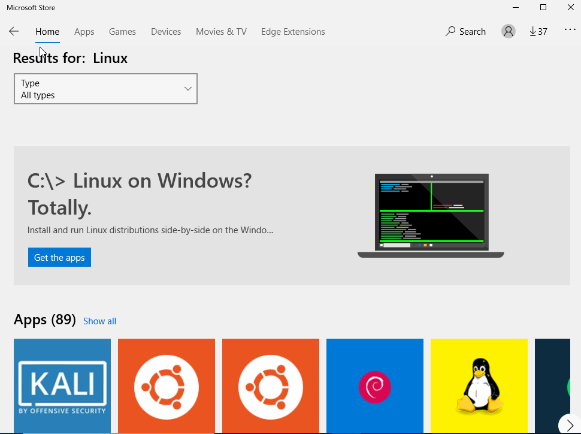

2. As you can see, there are many options to choose from. For the sake of this
article we are going to install `Ubuntu 1804 LTS`. Click on the associated icon
and you should see something similar to this.

    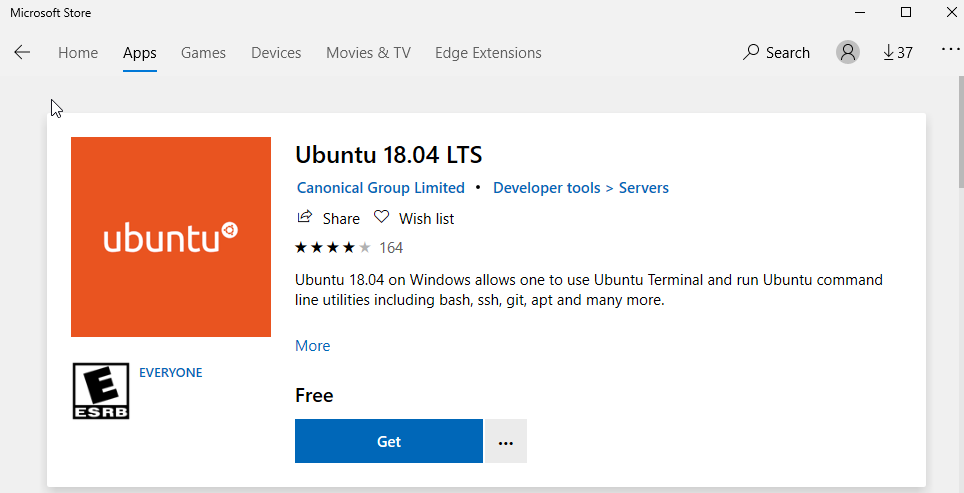

3. Click on the `Get` button. This will add the app to your account. Then in the 
top right hand corner you will see an `Install` button. Click this to actually
install it on your local Windows workstation.

    After this installation process has finished we can now search for `Ubuntu` in
    our applications and it appears! 

    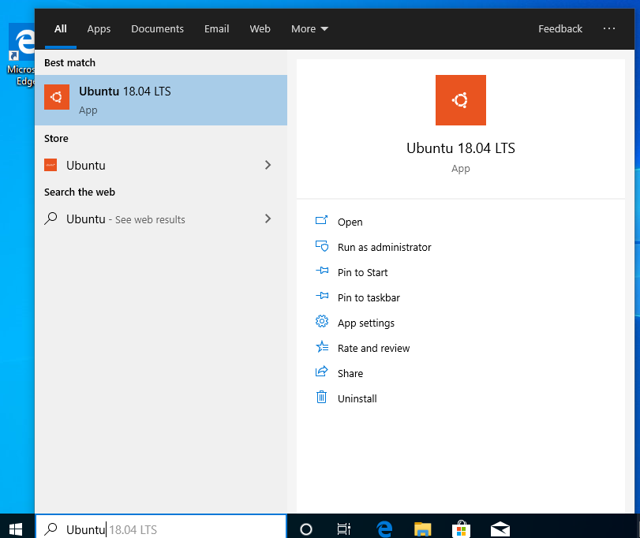

4. Look at that! Let's open it.

    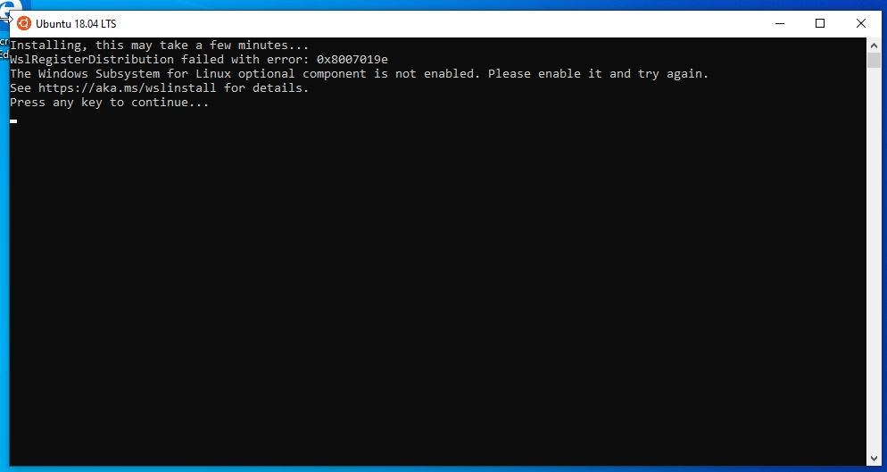

    Oh no! Error?!?

    When you first open Ubuntu you may be presented with this error message:

    ```bash
    Installing, this may take a few minutes...
    WSLRegisterDistribution failed with error: 0x8007019e
    The Windows Subsystem for Linux optional component is not enabled. Please enable it and try again.
    See https://aka.ms/wslinstall for details.
    Press any key to continue
    ```

5. Don't fret, this simply means you haven't enabled the WSL feature yet. To do this
navigate to the control panel path `Control Panel -> Programs` and select the
`Turn Windows features on or off`. Windows comes pre-configured with the most
commonly used features enabled, but the WSL is considered a specialty feature.
Simply enable it and reboot your machine. After this reboot the WSL should be
enabled.

    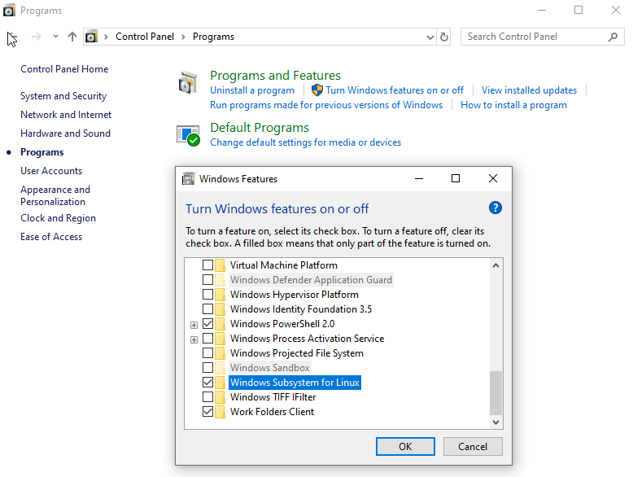

6. Now that you have rebooted your machine search for `Ubuntu` again and open
it. It may take a few minutes for the initial setup to complete. Once it
is done you will be prompted for a username and password for your Linux installation.
These don't have to be your Windows credentials, it can be whatever you want.
Once you have entered them configuration will finish and you will be presented
with a `bash` terminal. On Windows. Welcome to 2019.
    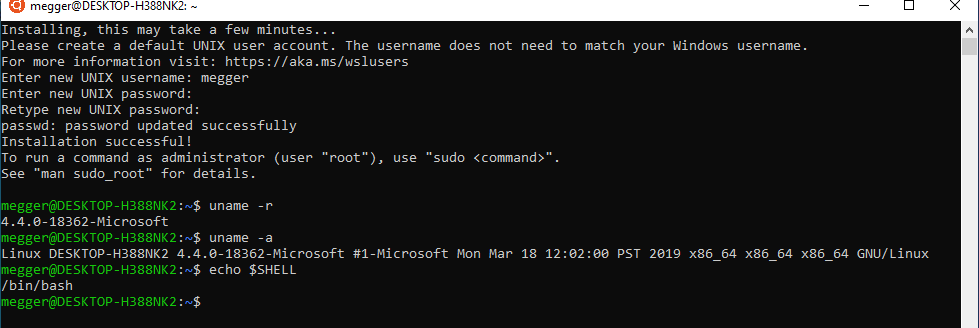

## Installing and Configuring the new Windows Terminal
Now that we have a Linux distro installed on our machine we need an awesome
terminal to go with it. The Ubuntu application launches a terminal for you, so
if you want to use that go right ahead. It appears that Microsoft, realizing 
developers desire for good tooling, has [redesigned the Windows Terminal](https://www.youtube.com/watch?v=8gw0rXPMMPE)
as well as open sourced it. While currently in beta, I haven't had any issues
with it and found it easy to install.

1. Search for Terminal in the Microsoft Store. The Windows Terminal will
be the first thing that appears. It may say `Windows Terminal (Preview)` which
is fine.

     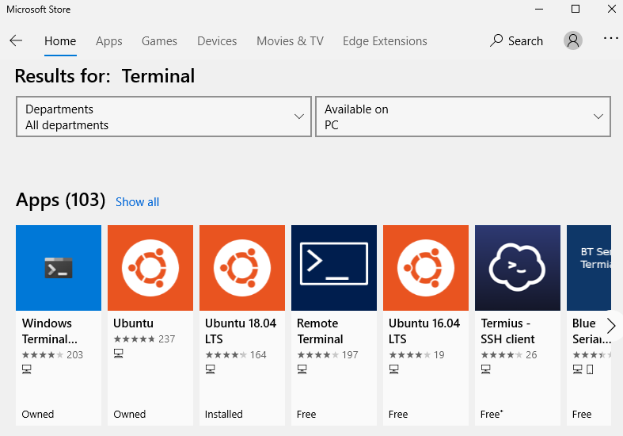

2. Now click on the icon and click `Get` and `Install`

    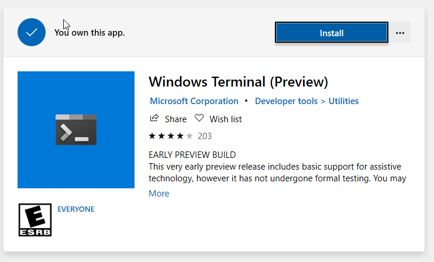

3. Once it's installed you can see it in your recently added section or scroll
through your applications to find it. For some reason when I search for it I
don't find it.

    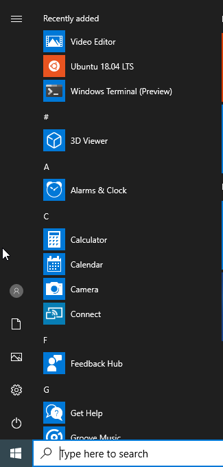

4. Once you open it you'll see it defaults to PowerShell. If you click on the
`+` sign next to the PowerShell tab you will see the options available. You can
choose between PowerShell, a traditional Windows `cmd`, an Azure Cloud Shell, or
since we installed Ubuntu, an Ubuntu shell. You also have the ability to modify
some settings which we'll get to later.

    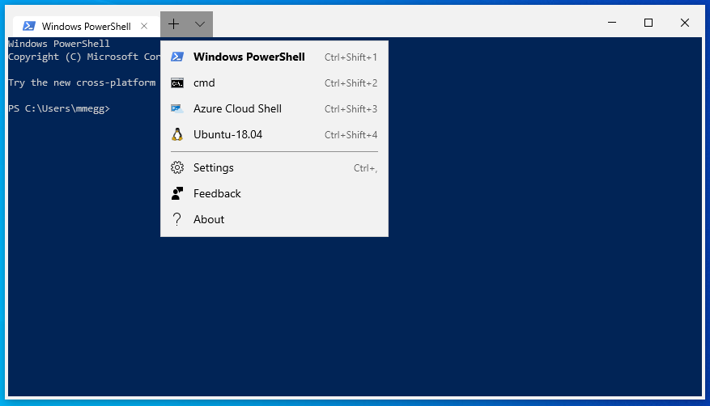

5. If I click on an Ubuntu shell _voila_ you now have a shell into your Ubuntu
environment.

    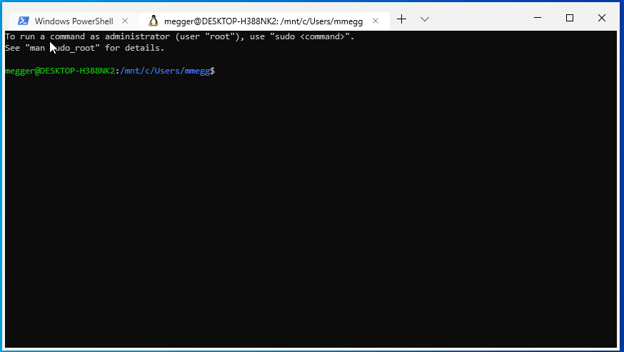

6. If you want to change your terminal to default open your Ubuntu shell
you'll need to click on the `+` sign and click on `Settings`. This will open
the `profile.json` in your default text editor and allow you to modify configurations
such as font, color, default, and default mount position.

    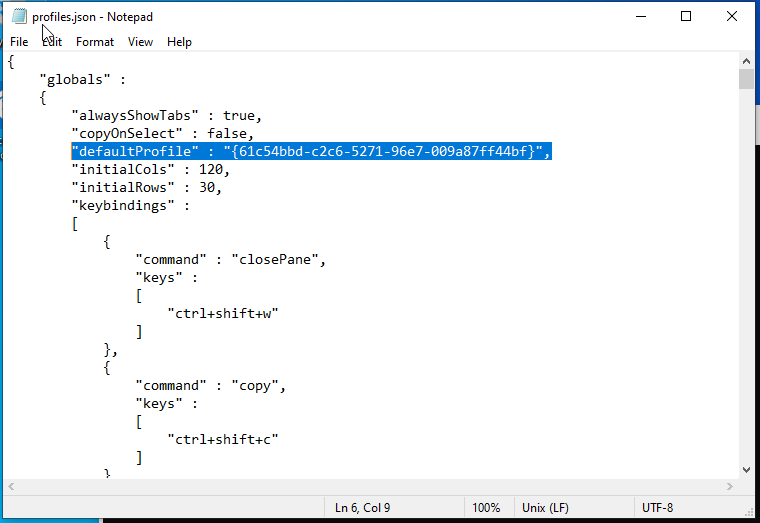

    ```json
    {
        "acrylicOpacity" : 0.5,
        "closeOnExit" : true,
        "colorScheme" : "Campbell",
        "commandline" : "wsl.exe -d Ubuntu",
        "cursorColor" : "#FFFFFF",
        "cursorShape" : "bar",
        "fontFace" : "Consolas",
        "fontSize" : 16,
        "guid" : "{2c4de342-38b7-51cf-b940-2309a097f518}",
        "historySize" : 9001,
        "icon" : "ms-appx:///ProfileIcons/{9acb9455-ca41-5af7-950f-6bca1bc9722f}.png",
        "name" : "Ubuntu-18.04",
        "padding" : "0, 0, 0, 0",
        "snapOnInput" : true,
        "startingDirectory" : "%USERPROFILE%\\Linux",
        "useAcrylic" : false
    }
    ```

7. To change the default terminal find the shell you want to open within
the `profiles.json` and copy it's `guid`. Then, at the top of `profiles.json` 
there is a `globals` section with a `defaultProfile` key. Copy the `guid` from
the profile you want as the `defaultProfile` and now your shell will default to
that option.

    ```json
    {
        "globals" : 
        {
            "alwaysShowTabs" : true,
            "defaultProfile" : "{2c4de342-38b7-51cf-b940-2309a097f518}",
        ...
    }
    ```

## VSCode and Remote Execution

On top of all this Linuxy greatness Microsoft added Remote Execution plugins
for their popular IDE VSCode. These Remote Execution modules seamlessly sync
your workspace with an environment to enable you to run and test your code
as if it were running on Linux. Currently the Remote Execution plugins support
Docker containers, SSH to servers, and WSL. So now, instead of simply editing
our code in a text editor in the Windows Terminal (which is how I do a lot of
my programming) I can now open VSCode and it thinks it's running in a Linux
environment with _minimal_ configuration.

So let's set this up and complete the puzzle.

1. Download and install VSCode from the [VSCode Website](https://code.visualstudio.com/Download).

    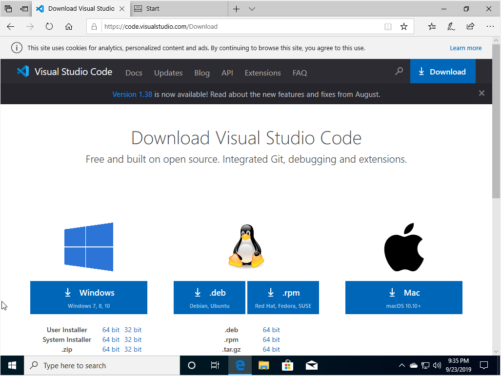

2. Install VSCode by clicking on the download and following the installation 
    wizard instructions.

    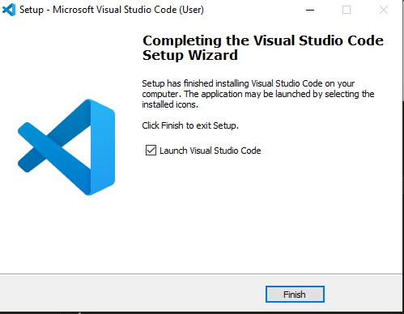

3. Launch VSCode and click on the plugin icon (4 squares on the bottom of the
    taskbar on the left hand side) and search for `Remote`. You will see a 
    plugin named `Remote - WSL`. This plugin will allow your VSCode to connect
    to your WSL Linux installation. VSCode will seamlessly sync your files and
    allow you to execute your code as if it were running on a Linux machine.
    Click `Install` to install this plugin.

    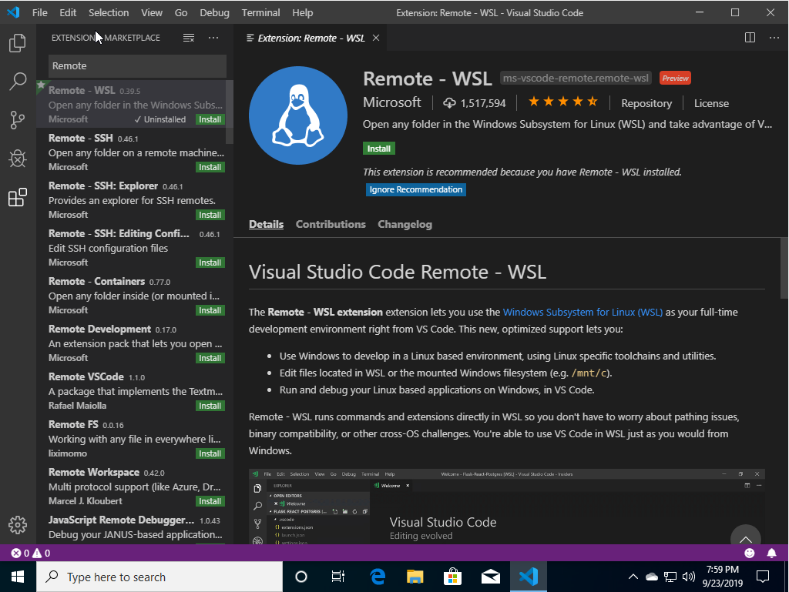

4. Create a test file and folder for the purposes of this installation. I'm going
    to create a simple Python Hello World in Python named `hw.py`.

    ```python
    print("Hello Python from WSL")
    ```

    Once you have done this save this file in a new directory. I saved mine in
    my Documents folder, but a folder called `Code` or something similar might
    be good to keep your projects separate from all the other files on your
    computer.

    Once done, close this file.

5. VSCode can treat folders as workspaces, so now just go to `File -> Open Folder`
    to open the directory containing the file. This will open the document view
    on the left with your file. Double click on it to open it.

    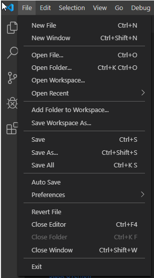

6. Immediately after opening the file VSCode will start to warn you that **nothing
    is installed!**. This is 100% fine. We haven't installed anything on the base
    Windows system and don't intend to.

    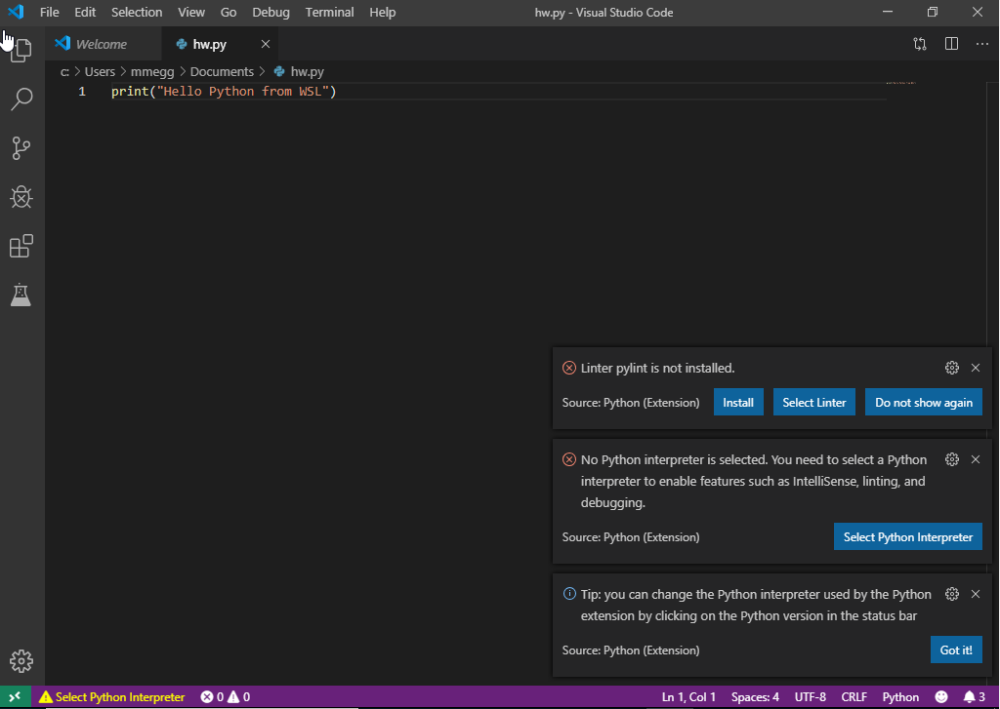

7. Now for the moment of truth. In the very bottom left hand corner their is a
    small green box with `><` symbol on it. When you hover over it it will say
    `Open a remote window`. Click on this and a menu will pop down from the top
    with the current options you have for remote connection (we've currently
    only enabled WSL so that should be all you see, there are other remote
    connections you can configure). Select the option `Remote-WSL: Reopen Folder in WSL`.
    This will relaunch your VSCode but now it thinks it's running Linux.

    *Note: You still may get warnings about missing plugins installed. This is
    ok. We'll cover that in a later step.*

    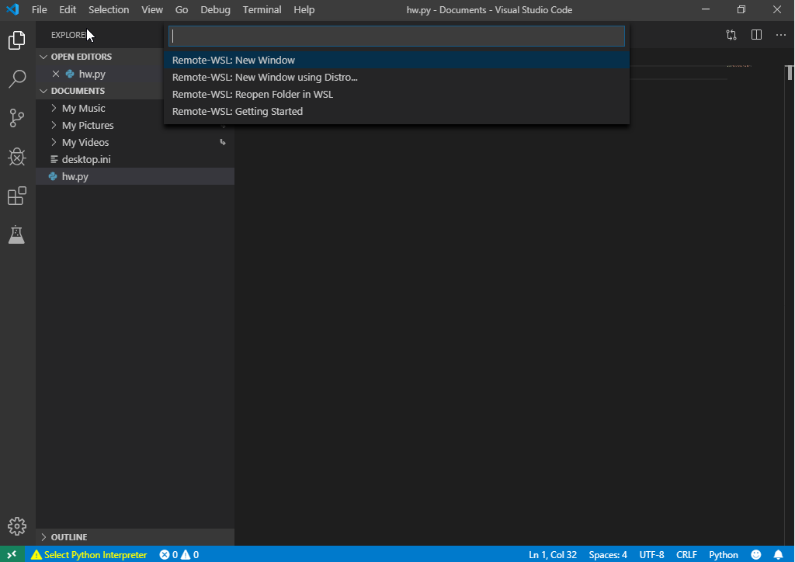

8. Now to test our code you can open a new terminal from the navigation bar
    `Terminal -> New Terminal` and now you have a bash terminal opened. Navigate
    to the location of your python script and run `python3 hw.py` and you should
    see the output of your program displayed to the terminal. Tada!

    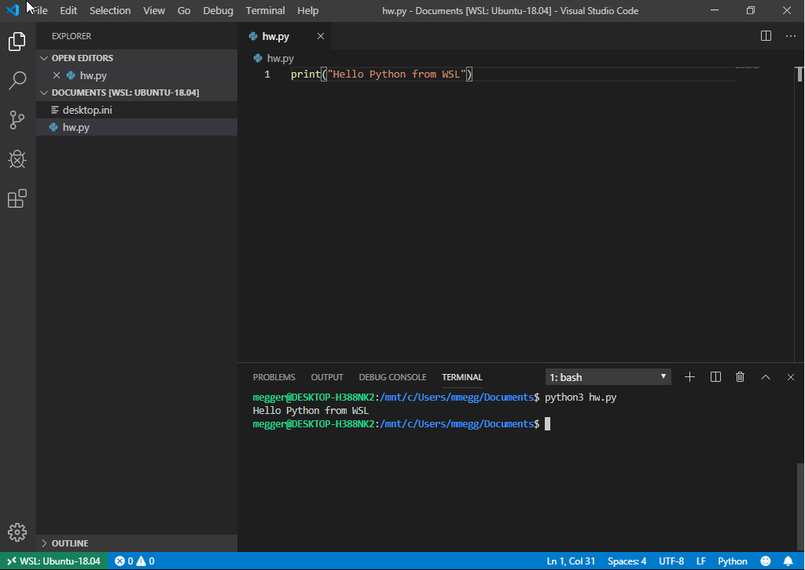

9. Executing our code in the terminal is nice and all, but if we just wanted that we
    could have used `vim`. We want all of the features that come with VSCode. Well you can
    install any plugin directly into the WSL the way you normally do. If you search for the
    Python plugin for example, you'll see the button says `Install in WSL: Ubuntu 18.04`.
    By doing this you will be able to run the debugger and other niceties you've come to
    expect from VSCode like the debugger, linter, auto code formatter (note you will need
    to install these plugins as well to get these tools).

    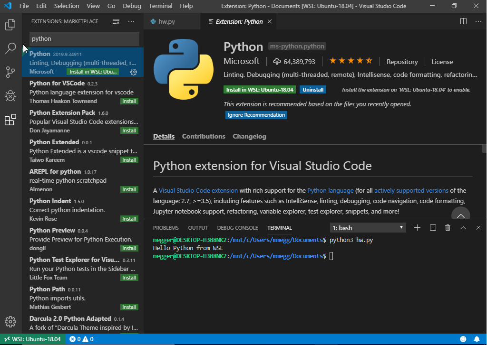

10. And now that we have installed Python we can run it from VSCode directly and get our 
    output.

    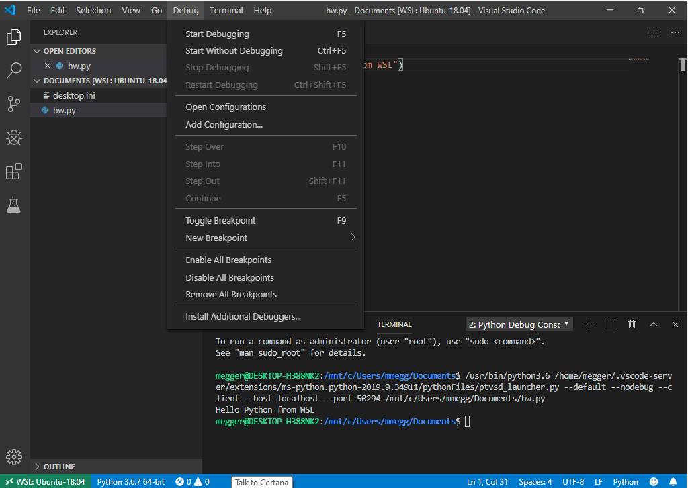

## Conclusion

With this relatively simple setup I now have a fully functioning Linux environment that
seamlessly integrates with my IDE for a development experience unlike any other. Now
when I'm waiting for a build to finish, I can play a game of Overwatch or _any_ game since
I'm not having to hope for an Apple port or that the developers also wrote it to work in Linux
through Steam.

I have been using this workflow for the past three months and haven't needed to boot into
my Linux partition since. One of the major downsides currently is WSL has pretty poor support
for Docker, but the WSL2 has already corrected this and is winding its way through the Windows
Insider Beta process. While not having docker has been somewhat of a challenge, when I need it
I standup a DigitalOcean droplet with it installed and use the `Remote: SSH` plugin instead.

I'm so impressed with this that when asked what type of laptop I want for my new job, which
I start October 1, 2019, I requested a Windows laptop instead of a Mac. I have no doubt that
going forward this will be a great experience for me.
