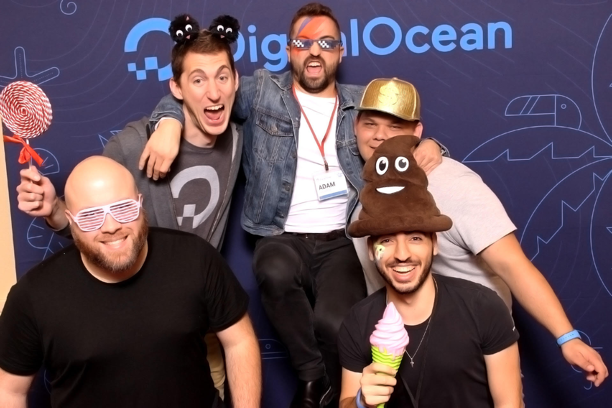

# Exploring New Waters: A Recap of My First Year at DigitalOcean

Another year come and gone, and what an adventure it was but I'm happy to say I have successfully completed my first year at DigitalOcean. Come, gather round and listen to the tale of a career change, being a Developer Advocate amidst a global pandemic, and everything else 2020 had to throw at me.

<!-- more -->

So this blog post is a few months late. I wanted to post it on the anniversary
of my first day at DigitalOcean, however between [Hacktoberfest](https://hacktoberfest.digitalocean.com/), [deploy by DigitalOcean](https://www.digitalocean.com/deploy/), and the launch of [App Platform](https://www.digitalocean.com/blog/introducing-digitalocean-app-platform-reimagining-paas-to-make-it-simpler-for-you-to-build-deploy-and-scale-apps) October and November were _very_ busy for me. However,
now that things have calmed down I can finally sit down and reflect on my first
year at DigitalOcean as a Developer Advocate. 

## How I Arrived at DigitalOcean
On October 1, 2019 I joined DigitalOcean as a Developer Advocate. This was my
first step into an advocacy role after spending roughly four years professionally
as a Software Engineer/Site Reliability Engineer[^1]. This was going to be my 
third role in under five years and I was feeling slightly down that I hadn't
managed to stay at one place for longer than two and half years. I left my first
role for reasons that honestly, looking back, I could have probably gotten over.
But I was young and dumb(er) and the sudden shift in company focus, team changes,
and the inability to decide on what we wanted to be triggered my fight or flight
reflex and I left. My second job, the job I left to join DigitalOcean, was....
interesting to say the least. I learned _so much_ about the Cloud, Availability,
Scaling, and the list goes on. The Cloud platform I got to work on and maintain
is still, to this day, one of the most impressive I've ever seen. However, the
culture among my org was slightly less toxic than a nuclear waste dump. Without
going into too much detail it sucked, I hated it, and became ever more depressed
the longer I stayed there. So, I started looking for a new gig. While being
miserable at my previous job I learned a neat little trick. If I got accepted
to speak at a conference my boss would give me the time off to attend the 
conference. He wouldn't pay for the conference, but honestly at that point
anything I could do to get away was worth it. So, I started submitting talks
and getting accepted to many different conferences across the continent.
It was during this time that I became more aware of the Developer Advocate role
and what it was. I applied for a handful of Developer Advocate roles, as well
as some SE/SRE roles. While the idea of being an advocate was enticing, I wasn't
quite sure if I wanted to take that step. And of course, fate would position me
where I had to make that exact decision. I received offers for both a Developer
Advocate role and a Site Reliability Engineer role at two different companies, 
both of whom I was _super_ excited to work at. I flip flopped at lot on which
role I wanted to take but, in the end, I took the role at DigitalOcean as a 
Developer Advocate. It was a hard decision, but I had become so disenfranchised
with engineering in general I thought it would be a good choice to try something
new. And, thankfully, I was correct.

## How This Year Went: October 1, 2019 - December 18, 2020
DigitalOcean prides itself on being a remote friendly company. When I started
almost 70% of the company was fully remote and my role was going to be remote.
That being said, most new sharks start their first week in the New York City office.
I had never been to NYC so it was excited. Due to current events coming up in 
the DigitalOcean company calendar my manager was able to allow me to start working the Monday after I stopped working at my previous job. This was due to
the fact that DigitalOcean was going to be having its global company all hands 
at Disney World in the middle of October and for me to go I needed to
start within a window. I agreed and was able to convince my boss to let me 
have the week off after my first week to kind of recuperate from my previous job.
I fly out to NYC and get put up in one of the company's corporate apartments.
Due to a majority of the company being remote these apartments were kept so 
employees cannot have to worry with the hassle of a hotel when they come into 
town. I get to the apartment and the first person I meet is Adam Harder, the new
Video Marketing Manager. Later that evening my manager Eddie Zaneski arrived at
the apartment since he was also spending the week in NYC. The next day we go 
to the office and I go through the typical first day things. This is where
things change. I am packing up my stuff when my manager Eddie comes by and says
"Are you ready to work an event?". Turns out that night was the kickoff night
for Hacktoberfest and I was going to help run the event. It was a lot of fun
and I must say, that was the most interesting first day I've ever experienced. 
Fast forward a few weeks and I'm off to Disney World for our company all hands.
I got to meet so many people in the company, including all of my teammates, and
just had the best time ever. My team was amazing. We got to take team pictures, 
hang out, plan what we wanted to accomplish for the next year and just get to bond.
The Developer Advocate team was finally fully staffed and ready to go. I leave 
Disney beyond excited for what the future holds. We continue through the year as
I settle in and meet more and more people in the company. We get started in 2020
and I was excited to get to work conferences. One of the main reasons I joined 
was to get to travel and meet developers all over the world......and we see how 
that all turned out. I am happy to say I did get to work one conference this 
year. I attended Sunshine PHP in Miami, Florida in the first week of February 
and I _loved_ it.

Unfortunately, these happy times were short lived. Due to changes made within
the company, the Marketing org, and people deciding to pursue options elsewhere 
I was left the only remaining member of my original team. I'm not going to lie,
it was kind of a blow. My previous team was amazing and to finally find a place
that felt welcoming just to have it disappear was a huge downer. I contemplated
if I should remain an advocate and even at the company. I decided to stay
because I had just gotten started and hadn't even been able to actually do much
Developer Relations work. I also wanted to see the new direction that my team
was going to take. And on top of all of this, the world was grappling to deal with
a global pandemic the likes of which hadn't been seen for a century. What was 
Developer Relations and Community going to look like when I couldn't physically
be with my Community? Luckily, I fortunate enough that my new manager was 
someone I trusted within the company and had been a part of my previous 
extended team. After that we picked up another Developer Advocate internally and then a contractor to help us with the logistical parts of the role and suddenly, I had a
team again.And honestly, I'm so glad I stayed. While I miss my old team, my 
current team is amazing. The direction, strategy, and charter of my team is amazing. We
have measurable goals to work towards and I get to work with some of the best
in Developer Relations. From product releases to Tech Talks (webinars) to 
virtual conferences (both attending and hosting) to Hacktoberfest this year
has been a new slate for Developer Relations at DigitalOcean. I feel that we 
were able to navigate the pandemic situation and brought new life to virtual 
events at a level that hadn't been seen before. I'm incredibly grateful for my
team, my extended teams, the Marketing organization and DigitalOcean as a whole
for making a challenging year much more enjoyable that it could have been. 

## 2020 Stats
So what all did I do this year? Here are the stats for my accomplishments of 2020:

* Code:
    * Added the DOCR resource and data source for the DigitalOcean Terraform Provider.
    * Wrote multiple sample example applications for DigitalOcean's App Platform:
        * [Django](https://github.com/digitalocean/sample-django)
        * [Flask](https://github.com/digitalocean/sample-flask)
        * [Fortran](https://github.com/digitalocean/sample-dockerfile-fortran)
        * [COBOL](https://github.com/digitalocean/sample-docker-cobol)
        * [Perl](https://github.com/digitalocean/sample-dockerfile-fortran)
    * Wrote multiple functional applications for DigitalOcean's App Platform
        * [RSS Reader API](https://github.com/do-community/rss-reader-api)
        * [App Platform Showcase API](https://github.com/do-community/app-platform-showcase-api)
        * [One Time Secret API](https://github.com/MasonEgger/python-ots-api)
        * [URL Sortener API](https://github.com/MasonEgger/url-shortener-api)
    * [Hacktoberfest Repo Label/Topic Manager](https://github.com/do-community/hacktoberfest-repo-topic-apply)
    * [Terraform Sample Architectures](https://github.com/do-community/terraform-sample-digitalocean-architectures) for DigitalOcean
    * Education Tool for setting up a lab type environment using Droplets [DigitalOcean Classroom](https://github.com/MasonEgger/digitalocean-classroom)
* Content:
    * Wrote 6 Tutorials for DigitalOcean's Community Site
        * [How To Use Visual Studio Code for Remote Development via the Remote-SSH Plugin](https://www.digitalocean.com/community/tutorials/how-to-use-visual-studio-code-for-remote-development-via-the-remote-ssh-plugin)
        * [How To Create A Minecraft Server On Ubuntu 18.04](https://www.digitalocean.com/community/tutorials/how-to-create-a-minecraft-server-on-ubuntu-18-04)
        * [How To Create A Minecraft Server On Ubuntu 20.04](https://www.digitalocean.com/community/tutorials/how-to-create-a-minecraft-server-on-ubuntu-20-04)
        * [How To Build a Slackbot in Python on Ubuntu 20.04](https://www.digitalocean.com/community/tutorials/how-to-build-a-slackbot-in-python-on-ubuntu-20-04)
        * [How To Deploy a Django App on App Platform](https://www.digitalocean.com/community/tutorials/how-to-deploy-django-to-app-platform)
        * [How To Deploy a Flask App Using Gunicorn to App Platform](https://www.digitalocean.com/community/tutorials/how-to-deploy-a-flask-app-using-gunicorn-to-app-platform)
    * Produced the following videos for DigitalOcean
        * [Using Visual Studio Code for Remote Development](https://www.youtube.com/watch?v=QW70p8lLE4A)
        * [Build a Django App on DigitalOcean](https://www.youtube.com/watch?v=US9BkvzuIxw)
* Community:
    * Presented at the following conferences:
        * PyCon 2020 - [Building Docs like Code: Continuous Integration for Documentation](https://www.youtube.com/watch?v=4SwdVMKhbn4)
        * Open Source Summit - [SLIs, SLAs, SLD’OHs! Learning About Service Uptime from Homer Simpson](https://www.youtube.com/watch?v=pkiEs3ax5uQ)
        * PyOhio - [There's a Snake in the Birdhouse! Building a Python Culture at Vrbo](https://www.youtube.com/watch?v=zTFRXHOOy3A)
        * EuroPython - [There's a Snake in the Birdhouse! Building a Python Culture at Vrbo](https://www.youtube.com/watch?v=OOoGjznwhJU)
        * PyBay - There's a Snake in the Birdhouse! Building a Python Culture at Vrbo
        * PyTexas - [There's a Snake in the Birdhouse! Building a Python Culture at Vrbo](https://www.youtube.com/watch?v=MR85hLdc1wk)
        * PyTexas - [How to Build and Deploy Your First Python Slackbot on DigitalOcean's App Platform](https://www.youtube.com/watch?v=FdXS-NpxtSo)
    * Presented at the following meetups:
        * Chicago Python - [SLIs, SLAs, SLD’OHs! Learning About Service Uptime from Homer Simpson](https://www.youtube.com/watch?v=pkiEs3ax5uQ)
        * IndyPy - [Infarstructure as Code using Terraform Workshop](https://www.youtube.com/watch?v=OzM1WQXiOC4)
        * Evening of Python Coding - [Mkdocs Intro](https://www.youtube.com/watch?v=dBd59NZ0MM8)
        * One Valley - [Strategies for Building Cloud Infrastructure](https://www.youtube.com/watch?v=O5Pnf1_xH4Y)
        * Texas State University EXE Student Club - Building a Discord Bot
    * Presented the following Tech Talks for DigitalOcean:
        * [Building a Minimal, Production-Ready Infrastructure on DigitalOcean](https://www.digitalocean.com/community/tech_talks/building-a-minimal-production-ready-infrastructure-on-digitalocean)
        * [Foundations of Computer Security](https://www.digitalocean.com/community/tech_talks/foundations-of-computer-security)
        * [Securing Your Droplet](https://www.digitalocean.com/community/tech_talks/securing-your-droplet)
        * [Top 10 Security Practices for Protectiong Your Infrastructure](https://www.digitalocean.com/community/tech_talks/top-10-security-practices-for-protecting-yourself-and-your-infrastructure)
        * [Command-line Your Way to PaaS Productivity With DigitalOcean App Platform](https://www.digitalocean.com/community/tech_talks/command-line-your-way-to-paas-productivity-with-app-platform)
        * [Utilizing Security Features in SSH](https://www.digitalocean.com/community/tech_talks/utilizing-security-features-in-ssh)
    * Multiple livestreams on my Twitch channel [Coding With Mason](https://twitch.tv/codingwithmason)
   

## What Does The Future Hold?
My future holds many more enjoyable days at DigitalOcean. For the first time in
my career I'm not looking to what's next or thinking about my next career jump.
I am incredibly happy in my role and want to just enjoy that for a time. 
Constantly thinking about the next step, the next jump, the next item on our 
career checklist often causes us to miss the fun moments and doesn't allow us
to just enjoy being in the moment. I finally found a company that feels like home,
shares my values, and allows me to do the kind of work that I want to do. 
They also support me by allowing me to further my career with courses and professional
development. Next year I'm going to be participating in Stephanie Morillo's 
DevRel CMS next year, I'm working on a book 
proposal and experimenting with Zines. 2020 may have been challenging but for me,
it was a good year to reset and introspect, preparing and motivating me to make
2021 a phenomenal year. 

Thank you to everyone who has and continues to support me and my work. I look
forward to producing amazing content for y'all in 2021. Happy Holidays!

[^1]: I had worked as a student at Texas State University managing labs and writing software while I was getting my degrees but our industry doesn't count this as "real" software engineering. I may write a blog about my opinion on this in the future but the tl;dr of that dismissive mindset is: "That's bullshit."

