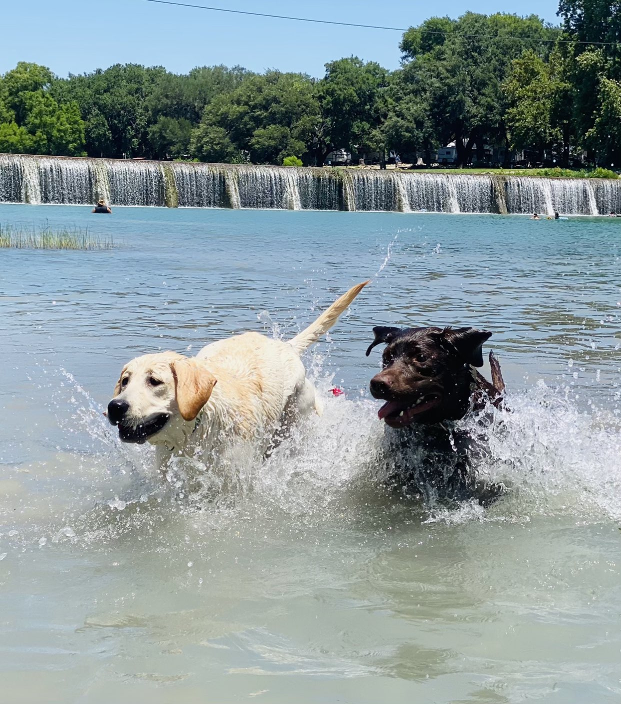

# Oh Shit, I Haven't Blogged in a While

You ever look at your blog and say to yourself "I should blog more"? Ya. I've
been doing that for almost two years now. Now while most of you probably follow
me already, maybe you missed a few moments along the way. So buckle up, I'm going
to catch up on two years of blogging in this post. 

<!-- more -->

My last blog(1) was on January 30, 2022 and it was actually one of my favorite blogs
to write. 2022 was an interesting year but I do believe that it was around
this point that my burnout from DevRel started to settle in.
{ .annotate }

1. It was about [How I Write Conference Talk Proposals](../how-i-write-conference-talk-proposals)

## So What Happened?

For those of you who aren't a Developer Advocate, let me just say that time-to-burnout
in DevRel is astronomically high. I may write another blog post that about this,
but the tl;dr is talking to people is exhausting, the industry doesn't know what
it wants DevRel to be, so you just kind of flail between projects for months on end,
touching everything but not long enough to feel accomplished until you eventually
just get tired and consider if you could make a living raising chickens. 

At the time I was working for DigitalOcean. While the company was great, you could
feel the change settling in post-IPO. The fun startup atmosphere was evaporating
quickly and decisions were being made that I wasn't fond of. On top of that,
DigitalOcean is pretty notorious for underpaying. They trade on people's love
of the brand and the pride of working there(1). Due to this a few other things
I decided to venture out DigitalOcean and explore other opportunities. I found
myself at a new company, [Gretel](https://gretel.ai). Early stage startups are interesting
because they can pivot on a dime. I thought I was joining a company focusing on
data privacy for backend developers. Within a few weeks of my arrival they either
pivoted to generative AI for Data Science or were already there and there was
a communication failure during the interview process. That being said, their 
product was already a generative AI model, I just think their customer profiles
shifted and instead of focusing on data privacy for tooling, it was more centered 
around data privacy for generative AI. Either way, it was not what I signed on for. 
While AI is interesting to me, I have absolutely zero desire to work in it.
While at Gretel I was met with many challenges. I gave it my best try, however, 
our visions on Developer Relations never coalesced which ended with me leaving the
company to pursue other options. I wish them nothing but the best(2). Their 
product is actually _super fucking cool_ and will definitely change the industry, 
but AI is not my passion. DevOps and Backend Engineering is.
{ .annotate }

1. At least this was the case for me. If you ask them internally they're proud
that they pay within a percentage of other companies that they deem acceptable.
Long story short, it's not acceptable and leads to turnover.

2. One day I'll write a blog about how to know when a job isn't a good fit
and when to leave. That kind of content would have helped me here a lot.

Also around this time myself and some other organizers hosted the 
[PyTexas 2022 Conference](https://pytexas.org). This was my first year as 
conference chair and most of the responsibility fell on me. This was a very
stressful time as we were chasing the easing of Covid restrictions up until
the day of the conference. We had made the decision to go back in-person in March
2022 and to say it was challenging would be an understatement. Either way, I'm
proud of the conference we delivered. This did result in me being elected to the
PyTexas Foundation Board where I have served as President since.

I was only at Gretel for nine months. I learned a ton about an industry I knew
little about, met many awesome people, and overall had a good time. I view this
as a little detour in my career. 

## Temporal

After leaving Gretel I land a position as a Developer Educator (Sr. Technical
Curriculum Developer) at [Temporal Technologies](https://temporal.io). It's actually
funny that I landed here, as I had interviewed for a Developer Advocate role
here while I was interviewing at Gretel. After that, I stayed in contact with
the Temporal recruiting team about once a quarter to check in and see how things
were going. Temporal was super cool and I was hoping to eventually land a role
there in my career. I just didn't anticipate it happening so soon. 

I was fortunate, one of my ex-colleagues and friends from DigitalOcean [Brian Hogan](https://bphogan.com/)
had a role opening up on his team and he was looking for "road weary DevRel people
who like to teach". Well that fit me perfectly, I applied, and got the role.

I plan on doing a Recap blog post about my first year at Temporal, so check
back in late January for that. 

Oh. I also ran PyTexas 2023. I'll have to write about all that too.(1)
{ .annotate }

1. That's it Mason. Just keep adding stuff to the fucking list.

## So What's Next?

A lot. I'm writing a book. More on that later. PyTexas 2024 is coming up. I'm
doing a lot of work to expand the PyTexas Foundation. We have a 
[meetup](https://pytexas.org/meetup) now.  I plan on writing a full recap post 
on the 2024 conference on the [PyTexas](https://pytexas.org) site.
I'm working my ass off at Temporal and will have more to share on that in a later 
post. 

Hopefully now that I've filled in the gap I wont feel stuck unable to publish
more blogs and tutorials. I felt guilty that I hadn't posted in so long and it
stopped me from posting otherwise. 

The psychology of writing can kick your ass. I'm dealing with that while writing
my book.

Anyway, thanks for catching up. Here's hoping my next post isn't in like, 2025.

## Other Shit I Forgot
Oh. I also am the Deputy Province Governor of [Province 9](https://province9.org)
of the [Phi Mu Alpha Sinfonia](https://sinfonia.org) Fraternity of America. 

I got another puppy. A yellow labrador named Butters. 

But they grow up so fast

{: width="400" align=left}
{: width="300" align=left}
