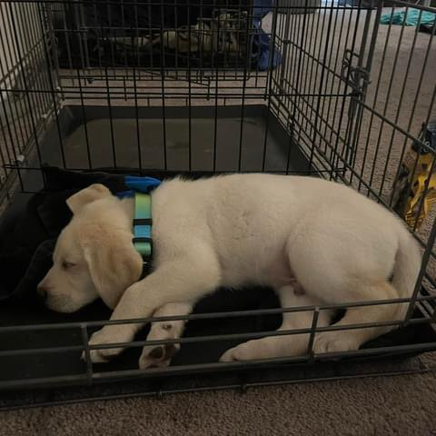
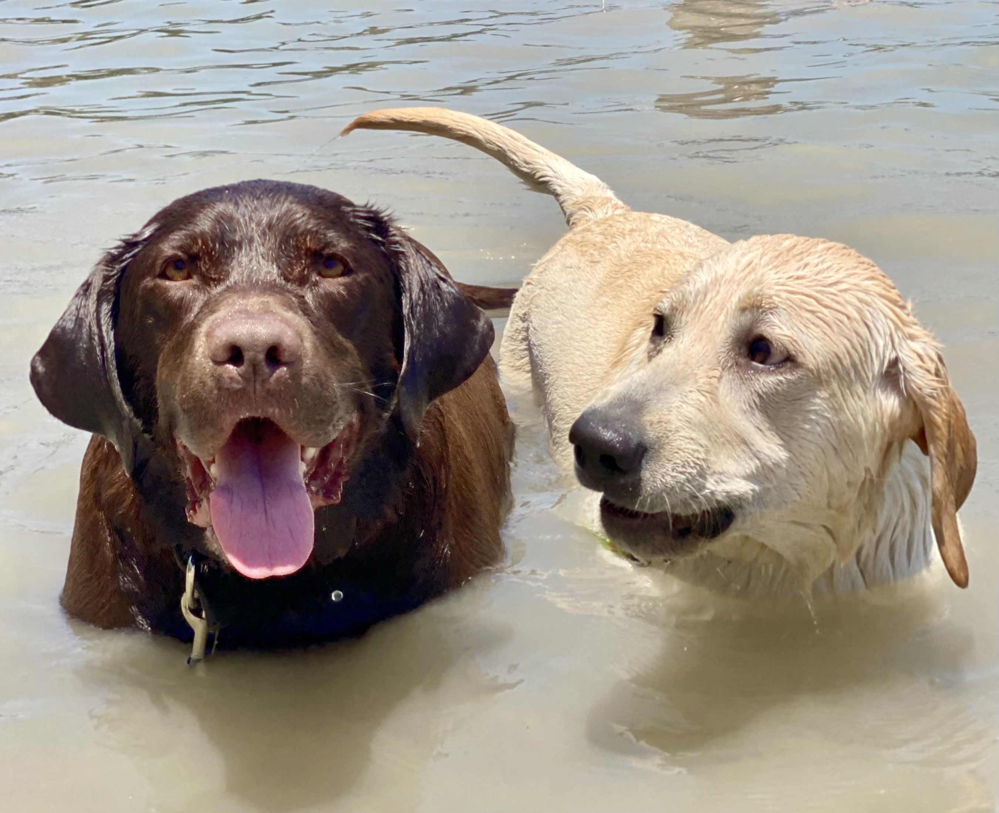
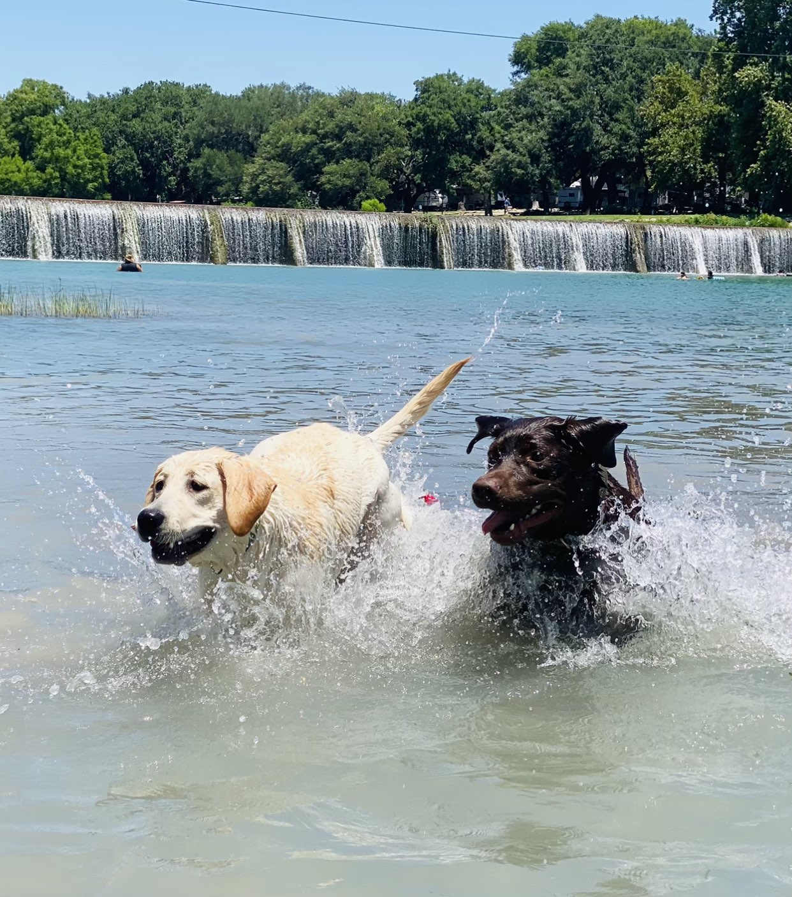

What a year it's been. I've long disliked the cliche "That year just flew by!" but holy shit this year really did. This year I changed jobs, organized a regional conference,
started a new meetup, and got a new puppy just to name a few things.

<!-- more -->

## A Year In Review

### Career

In mid-January I decided to leave my job as a Developer Advocate at Gretel.ai and make the jump to Developer Education at [Temporal Technologies](https://temporal.io). After four years in Developer Relations, I was burned out of speaking and wanted to take the opportunity to improve my writing and teaching skills. Luckily a good friend of mine [Brian Hogan](https://bphogan.com) had an opening on his team so I applied and got the role. I had worked with Brian at DigitalOcean and knew that I had a once-in-a-lifetime opportunity to learn about writing and developer education. This first year at Temporal I delivered _four_ courses, Temporal 101 and 102 in Java and Python, a tutorial, and various updates to the product documentation. The culmination of a lot of this work was getting to give Temporal 101 and 102 live and in-person at Temporal's annual [Replay](https://temporal.io/replay) conference. I've learned a _lot_ about Durable Execution and just how cool the technologies are. I actually finished a fifth course, but my team decided to hold off releasing it for a bit. But I'm still going to count it for this year!

I did far less speaking this year than I have done since 2019. And by far less I mean practically zero. I gave one workshop but I needed a break from public speaking. I am finally feeling ready to speak at conferences again and have started writing a few CFPs.

Maybe I should do a blog post on DevRel burnout. If you think so Tweet at me.

### PyTexas

This was _by far_ the busiest year for me with regards to my PyTexas work. We delivered a phenomenal conference in April and immediately moved into planning the 2024 conference. We were able to announce the 2024 dates at the end of our 2023 conference, something that had never been done before. We also finally sat down and created a PyTexas Foundation website and aligned on a singular tech stack for all of our assets. Finally, we launched the PyTexas Virtual Meetup in September and are still going strong! 

There's a whole blog post about the PyTexas work that has been done on the foundation website, so check that page out on January 5th for the release!

### Personal

I got a new puppy! Welcome Butters! His brother Loki loves him.

He's growing up fast! 

{: width="400" align=left}
{: width="300" align=left}

Other than that it was a quiet year on this front. 

 

## 2023 Stats
A brief list of the things I accomplished this year that I'd like to highlight:

* Code:
    * Migrated my personal website to [Mkdocs Material](https://squidfunk.github.io/mkdocs-material/)
    * Established a unified tech stack for PyTexas websites
* Content:
    * Published [Build a Temporal Application from scratch in Java](https://learn.temporal.io/getting_started/java/hello_world_in_java/)
    * Published various parts of the Temporal Java Dev Guide
    * Published the _Temporal 101_ Courses in [Java](https://learn.temporal.io/courses/temporal_101/java/) and [Python](https://learn.temporal.io/courses/temporal_101/python/)
    * Published the _Temporal 102: Exploring Durable Execution_ Courses in [Java](https://learn.temporal.io/courses/temporal_102/java/) and [Python](https://learn.temporal.io/courses/temporal_102/python/)
* Community:
    * Organized and delivered [PyTexas 2023](https://archive.pytexas.org/2023)
        * Currently organizing [PyTexas 2024](https://pytexas.org/2024)
    * Organized and launched the [PyTexas Monthly Meetup](https://pytexas.org/meetup)
        * And continuing with this into the new year
    * Presented at [PyTexas December Meetup](https://www.pytexas.org/meetup/past_meetups/december-2023-meetup/)
    * Delivered Temporal 101 and 102 in Java live at Temporal's [Replay](https://temporal.io/replay) Conference
        

## What Does 2024 Hold?
I am aiming for 2024 to be a transformative year for me. It's mostly going to be a year for me. I need to improve my health, both mentally and physically. Time to make the most out of my 30s. 

Putting these out into the world. I will report back in next year's recap.

* No sodas
    * I made it halfway through the year and then backslid. I can't even allow myself sugar free sodas as they tempt me. And honestly, with how much the shit costs these days good riddance. 
* Lose 50 lbs
    * And this time I mean it! I started out 2023 on a good track and was even down
    20 lbs at one point. I was going to the gym five days a week before work and really
    enjoyed swimming again. When I was 18 I had major reconstructive surgery on my
    right knee which limits my ability for high impact cardio, but I've always loved
    swimming. I'm also doing weight training and already am making good progress.
* Eat Healthier and Avoid Fast Food
    * This alone will help with the issue above. There's going to be a lot more crock pot meals and meal prepping. Too often I choose convenience over health and that must change.
* Finish my book
    * I have a contract with a publisher to deliver this. I have the first few chapters done and more on the way. I procrastinated in 2023, let's get this out the door quickly in 2024.
* Build My First SaaS
    * I finally have an idea. My little brother and I are discussing it and I hope to have something ready to deliver by mid-year. That's all I'm going to say for now.
* Read More Books. Like, a lot more
    * I have a metric fuck ton of books on my bookshelf that have gone unread. That changes this year. I long have had an idea of selecting 52 books and assigning them the value of a card from a standard deck of cards. My goal is to draw one card a week and read one book a week. Some are shorter than others. I'll probably slip some here, but I'm going to try. The goal is to finish more books this year. I'll report back in 2024 with the progress. If you want to follow along, check out this [Google Sheet](https://docs.google.com/spreadsheets/d/1TVm_g0iLszxpeRXCHe_PlH8YGEKYLfH7QixW_hwj-mI/edit?usp=sharing)

It's a lot. But 2024 will be a transformational year for me. As I age my discipline seems to increase and I am feeling very confident that I can achieve these goals. Feel free to drop a line sometime and ask me how I'm doing to keep me honest. 

Happy New Year and here's to a great 2024, regardless of what the world throws our way.