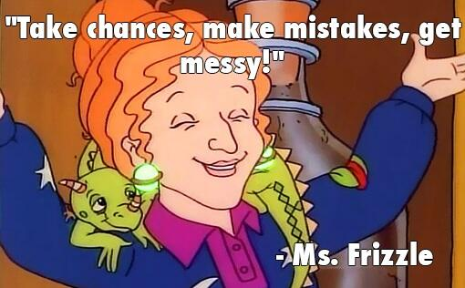

Oh look, I've changed careers again.
Recently I moved from the Developer Relations team to the Sales team to start my journey as a Solutions Architect.
I'm sure many of you have questions, so let me take you on the journey of how I came to this decision.

<!-- more -->

## Wait, You Did _HWAT?_

On 9/1/2025 I was officially transferred from the Developer Relations team in Marketing to the Solutions Architecture team in Sales.
For those of you who know me, this may seem like a wild deviation, and in a way it is. 
I definitely didn't have "career change" on my bingo card when I started this year, but here we are.
I'm making this announcement a month out after having given myself time to onboard into my new role, as well as take some _very much needed_ PTO(1).

But I want to make a few things clear.
I have not left Temporal, nor do I want to.
Temporal is an _amazing_ company to work for.
It's easily in the top 2 jobs I've had and it's closing in on best job.
It's also the job I've been at the longest(2).
So, without further ado, let's pay attention to that man behind the curtain and examine what led me to this decision.
{ .annotate }

1. Disney World!!!!
2. So long as you don't count my time working at Texas State University, which doesn't really count because I worked there while I was a student, and being a Lab Instructor with an on-campus office while doing my undergrad was absolutely fantastic.

## What This Move Isn't

Many people will make assumptions on why I made this move.
Even if I start with the positives, people will "read between the lines" and try to infer something that isn't there(1).
So I'm gonna lead with what this move _wasn't_ in the hope to head that off(2).
To be clear, this move was in no way inspired by negative interactions, presumed industry trends, or made in haste.
{ .annotate }

1. Kinda like when your English teacher tried to tell you that the color of the drapes in the house symbolized something. Blue for rebirth, green for envy, yellow because it's St. Olaf's day. But maybe, just maybe, the drapes were just fucking blue.
2. But alas, some of you will make your own stories to fit some narrative. That's fine. If you do, can you _please_ include warlocks that fly on enchanted unicorn manatees that breath fire? If you're gonna make shit up, at least make it entertaining. 

### No, Temporal Management Isn't Terrible

Quite the contrary honestly, Temporal Management has been extremely supportive and encouraging through this process.
Both my manager and the director of DevRel were sad to see me depart, but excited for me to advance my career.
They supported me through the entire process, helped me offboard effectively, and handled the entire situation with professionalism.
Pair that with the enthusiasm of my new manager, and this process has been unbelievably smooth.

Y'all know me, if management is bad, I bounce(1).
Not here.
Are things perfect?
Hell no.
If they were I'd probably run like hell.
Show me a place that has no issues whatsoever and I'll show you a place hiding some **dark** shit.
But the issues here were so minor, I often laughed at them.
"Do we use story points or time estimates?"
"This deadline slipped because the content was more complex than I thought and it took me a little longer to write it."
"We have too much to do and not enough time to do it(2)."
{ .annotate }

1. Ain't nobody got time for that.
2. Again, show me somewhere where this _isn't_ true, and I'll show you a place that's gearing up for layoffs, **especially** in the current market. 

At the end of it all, leadership at Temporal is superb.
So much so they actually made me feel safe in taking this sudden exit off the highway crossing 3 lanes of traffic(1). 
And for that, I'm grateful and I look forward to continuing my time at Temporal.
{ .annotate }

1. Don't worry, I used my blinker. I'm not **that** stupid.

### No, DevRel isn't dead

I'm so tired of this talking point.
It feels like click bait already.
Is DevRel going through a transition period?
Absolutely.
But to make foolish claims that DevRel is somehow dead or dying is just fucking stupid and shows a complete misunderstanding of the role of DevRel(1).
{ .annotate }

1. I have _soooo_ much to say on this topic, so yeeting this into the blog posts for the future pile. 

Without going into a dissertation style rant, here's the reality of what's happening.

**DevRel is evolving.**

How developers learn and program is changing daily. 
We're already seeing this take place in real time.
Google's share of search engine traffic is down for the first time [in decades](https://www.forbes.com/sites/torconstantino/2025/04/14/the-60-problem---how-ai-search-is-draining-your-traffic/).
Stack Overflow traffic is [falling off a cliff](https://blog.pragmaticengineer.com/stack-overflow-is-almost-dead/).
Non-fiction book sales are [declining](https://www.publishersweekly.com/pw/by-topic/industry-news/financial-reporting/article/98147-print-book-sales-slipped-in-first-half-of-2025.html).
The list goes on and on.
So what's happening. 
I'll give you a hint.
It's an acronym that's two vowels next to each other.

So how does this affect DevRel?
Well, many DevRel functions focus primarily on written content. 
Why do they do this? 
Because it's the easiest to measure. 
DevRel _knows_ written content works, because some poorly configured dashboard said it does. (1)
This means a _lot_ of DevRel teams are reevaluating what they can do to have an impact.
This isn't a **bad** thing.
_This is how functions **should** work._
Challenge your assumptions.
Try something bold.
Break outside the box.
{ .annotate }

1. I get better results from `/dev/urandom` than I do from Google Analytics.

So when I hear that AI killed DevRel, or Docs, or anything, I scoff.
DevRel is going through an exciting recalibration phase, and I look forward to what this holds. (1)
{ .annotate }

1. "Well then why did you leave if you're excited?" I hear you all saying. First, I'm getting to that, keep reading. Two, you can be excited for something and not participate in it. I'm excited for space travel, but you aren't strapping my ass to a rocket.

### No, This was Not a Sudden Decision

Contrary to outward appearances, I do take time to make these kind of decisions.
While my departures or changes can seem like they came out of left field, I typically contemplate them for _months_ before making the change.
What tends to confuse people is once my mind is made up, I'm confident in it and there's no going back. 
So outwardly, it looks sudden.
But in reality, I have been thinking about this decision for almost a year.

## What This Move Is

Now that I've explained what didn't impact this choice, here's what actually did.

### A Way to Expand My Knowledge

I'll be frank, I don't plan on working at Temporal for the rest of my career(1).
The era of staying at a job for 40+ years went out the door two generations ago.
My dad is about to retire from his job after 43 years as the same job, in the same role(2).
That's not how tech works.
We're _expected_ to move on after a short amount of time.
Now I don't currently have any plans to leave Temporal.
I mean it when I say I'm legit happy and proud to work here.
But am I still here a decade from now? 
Highly unlikely.
But will I still be _using_ Temporal a decade from now?
No doubt in my mind.
This is by far the most amazing tech I've ever worked with, and has a permanent place in my stack. 
Because of this, I found 
{ .annotate }

1. And let's be real, no one expects me to.
2. That's the luxury of a union job with amazing benefits and a pension. Something we sure as shit don't have in tech.

### A Way to See Another Part of an Organization

When I made my move to DevRel back when I joined DigitalOcean, I was placed in the Marketing organization. 
This is fairly standard, DevRel tends to live in either Product or Marketing.
But to say I was _shook_ was an understatement.
I was a young, dumb, headstrong engineer who didn't see the purpose of Marketing and was baffled that _I_ would be in that organization(1).
{ .annotate }

1. If you had asked me when I graduated if I ever thought I'd wind up in Marketing, I would have laughed in your face.

Turns out, that was _exactly_ what I needed.
I got to see what it actually takes to make a company successful.
Engineers often get stuck in the "Build it and the will come" mentality, which is 100% grass fed organic horse shit.
That's not how the world works.
Show me a startup that believes that and I'll show you a startup with limited growth potential that'll be dead in the water in less than five years unless they correct course.

All of this to say, I benefited greatly by exiting engineering and seeing what happens in Marketing.
And now I'm doing the same thing again, but in Sales.
I'm going to see how the money _actually_ gets made. 
What features are actually used? 
What are real humans using Temporal for?
How do you sell software?

Why do I feel the need to do this?
Well I'm naturally curious.
Maybe I'm setting myself up to be the most well-rounded startup founder ever in a couple years. 
But it's not often someone get the opportunity to sit in three distinctly different organizations within a company, and I'm going to learn from every minute of it.

### A Way to Return to Engineering

One of my largest concerns when I left Engineering for Developer Relations was the potential atrophying of my technical skills.
I feared that without continual production experience and innovation, my in-depth knowledge would become essentially sealed in time when I left.
While this wasn't the case, and in reality I think I was exposed to _more_ emerging trends due to my work, I do feel that I am not as in touch with those roots as I'd like to be.
The nature of DevRel is to work in the "happy path".
To work on what you hope the users are using the software the exact way you intend.
Maybe sometimes you stray from this, but mostly you focus on using it right.
So my longing to return to something closer to an engineering role began to grow.
I found it difficult to spend time outside of work to do side projects(1).
These side projects were what I was banking on to keep my skills sharp.
So instead, I'm moving into a customer facing role that shows me the reality of the software I work with.
And I'm excited.
I get to help with POCs, I get to debug, I get to still teach, but be closer to the action.
But most importantly, I get to learn.
I get to really dive deep into Temporal.
Could I have achieved that in DevRel?
Possibly.
But sometimes a change of scenery is necessary for a change in mentality.
So here's to moving ever so closer back towards engineering.
{ .annotate }

1. I have a half finished failed book draft to prove it.

## What Does This Mean for Your Career Journey?

So many people have asked "Well what does this mean for your career?" or "What do you plan on doing in five years?" or some variation on this theme.
And I have one answer, and I'll share it now for all to hear:

> Fuck if I know. - _Mason Egger, when being asked what to this job shift means for his career_

I honestly have no idea what comes next.
And that's _exhilarating_!
Let me share with you two stories that shape how I approach this.

### A Lesson Learned in Sunday School

So growing up, I was raised in the Lutheran Church. 
I went to service, Sunday School, the whole thing.
For my high school years, I had an _amazing_ Sunday school teacher. 
She was amazing for the reasons you wouldn't expect.
Unlike my prior Sunday School teachers, who was the preacher's wife or other members associated with the church in some way, this teacher was an accomplished professional outside of the chapel(1).
She started her career as a chemist, and worked at a power company.
Then she got bored, and decided to become an EMS.
After than, she became a teacher of all the new EMS in the area.
And by the time I was graduating, she was studying to become an RN.
She carries _multiple_ degrees, is a specialist in _many_ fields, and essentially showed me that you're never to late to flip the table and start over again. 
Why did she do this?
Because she got bored.
She had learned everything she wanted, accomplished everything she wanted to do, and then decided "It's time to do something new."
And that has always stuck with me.
It's not that didn't like my time in Engineering or DevRel, but that time has come to an end.
Does it mean I'll never make it back to those roles?
Who knows?
But when it's time for my next move, I'm sure I'll remember my Sunday school lessons at Trinity Lutheran Church(2).
{ .annotate }

1. And this is not meant to disparage my other Sunday school teachers. They were all _phenomenal_ and I'm still close with all of them. But for this story, this distinction matters.
2. Also, the hilarity of the lesson of "Don't like it? Change it." coming from the Lutheran Church is not lost on me at all. It almost seems like it was fate.

### Connecting the Dots

Perhaps more than the story above, `Connecting the dots` guides and will continue to guide a lot of my life choices.
If you've never watched Steve Jobs' commencement speech from Stanford, I recommend you do.
It taught me many lessons.

<iframe width="560" height="315" src="https://www.youtube.com/embed/UF8uR6Z6KLc?si=g-RIgmhkejJkCEDd" title="YouTube video player" frameborder="0" allow="accelerometer; autoplay; clipboard-write; encrypted-media; gyroscope; picture-in-picture; web-share" referrerpolicy="strict-origin-when-cross-origin" allowfullscreen></iframe>

In this speech, Steve tells 3 vignettes about his life, and what inspired him. 
While all three are fantastic, the first one, known as `Connecting the dots`, stuck with me.
In it, he details his failed attempt at going to college, dropping out, and then trusting his instinct to lead him to the place he needed to be.
He details sitting in on a calligraphy class, and how that inspired him for fonts on the Macintosh.
This decision didn't make sense in the moment, but it proved invaluable later in life. 
The following quote has stuck with me since the first time I heard it:

> [Y]ou can't connect the dots looking forward; you can only connect them looking backwards. So you have to trust that the dots will somehow connect in your future. You have to trust in something — your gut, destiny, life, karma, whatever. This approach has never let me down, and it has made all the difference in my life.

This is how I've approached much of my life and career, even before I graduated high school(1).
I get an inkling, a nudge, or something that tells me to make a move, and if it persists, I follow it.
I never knew where it would lead me.
All I did was push forward, and hoped that when I've looked back, they'd connected behind me.
So far, they have.
And I look forward to looking back after this adventure, and seeing how they've connected since.
{ .annotate }

1. This is a _much_ longer story, and maybe one day I'll tell it. 

## Parting Thoughts

One of the final projects Robin Williams worked on before his tragic passing was a little known sitcom titled [The Crazy Ones](https://en.wikipedia.org/wiki/The_Crazy_Ones).
It's a _hilarious_ show where Robin owns an advertising agency and his daughter, played by the _amazingly talented_ Sarah Michelle Gellar, go through all sorts of crazy hijinks to sell ads to people(1).
In the first episode, Robin makes a hail mary pitch to stop from losing their biggest account, much to the ire of his partner.
As he's leaving to try to execute his wild plan, he throws out a famous line that many could easily miss, but is very much prevalent to how I've approached this change:
{ .annotate }

1. If you haven't watched it, you should. It's a gem.

> Leap and a net shall appear - Robin Williams, The Crazy Ones (attributed to John Burroughs)

And so I have.