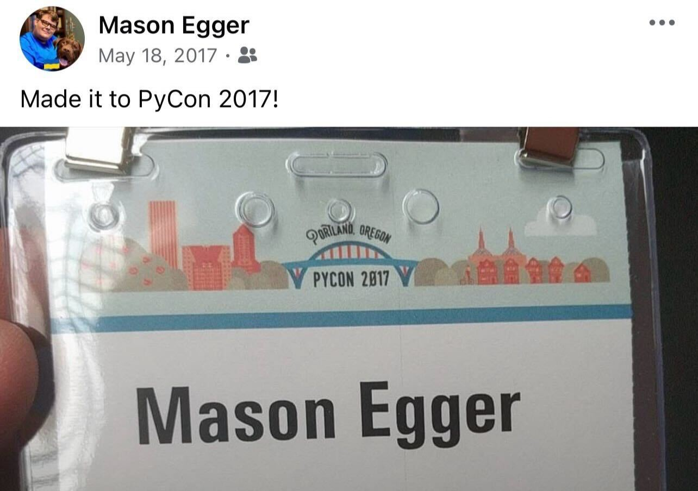

As of Q3 2025 board meeting, I have been named a Fellow of the Python Software Foundation.
First off, I'm unbelievably grateful and surprised.
This was not on my 2025 bingo card, and I'm honored.
Now, let's look at the journey that got me here.

<!-- more -->

There's a lot that led me to this point in my life.
I don't think I've ever written this down, or even told anyone the entire story, so this seems like an appropriate time to do so.

## Thank You

Before I go too far down the rabbit hole of this story, I want to express my thanks for this honor.

When I received the email informing me that I was named a PSF Fellow, I exclaimed a loud, visceral "What the fuck?!?!"(1).
This wasn't on my bingo card for 2025.
PSF Fellows are renowned, accomplished people who have contributed so much to the Python ecosystem.
I personally didn't feel like I earned the award.
I mean, look who's on the list!
People that I've looked up to my _entire_ time in the Python community.
And someone thinks my contributions are on that caliber?
Well, I'm humbled to say the least.
Because I never saw my work as noteworthy.
I'm just doing what needs to be done.
I'm incredibly grateful and humbled for whomever nominated me, and to the board for granting me this honor.
And I hope to do it justice.
{ .annotate }

1. You can ask my husband, he'll confirm.

Now, without any further ado, how the fuck did this happen to me?

## How I Got Involved in the Tech Community

My tech community journey started as I was leaving college.
I attended [Texas State University](https://txstate.edu) where I attained undergraduate degrees in both  (BA) and Computer Science (BS)(1).
I had spent my entire undergraduate time working for the Computer Science department as a lab instructor and software developer(2).
Over this time, I developed a community within the department, as well as a community in the Music building through my involvement with [Phi Mu Alpha Sinfonia](https://sinfonia.org)(3).
I had even attended the [Texas Music Educators Association Convention](https://www.tmea.org/convention/) multiple times, so attending conferences wasn't new to me.
I got my first job and began commuting an hour and a half one way to my job in Austin, TX(4).
Needless to say, I had a lot of time to kill, so I started listening to podcasts.
During my time at Texas State I became interested in [BSD](https://en.wikipedia.org/wiki/Berkeley_Software_Distribution) operating systems and started listening to the [BSD Now](https://www.bsdnow.tv/) podcast.
I downloaded a ton of episodes to my phone and would listen to them. 
Also at the time, YouTube culture was on the rise, and with so much spare time and my background in the performing arts, I decided I wanted to make a YouTube channel dedicated to things BSD related.
So I started the [BSD Synergy](https://www.youtube.com/masonegger) channel, and actually made 25 episodes before exhaustion took over and I stopped.
During this time I met a few people, spoke at [Texas Linux Fest](https://texaslinuxfest.org/) in 2016, and tried to find my community.
However, without anything local happening, it was difficult.
Then something fun happened.
My boss at Texas State University, who was a graduate student at the time, came to work with me at my first job. 
At one point, we were talking about meetups and conferences, and he mentioned that one day he'd like to attend PyCon.
I had no idea what this was, but decided to look into it.
I had worked with Python at the university, and our main product at work was built in Python.
Then, on a random whim, I decided that I was going to PyCon.
My friend was unable to go as he would be on his honeymoon at the time, so I made the journey alone.
And this led me to a community that would change my life.
{ .annotate }

1. This is a _much_ longer story, which I also want to write one day. But for now, let's start here.
2. It was a fun job. Write software for the labs and professors, get paid $10 an hour. On campus job. I even had my own ~~office~~ broom closet.
3. Yes, I was in a fraternity. Not a frat. We sang at nursing homes, did community service projects, etc.
4. Why? Because I was still paying $400 a month in rent with my college roommates. I graduated in December and our lease wasn't up until May. I did eventually move much closer to work though. 

## PyCon 2017

So I boarded a plane, and flew to Portland, Oregon for PyCon 2017.
I had no idea what to expect, but was excited.
I read all the talk descriptions, planned out a schedule, and was excited to learn.
My first talk at any PyCon US ever was given by my now good friend Moshe Zadke on using Python to manage AWS infrastructure.
I saw many great talks, but one of my favorites of the conference was [The Dictionary Even Mightier](https://www.youtube.com/watch?v=66P5FMkWoVU) by Brandon Rhodes. 
This talk single handily made me switch to Python 3.

The interesting thing about this PyCon, was I talked to almost no one.
I didn't know how to just make friends.
I hadn't heard of the [Pac-Man Rule](https://www.ericholscher.com/blog/2017/aug/2/pacman-rule-conferences/) as I didn't attend the keynotes(1).
I ended up talking to one person at the very end, who I sat down to have breakfast with.
While this may sound sad, it wasn't.
I enjoyed PyCon and couldn't wait for the next one, which was announced to be in Cleveland.
{ .annotate }

1. I didn't even know what a keynote was. I did end up attending the closing keynote.

## More PyCons and Regional Conferences

I returned from PyCon 2017 energized and happy.
I learned a lot, and was excited to bring that information home.
Not much happened between PyCon 2017 and 2018, except I changed jobs.
I connected with the person I met in 2017 and we were both going to PyCon, so I was happy I'd have someone to talk to.
PyCon 2018 was in Cleveland, and it was a massive conference. 
I was much more experienced now, so I felt less like a fish out of water.
I took tutorials, went to the keynotes, and even chatted with more people.
I remember going by the PSF booth and chatting with them, and learning about the various tiers of membership, core contributors, and fellows.
I felt much more immersed in the Python experience, and even learned there were mini Python regional conferences that happened all around the world!
I immediately looked up to see when the next [PyTexas Conference](https://pytexas.org/2026) was, but I had just missed it, and would have to wait a full year to go.
However, this inspired me to speak.
I wrote what I consider my first serious talk, [Building Docs like Code: Continuous Integration for Documentation](../../speaking/posts/ci-docs.md)
At the time, I was focusing on making documentation better at work(1).
The talk was a success, and I have since given it six different times.
{ .annotate }

1. A thankless job most of the time, but someone has to do it. I had done the same at my first job. See. I've been obsessed with good documentation my entire career.

This talk was the beginning of my PyTexas journey, which so happened to be the first conference I presented it at.

## Getting Involved with PyTexas

After my presentation at PyTexas, I was eager to get involved in the organizing of the conference.
I made a lot of friends in the conference space in a short time, and wanted to volunteer my time to it. 
I joined on as an organizer, and began helping with the [2020 PyTexas Conference](https://pytexas.org/2020).
Well, we all know how this turned out.
We went from planning a conference, to maybe pushing the conference out if the spread could be stopped, to converting to a virtual conference.
Either way, we pulled it off.
It didn't feel overly good though. 
A pandemic was happening, there was other stuff on people's minds. 
During that time, the chair of PyTexas moved out of the state.
The remaining organizers met, and decided to not have PyTexas 2021.
By this point, virtual conference fatigue was setting in, and we opted to just try again next year.
When [PyTexas 2022](https://pytexas.org/2022) came around, there were 4 organizers left including myself.
We decided then we were having a conference, whether it was for 250 or 20 people, we needed to do it.
And so we did, and I became the chair of the PyTexas Conference.

## Stepping into a Community Leadership Role

The 2022 conference remains a fever dream.
Covid 19 restrictions were lifting, but still in effect.
How many tickets we could sell was directly tied stages of lock down, and we chased that number up until the very end.
In the end, the conference was a success, with roughly ~80 people in attendance.
Afterwards, Jeremy Boyd and Kevin Horn decided to elect me President of the [PyTexas Foundation](https://pytexas.org).

And that's where I've been.
Coming up as chair of my fifth PyTexas conference, having started organizing in 2020.
In that time we rebuilt the PyTexas Conference, even surpassing pre-pandemic numbers.
We launched a Discord server, and now have ~1300 members interacting with us on a regular basis.
We launched a monthly virtual meetup, because _everyone_ should have access to a meetup, no matter how remote of an area in Texas (or anywhere) they live.
We helped relaunch dormant meetups, bringing [PyHou](https://www.meetup.com/python-14/) and [Alamo Python](https://www.meetup.com/alamo-python/) back online. 
Started the [PyTexas Meetup Pro](https://www.meetup.com/pro/pytexas/) network, and now support the majority of Python Meetups in Texas.
Currently we're working to bring back PyLadies in Texas by revitalizing the dormant meetups. 
In four short years, we went from being a conference of 80, a burnt out community on the edge of collapse, to a thriving, renowned community that people always praise within the community.

And the work never ends.
There's always more we can do.
More people we can reach.
More communities to foster.
More space to give.
And that's how it should be.
Community isn't a one and done.
It's not something to be done for clout or fame.
Community is a living, breathing thing.
It must be nourished, encouraged, and above all, cherished.

## A Forgotten Goal

After the initial shock of reading the email, I began to reminisce on my time in the community.
And it dug up a memory of a long forgotten goal.
At one of my first PyCons (either 2017 or 2018), I learned about the Fellow designation.
I remember looking at the name of people and saying to myself "Wow! These people do so much!" and I made a goal to, in the timeline of my career, be named a Fellow.
I looked into it what it would take to become a Fellow.
I read the requirements, and decided I wanted to contribute some code to the Python ecosystem.
So I tried to start a few open source projects that never went anywhere.
I attended PyPI sprints at PyCon and tried to contribute, but at the time the codebase was way over my head and I didn't have time for it.
Eventually, I decided this just wasn't attainable and forgot about it.

So when I went in to organizing, this wasn't even on my list.
I just wanted to help organize a conference.
And look what it turned in to.

## Why Though?

I often get the question, "Why?".
When people ask this question, I know what they mean.
Why am I giving away my time for free?
Why am I not doing something to make money.
And they're right!
It's a lot to give. 
I average 10 hours a week on PyTexas work during the off season, and a _ridiculous_ amount during conference season.
I could be spending my time learning a new language, or contracting, or working on a side project to make money to start my own business.
And the answer is simple.

We as a society seem to have forgotten that not everything we **fucking** do has to generate money.
God forbid we have a hobby anymore.
Or do something just for the sake of doing something.
This isn't healthy.
Thinking that our lives are only meaningful if we're chasing wealth or fame or status is toxic.
And it will make you ill.
So for those who need or want an answer to the question "Why do you do this Mason?", maybe the words of the immortal Mr. Charley Pride(1) will shed some light.
{ .annotate }

1. This song means the _world_ to me. I grew up listening to it. It's my Dad's favorite song. There's so much of my life tied to this song I can't even do it justice here. If you see me at an event, come ask me the story. But be ready to sit, because it's a long one.

<iframe width="560" height="315" src="https://www.youtube-nocookie.com/embed/tPL12yGs3bE?si=0-ciOKBshBOYFExr" title="YouTube video player" frameborder="0" allow="accelerometer; autoplay; clipboard-write; encrypted-media; gyroscope; picture-in-picture; web-share" referrerpolicy="strict-origin-when-cross-origin" allowfullscreen></iframe>

So why do I do all this? 

> I remember walking with my daddy through his weathered fields of grain  
> But he wouldn't curse the sun or give up on the rain  
> I ask him why don't you sell this place  
> Move to town you'll have money to burn  
> He said son you don't understand I don't do this for what I earn  
> 
> Oh it's just for the love of it that's all the reason you need  
> What more could anyone ask satisfaction guaranteed  
> Don't chase rainbows or your pot of gold you'll always have enough  
> If you'll do everything you do just for the love  

