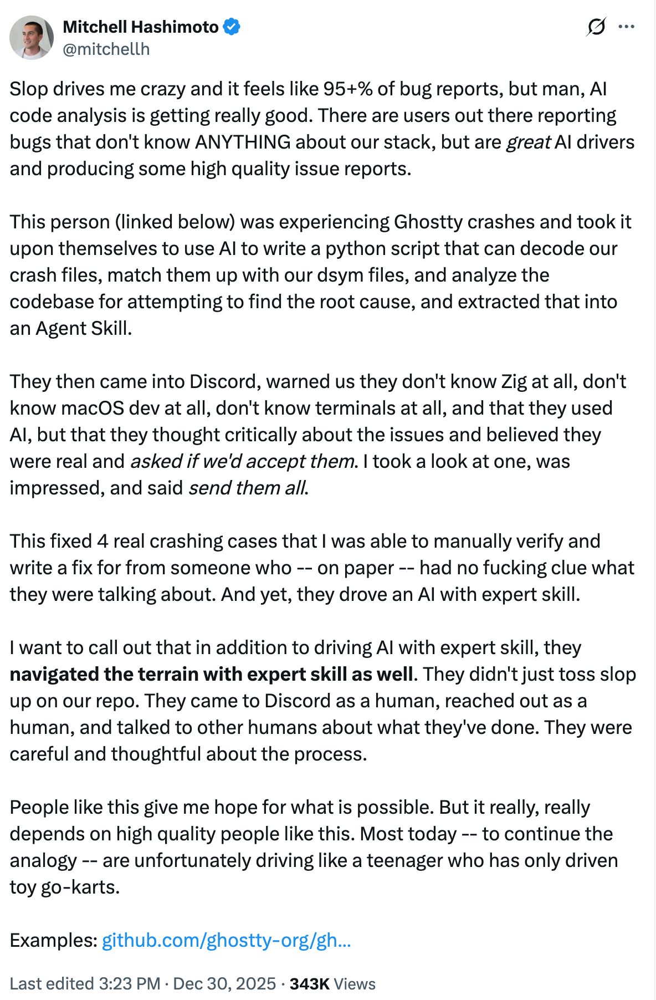

There's an old joke about a consultant who gets called in to fix a machine.
They walk in, look around for a minute, push a single button, and the machine roars back to life.

"That'll be $500," they say.

"$500?! For pushing one button?!"

"$5 to push the button. $495 to know which button to push."

This has always been true for software engineering.
We just convinced ourselves—and our employers—that the button-pushing was the hard part.
AI has made the truth undeniable.

<!-- more -->

## Code is Cheap

Like it or not, we're experiencing the _exact same_ moment Dorothy Vaughan and her Computers experienced at NASA.
A new technology has entered the scene, and it's about to change programming forever.
It's a faster programmer than you.
It knows more programming languages, syntax, algorithms, design patterns than you(1).
It has more energy than you.
{ .annotate }

1. Remember those LeetCode questions we all love so much? Done for. No more trying to figure out how to get the fucking wolf, chicken, and grain across the river.

And you know what?
**Who gives a shit?**
Are you jealous of your car because it can carry more weight than you can?
No?
Then why are you worried about some machine that generates code?
You still have to guide it.
You still have to tell it what to do and what to build.
The value of software engineering is _not_ the code, it's the product.

## But What About the Hallucinations?

Yeah, AI hallucinates.
It will sometimes get things wrong.
It will even lie to you so convincingly you'll think it's a sociopath(1).
{ .annotate }

1. You used to just have to be bad at hiring to get people like this in your org. Now, you can purchase it for a premium and run it on GPUs.

But regardless of that, your existing guardrails _should_ catch most of this.
You know, those things called tests, linters, type checkers, etc.
AI works best when it has guardrails, and it can even run those for you!
So if you're worried, don't be!
I'm sure your fully implemented, functioning, up to date quality assurance pipelines will catch the issues.

**If you're feeling uncomfortable right now, that's on you, not the AI. Get your shit together.**

And what about the flip side?
Do you write code perfectly the first time, every single time?
No, you don't(1).
Do you think that other engineering disciplines' tools execute perfectly every single time?
At the end of the day, you're still responsible for the code you push to production.
Whether you write it, the intern writes it, or AI writes it.
{ .annotate }

1. And if you try to tell me you do you're lying to me, and you're lying to yourself.

## The Math is Obvious

But if it takes you a day to write a 10,000 line application and it takes AI 45 seconds and then you an hour to review it, the math is obvious.
Hell, if it takes you a day and the AI an hour, the **math is still obvious**.
The reward **far** outweighs the risk.

So why are people so terrified right now?
Because just like the engineer in our first story, they valued the knowledge of the implementation more than the wisdom of the design.
And to be fair, you have every right to be terrified right now.
For many years we told people "Just learn how to code and you'll have a good, middle class life".
Code is no longer the bottleneck.
**Code is cheaper than it ever has been, and the most expensive it ever will be again.**
The career of clocking in, writing code, and clocking out is coming to an end very quickly.
This isn't to say code won't be written.
This isn't to say code won't need to be reviewed.
But who, or I guess, _what_ is doing the writing and verification is rapidly changing.

## The `Is Software Engineering REALLY Engineering` Debate

For years many have argued if software engineering is a _real_ engineering vocation(1).
There are many facets to this debate, but one of the primary ones was that software engineering focused too much on the implementation details, and resembled something more of a craft.
The rationale for comparing this to a craft was that success depends heavily on individual skill, intuition, and accumulated experience rather than applying established formulas.
For example, a mechanical engineer doesn't machine every part that goes into their design for an engine.
{ .annotate }

1. There is _sooooooo_ much history here I will not be explaining it all. If you're curious, look it up. There's a lot.

However, with the advent of AI and the implementation of software becoming automated away, I believe software engineering is starting to look more like a traditional engineering discipline.

The "craft" layer is actively being abstracted away as we speak.
Just as CAD and CNC abstracted away manual drafting and machining for mechanical engineers, AI is doing the same for code.
Software engineers won't manually be writing the code for much longer.

When code generation becomes abundant, constraints become the focus.
So often we put things off, make compromises on designs, accumulate technical debt for the sake of speed.
Speed is no longer an issue anymore.
This may very well be the end of technical debt.
Or at least, human created technical debt.
Will there be AI technical debt?
Absolutely.
And we'll solve for that as well.

Verification now becomes paramount.
We can't blindly trust the AI code(1).
We must define and understand correctness, and how to ensure it.
This is very much a traditional engineering discipline.
{ .annotate }

1. No matter what some influencers say.

Lastly, the science, the theory is no longer optional.
It's essential.
Algorithms matter.
Designing a distributed system?
Better understand CAP theorem, consensus protocols, various failure modes and more.
All of the theory that computer science undergrads learned and _never_ used in their day job isn't just academic anymore.
It's their fast pass to getting ahead with AI(1).
{ .annotate }

1. But only for a short while. Don't think others won't catch up.

## Proof It's Already Happening

And you may think I'm blowing smoke out of my ass, but I'm so happy to say that as I was writing this, I _already_ saw an example of this in the wild(1).
I follow the development of [Ghostty](https://ghostty.org/) on Twitter because it's interesting, and its creator, Mitchell Hashimoto, made a post about someone who used AI tools to do an analysis of Ghostty to find a bug.
This user had no experience with the programming language the tool was written in, the operating system they were using it on, how terminals are even built, **BUT** they knew how to drive AI and had an engineering mindset.
They applied their skills and were able to use AI to understand the problem, write a script, and submit a patch that fixed **4 real crashing cases**.
All with **zero knowledge of the code base prior**.
{ .annotate }

1. Thank you very much Mitchell Hashimoto.

{ width="600" }

_source: [Mitchell Hashimoto's Twitter](https://xcancel.com/mitchellh/status/2006114026191769924)_

This is the sign of a mature engineering discipline.
Implementation is removed.
Critical thinking, an engineering mindset, and the right tool solved the problem.

## A Fork in the Road

So where does that leave _all_ of us, the software engineers?
The programmers?
The coders?
It leaves us with a choice.
The same choice Dorothy Vaughan had.
Do you rise to the challenge, and learn the new paradigm?
Or do you cling to the past and let yourself slowly become irrelevant?

This isn't me being hyperbolic.
I absolutely believe this.
And if you would have talked to me a year ago and presented me with this argument, I would have said you were full of shit.
That's how _fast_ this space is moving.
That's how _good_ this technology has gotten.
And it's not slowing down.

Here's my predictions on where the space is going, and this is me being conservative with the timelines:

* Within the next 2 years, the majority of code will be written by AI.
* Within the next 5 years, all of it will be.
* 10 years down the road, handwriting code will be viewed the same as calculating derivatives in Calculus class.
    You have to do it by hand to learn the concepts, but once you get into the "real world" you'll never do it that way again(1).
    { .annotate }

    1. There's so much to be said about how this is going to impact the way we teach, hire, and structure work not only in this industry, but all industries. And that is _waaaay_ too much for this blog.

You may think this is wild.
You may think I'm bat shit crazy.
That's fine.
I've watched some of the most brilliant programmers I know go from skeptics to avid users.
Hell, even Linus Torvalds, creator of Linux and programming wizard, recently admitted in a [PR](https://github.com/torvalds/AudioNoise/commit/93a72563cba609a414297b558cb46ddd3ce9d6b5) that he vibe coded a noise reduction tool and AI wrote the code better than he could.

Sure there will be hold outs.
There will be those companies that say they won't do it.
Some will cite the environment, some will cite security, some will cite ethics(1).
They'll ship features 10000x slower than their competitors.
And we all know how the market will react to that.
{ .annotate }

1. All of which are perfectly valid reasons. But in the end, it won't matter. The road to hell is paved with good intentions.

Sure, some people will still write code by hand, likely as a hobby or for a small side gig.
But people will not be getting paid to be programmers anymore.
They'll be getting paid to be software engineers.

## The Path Forward

So, I'm not going to sit here and lie to you and tell you this shift is going to be easy.
Because it's not.
We are experiencing the largest shift that our industry has ever seen.
Skills that you spent years, maybe even a lifetime to learn and master are being trivialized and devalued in real time.
It's a hard pill to swallow(1).
{ .annotate }

1. And if you're struggling with this, know you're not alone. The entire industry is collectively losing its shit right now.

But there is one thing you don't have time to do right now, and that's panic.

Seriously.
Take a breath.
You don't have to learn all of this tomorrow.
You don't have to suddenly be an AI wizard by next month.
This is a marathon, not a sprint.
Everyone who appears to be creating sixteen startups with AI in fourteen seconds started at the exact point you are at now(1).
The people who will succeed and come out of this on the other side aren't the ones who are running around frantically trying to keep up with every new tool, every new release, and reading every _fucking_ blog post that comes out.
They'll pick up a tool, and learn how to make their life better with it.
And when they're ready, they'll pick up another.
{ .annotate }

1. Or is a bullshit grifter, and there are a **lot** of those in this space right now.

That being said, you **do** have to start.
This isn't optional anymore.
Your "Oh let's just wait and see what happens" window is **fucking over**.
If you're still on the fence, you're being left behind.
There's still time to catch up, but every day you wait, someone else pulls ahead of you.

I'm not going to claim I have all the answers.
I'm just like you, figuring this shit out as I go along.
I started using Claude Code six months ago, and it has _dramatically_ changed my life.
Not a little.
Not a smidge.
A whole **fucking** lot.

And I'm going to document that for y'all.
You'll find my first (of hopefully many) blogs on what I've learned using Claude Code these last six months for software engineering.
I use it for _so much more_, but I'm going to keep it scoped to programming for now.

[Read my Claude Code Blog (coming soon)](#){ .md-button .button-primary}

So I wish you luck.
Trust me, you're going to love this.
It's going to open up a whole world of possibilities for you.
Just don't delay.
Because at the end of the day, the future belongs to those who show up for it.

---

*This is Part 2 of a three-part series. If you haven't read [Part 1: The Next Great Abstraction](014-1-the-next-great-abstraction.md), check it out for the historical context on why AI represents the next evolution in software engineering.*

