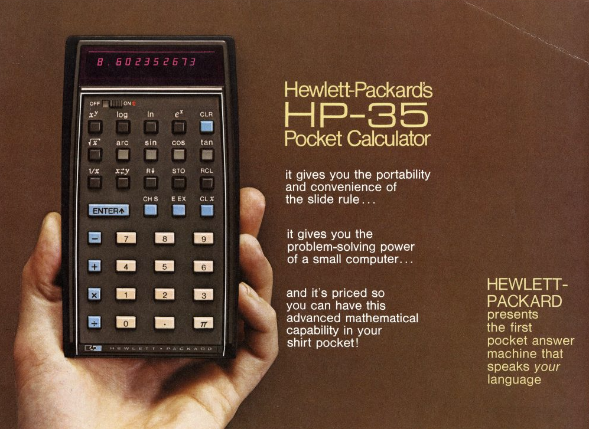

Software engineering is drastically different than it was in the early days of the discipline.
Computers are smaller, languages have changed, we have the internet.
But the advent of LLMs has brought about a Big Bang level event.
Like it or not, one thing's for certain.
We're witnessing evolution in real time.
And it's time to stop pretending like we aren't.

<!-- more -->

## A Gem at an Estate Sale

A new hobby that I've picked up is on the weekends my husband and I like to frequent estate sales.
For some reason I feel I don't have enough shit in my house, so I've taken the liberty of filling it with other people's shit.
This leads to finding all sorts of _wild_ gems.
Do I now have a painting of a hallucinogenic view of Austin, TX from the vantage point looking across Lady Bird Lake(1)?
You bet your ass.
But every now and then you come across some fun stuff.
One of my favorite things is to look at antique books, especially school books(2).
Recently I came across a book of logarithms.
Not a book teaching logarithms, a book with a table of logarithms that you could look up the answer to a specific logarithm given certain parameters.
{ .annotate }

1. If that's not Austin I don't know what is.
2. These make me realize just how much we've dumbed down the education system, because I couldn't do the math those kids were doing in 8th grade when I was a senior, but that's a topic for another day.

This fascinated me. (1)
I'd never seen anything like this.
It never occurred to me that someone would calculate the logarithm _for an absurdly large amount of numbers_ and then publish it as reference material.
In hindsight it makes sense, but digital calculators were commonplace by the time I was born.
{ .annotate }

1. And I'm still kicking myself for not buying it.

Regardless of how I felt flipping through the pages of this curious antique on a random Saturday afternoon, it got me thinking.
At some time, _this_ was useful.
There were people whose professions depended on this book.
There are likely countless structures, such as roads, bridges, dams, that a book like this was consulted when designing it.
People in this profession may have even memorized common logarithms that they worked with on a regular basis.
Or they learned how to calculate them in their head quickly.
Maybe they even prided themselves on this ability.
They were faster than others because they didn't have to go flip through pages in a book every time they needed a calculation.
And then, perhaps seemingly overnight, a device became available that could fit in your pocket that could do all of this for you.

The HP-35, named for its 35 keys (1), made this book obsolete.
While the price tag may have dissuaded people initially, eventually they became cheap enough that anyone could afford one.
And then we put a calculator in the pocket of every person on the planet via their phone(2).
Being able to calculate the logarithms in your head became a parlor trick, and eventually not even taught in school(3).
With this step forward in technology, a skill set that some held, and maybe even prided themselves in, became obsolete.
It was no longer needed.
Sure they could still use it, but the advantage it brought evaporated.
Because now everyone was just as fast as they were.
And this probably scared the shit out of people.
They had been doing something their entire life, they were valued for the speed and precision that they brought, and then suddenly the aspect that gave them a sense of pride was vanquished by a machine.
{ .annotate }

1. We just don't market like they did in the 70s. "Well Bob what should we call it?" "I don't know Frank, how many keys does it have?" It was a golden age.
2. Anyone else have a math teacher in school tell them "You won't have a calculator in your pocket everywhere you go!"? Joke's on them, we do.
3. I sure as shit don't know how to _manually_ calculate one.

And this isn't the only time this happened.
Let's look at a story directly from the software engineering field.

## Dorothy Vaughan and the IBM

If you haven't seen the movie or read the book [Hidden Figures](https://en.wikipedia.org/wiki/Hidden_Figures) yet, I highly recommend it.
It tells the story of the African American women "Computers" at NASA during the Space Race whose job it was to perform the calculations by hand.

But as the space race heated up, NASA looked for a faster way to perform these computations.
This manifested in the form of the IBM 7090.
The IBM could perform over 200,000 calculations per second, way more than a room full of human computers could ever hope to achieve.
But Dorothy didn't balk at this.
She didn't stick up her nose and say "That's slop," or point out every time it made a mistake.
She recognized the potential and the reality of the situation.
So she made a choice(1).
She chose to learn how to program in FORTRAN, and then taught those skills to the other Computers she supervised.
And those who were the most successful picking up this new skill weren't those who were the quickest at arithmetic, or could use a slide rule the fastest, or had the logarithms memorized, but instead, it was the person who understood _what_ needed to be computed and _why_.
Skills that were paramount one day weren't so much the next.
{ .annotate }

1. One which cemented her name in the history books and has me writing about her in my blog post some 70+ years later.

It wasn't the implementation, the raw arithmetic, that was actually the difficult part.
It was the design.
The logic.
The ability to see the completed picture and architect a solution.
Because if that was simple, the machine would have done that too.

## The Crucial Element

In both scenarios above, there is a crucial theme that emerges.
It's that expertise and domain knowledge are what bring value, not raw implementation.
The mathematician who memorized various logarithms didn't _just_ sit around all day calculating them(1).
They were typically doing this as part of other engineering work.
The knowledge alone was not valuable, it was the engineer's wisdom of how to use it that gave their role value.
Same with the Computers who were programming the IBM.
It would not have been possible for them to write the programs if they did not first understand the mathematics behind what they were doing.
These folks adapted to the new tools that were introduced, and became more productive.
Yes there was some overhead in learning the new tooling, but that's life.
This won't be the first new tool you'll have to learn in your career, and it sure as shit won't be the last.
And let's be real, the alternative isn't great.
Because the alternative is to be left behind.
To become obsolete.
{ .annotate }

1. Although it is funny to envision someone just sitting in the corner doing this for no reason.

## The Broken Abstraction Cycle

The two examples above aren't isolated incidents.
They are a phenomenon that has been happening throughout human history since its inception.
It is the abstraction of a process, leading to the simplification of work, and the next step of the evolution of an industry.
Let's bring this back to our field, software engineering.

The software engineering field is littered with abstractions.
Programming a computer started out by actually programming the physical bits of the machine.
Then an assembly language was created to make that simpler.
Next we created languages like FORTRAN and COBOL to abstract away from the assembler.
Object oriented programming, virtualization, the list goes on and on we continually abstract away complexity to make life simpler.

But then, if you look at programming languages at least, we kind of lost our way.
Sure we made _more_ programming languages.
And we have made things slightly simpler.
But the major leaps became smaller.
And when we do make massive leaps, such as WYSIWYG editors, no or low code solutions, or anything that does make writing code more palatable to the masses, these tools are generally mocked.
You'll hear things like **"That's not _real_ programming."** or **"You're not a real programmer if you use X language."**
Once we figured out the modern form of memorizing logarithmic tables, ie knowing how to code, was **insanely profitable** we started doing it.
And then, we took things the _other_ direction!
We started making our abstraction layers **more** complex!
Don't believe me?
How many load bearing YAML files do you have in your infrastructure right now?
Did replacing that monolith with 47 microservices really simplify things?
If I ask you to describe your JavaScript build process, can you do so without sobbing?
Instead of focusing on making things more human readable, more accessible, we optimized for scale at the cost of simplicity.
We architected for _cool_ instead of practical(1).
Don't get me wrong, these new tools and processes did help large enterprises like Google, Amazon, Netflix, etc. manage the massive scale they were handling.
But then we _pushed_ them on every developer who **didn't need them**.
Small startups with three engineers and an angel investor were more worried about multi-region replication than getting a product that their users could actually use(2).
Complexity became _cool_.
{ .annotate }

1. I call this "Resume Driven Development" but that's an _entirely_ different blog topic.
2. If you look up "Premature Optimization" in the dictionary, it redirects to Kubernetes.

And why did we do this?

Because it was lucrative to do so!
Software engineering salaries are some of the highest paying undergraduate jobs you can get.
Being a programmer was marketed as an instant ticket to middle class.
We saw enrollment in Computer Science programs at universities across the world skyrocket.
And when they couldn't produce programmers at the speed the industry required, we created alternative certification programs in the form of programming bootcamps.
_Give me six weeks of your time and I'll get you a six figure job!_
And everyone jumped at this opportunity!
Who the hell wouldn't?
In _this_ economy?!?
But somewhere along the way, we started justifying our paychecks with complexity.
"My job _should_ be hard! Look how much I get paid!"
We had to protect ourselves.
And then we started gatekeeping.
We made tech interviews this unholy gauntlet of whiteboard coding and obscure syntax trivia that had absolutely _nothing_ to do with the actual job(1).
We created a hazing ritual and called it hiring.
We got so tied up in our own hubris, we stopped our abstraction journey.
We never made the next major step.
Until recently.
{ .annotate }

1. Been shouting about this for years. Read my [blog](005-interviews.md)

## Nature Abhors a Vacuum

So we had a simplicity vacuum.
We kept abstracting things into more convoluted things.
New text formats, new languages, new programming models, new paradigms.
And the evidence we were going in circles was **SO OBVIOUS!**

What was this evidence?
The fact that everything new and shiny was just a slight rehash on something old.
Serverless functions?
Do you mean Perl and `cgi/bin`?
Service discovery?
You mean dynamic DNS with some extra bits?
Oh look Laravel is popular(1).
MVC coming back!
The list goes on and on and on and we kept re-inventing the wheel telling ourselves it was new.
{ .annotate }

1. No shade to the Laravel folks, they're doing a fantastic job. Honestly, no one gives them the credit they deserve for making PHP popular again in 2025.

> "Well Mason if it's so simple why don't you tell us what we were supposed to do." - probably you, as you're reading this blog right now.

Isn't it obvious?
Why are we still writing for computers?
Why aren't we just speaking to them the same way I'm speaking to you now?
Why is human language not the primary programming language?
And before you take a deep breath and come at me with your big voice, stop.
There's no need.
Because this vacuum has recently been filled.
It's over.
The next major abstraction has been implemented.
The industry has proceeded to its next evolution.
And what was the solution?
AI.

## So How Is This Different from `INSERT_OTHER_TOOL`?

I know what you're thinking.
We've seen tools that were supposed to "be the end of programming" before right?
We tolerated the CASE tools of the 1980s, we learned worse programming languages to use 4GLs, we drag-and-dropped our share of boxes, tiles, widgets, buttons, forms, etc in the visual programming.
We've been sold snake oil on this time and time again so if you're wary(1), I don't blame you.
But trust me when I say, this time it's different.
{ .annotate }

1. As any rational person should be.

The fundamental flaw with all of these previous attempts was they were all essentially deterministic template systems.
Their functionality was bound to what they were explicitly programmed to do.
There was no reasoning, no adaptation, no extending.
They were static, finite, and limited.

The sheer scale of AI is mind boggling.
The amount of training data is vast.
If previous tools were created by dozens of engineers, AI has "learned" from millions of developers.
Users don't have to learn a new language to use it, they can just speak to it in natural language.

And best of all, it outputs the languages that developers already know and love.
It doesn't try to change developers' tooling, it augments it.
It can explain why it made a choice to use a function, or how to compile the code.
Want it to explain the code to you like you're five, or like you're a senior engineer?
It adapts to you and your needs.

Now, could this all still go belly up tomorrow?
Sure.
Anything is possible(1).
But the trajectory on this feels different.
How do I know?
When was the last time you opened up your VSCode UML->Code generator?
Never?
Ya.
Me neither.
But how many people are using AI to write code every day now and talking publicly about it?
Now think about how many people _aren't_ shouting about it from the rooftops.
It's not vaporware.
You have to look through the bullshit online from both sides.
Some people are claiming that AI is the second coming of Christ and others are saying it produces more slop than a pig farm.
Neither of these types of folks can be taken seriously.
But look around.
Ask your colleagues, your trusted friends what they think.
Look for small blogs from people without a lot of followers.
These folks have nothing to gain, and are just sharing their experiences.
I'm not going to tell you AI is perfect.
It sure as shit isn't.
But this is the most exciting thing to happen in our industry since the internet.
And it would be an absolute shame if you went full ostrich and buried your head in the sand during this absolutely exhilarating time.
{ .annotate }

1. But you better hope it doesn't! Or that you have your 401k in gold bars under your bed because if the AI bubble pops the economy goes with it :sob:

## Preparing for the Aftershocks

The Big Bang was arguably a good thing for humanity.
Without it, we'd probably not be here.
However, with any large scale violent supernova explosion event, there's going to be aftershocks.
And those are coming for us all now.

AI is going to make people quicker and more efficient at their work.
What took a team of 10 six months now takes a team of 4 with AI a few weeks.
This is _most definitely_ going to lead to job loss.
Smart companies will just ship more, but most companies forget there's a quarter that exists after this one, and will sacrifice long term strategy for short term profits(1).
{ .annotate }

1. Because I know that's my favorite thing to do, provide shareholder value!

Do I think we're heading to a post-work all AI task force?
Nah, no one trusts it that much.
And the companies that do will be out of business quick.
But AI adoption will continue to increase.
So be ready.

Because AI isn't going to take your job. 
But the person who knows how to use AI might, if you don't.

---

*This is Part 1 of a three-part series. In [Part 2: Code is Now Cheap, Don't Devalue Yourself](014-2-code-is-cheap.md), I'll explore what this shift means for software engineers and how to navigate it.*