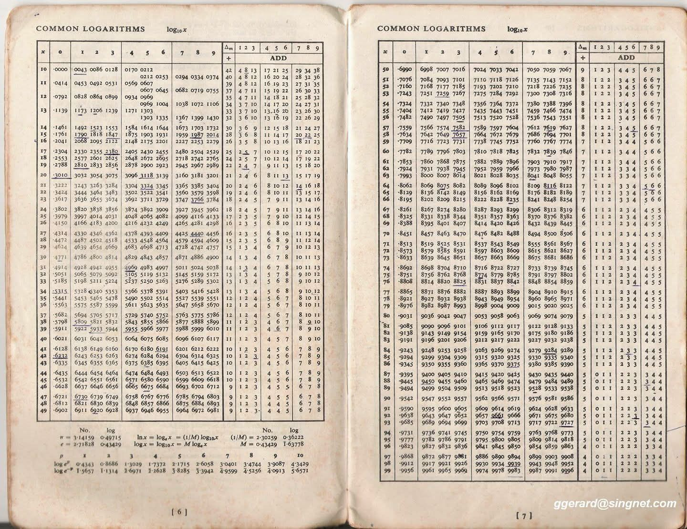

For years a heated debate has been waged over a simple question: "Is Software Engineering a _real_ Engineering vocation?"
People on both sides adamantly defend their point of view.
Regardless of what side you're on, the advent of LLMs and code generation has made one thing clear.
Software Engineering is no longer about writing code. And let's be honest, it never truly was.

<!-- more -->

## Genesis

When I was in college getting my undergraduate degree at Texas State University, I worked as an undergraduate instructional assistant for the Department of Computer Science.
My job was to monitor the labs, tutor students on their homework, and eventually teach the instructional labs that went along with the introductory computer science courses. 
In the first class, I would ask the my students "What do you study when you are studying Computer Science?"
And often they would reply with programming.
Some would say hardware, others would get closer and say logic. 
I would then explain that it's a combination of all of that, but in reality, it's more the study of logic, algorithms, and information theory (1).
{ .annotate }

1. I would usually water it down a bit, no need to needlessly scare the freshman. That's what we have Discrete Math II for. 

Then I would recite one of my favorite quotes of all time:

> Computer science is no more about computers than astronomy is about telescopes. - Edsger W. Dijkstra

This always seemed to make them think, and then we'd move on with the lesson.

## Is Software Engineering a Real Engineering Vocation?

## A Gem at an Estate Sale

On the weekends my husband and I like to frequent estate sales.
For some reason I feel I don't have enough shit in my house, so I like to fill it up with other people's shit.
This leads to finding all sorts of _wild_ gems.
Do I now have a painting of a hallucinogenic view of Austin, TX from the vantage point looking across Lady Bird Lake?
You bet your ass.
But every now and then you come across some fun stuff.
One of my favorite things is to look at antique books, especially school books(1).
Recently I came across a book of logarithms. 
Not a book teaching logarithms, a book with a table of logarithms that you could look up the answer to a specific logarithm given certain parameters.
{ .annotate }

1. These make me realize just how much we've dumbed down the education system, because I couldn't do the math those kids were doing in 8th grade when I was a senior, but that's a topic for another day.

## Hidden Figures and the IBM

## Code is Cheap

## We Are Witnessing Evolution