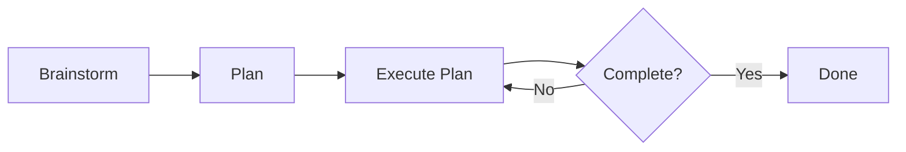

Ok.
Enough waxing poetic about AI.
Here's how I use Claude Code to build software.

<!-- more -->

??? tip "TL;DR - Just Want the Workflow?"

    **The BPE Loop (Brainstorm → Plan → Execute):**

    1. `/app-dev:brainstorm` — Discuss your idea, creates `spec.md`
    2. Review `spec.md` manually — fix any errors
    3. `/app-dev:plan` — Creates `plan.md` and `todo.md`
    4. Review `plan.md` manually — verify prompts make sense
    5. `/app-dev:execute-plan` — Implements one step
    6. Review code, commit, `/clear`, repeat step 5

    **Quick setup:** See the [Claude Code Quickstart](/tutorials/posts/004-claude-code-quickstart/) tutorial.

    **Want the full story?** Keep reading below.

## From AI Skeptic to AI Enthusiast

So it's no secret, I, like many of my colleagues, was very much an AI skeptic when it was first introduced.
The claims then (as they are now) were that this would "replace all Software Engineers" and people's eyes rolled so far back in their heads you could hear them pop. 
And for good reason.
Output of the early LLMs was questionable to say the least.
But as time has gone on, results got better and it became more difficult to ignore.
And like any curious person trying to avoid work on a Tuesday(1), I downloaded Claude Code(2) and tried it out.
From that moment, I was hooked.
I've always been a CLI person, and this was the UX I was looking for.
My productivity skyrocketed.
I dubbed 2025 "The Summer of Side Projects". 
Finally, I could achieve the throughput necessary to work through my massive backlog of projects.
I spent hours reading articles on optimizing `CLAUDE.md`, creating slash commands, everything I could to refine my process(3).
This is by far the most fun I've had writing code in a long time.
So much so that I couldn't contain my excitement.
I showed anyone who would listen: people at work, friends, community members, random strangers on the street(4).
Now I finally have the core process solidified enough that I can share what I've learned(5).
{ .annotate } 

1. You think this is an arbitrary day, but no, I looked up my commits, checked the date, then went back and found what day of the week it was. Buckle up. It's going to be one of _those_ types of blogs.
2. I will be abbreviating this to CC for the rest of the article.
3. One of the most impactful being [Harper Reed's Blog](https://harper.blog/2025/05/08/basic-claude-code/). I initially forked his CC setup and have iterated on it from there.
4. Most ran away screaming, but a few were interested.
5. And I look forward to Anthropic dropping a new feature the day after I publish this and rendering it obsolete. Seriously. They've done that to me like twice already.

Oh, and my manager asked me to.
So there's that.(1)
{ .annotate }

1. :wave: Dallas

## "Ya, but what have you _actually_ built with AI?"

Fair point.
Many people see posts online of people touting their productivity gains via AI but no one shares their work.
So here's what I've contributed to and built since I started using CC.

* [`fountain-py`](https://github.com/MasonEgger/fountain-py/tree/init-version)
    * My first AI project. A Python library to parse [Fountain](https://fountain.io/) syntax.
* A [`homedir` repo](https://github.com/MasonEgger/homedir)
    * I have long wanted to automate setting up my personal environment using Ansible. CC did it for me super quick.
    * I also love writing Python CLI tools. Now CC does that and installs them.
    * I'm constantly iterating on this repo, and this is where all my `.claude` files are.
* Knowledge Base via Obsidian
    * This one I obviously can't link to as it's my personal knowledge base, but I used CC to organize my Obsidian vaults into a format I actually use. I also record myself ranting about my day and have it fill in my daily journal entry with the transcript.
    * Also an [MCP Server](https://github.com/napcs/mcp-knowledge-base) I want to try.
* Temporal Course Ports - [Temporal 101 in Ruby](https://learn.temporal.io/courses/temporal_101/ruby/)
    * Porting courses at Temporal from one programming language to another is tedious. You have to learn the language, learn the subtle differences, change words from function to method or vice versa to sound idiomatic. With proper guidance, CC could do this in a fraction of the time
    * Other ports are in progress, and will be released soon
* Temporal Workshop Code and Customer Demos
    * I had to build out a workshop to build a CI/CD pipeline using Temporal to build and deploy to K8s. CC wrote all of it and helped me make exercises for it.
    * [Check it out](https://github.com/temporal-community/workshop-cicd-k8s-deployment) The various exercises are in branches.
* Various commits to [PyTexas](https://github.com/pytexas)
    * If you see a commit in these repos over the last 6 months, they weren't done by me, but AI. It's been great for automating monthly updates, creating schedules, run books, etc. for a community.

And that's just what I can publicly talk about and I can remember off the top of my head.
What's even _more_ impressive is what I've seen others accomplish with AI.
I recently watched the CTO of Temporal [Maxim Fateev](https://www.linkedin.com/in/fateev) use Temporal's internal study break and CC to accomplish in two weeks what would have taken teams of engineers months to do otherwise.(1)
{ .annotate }

1. Read his thoughts on what AI means for software engineering in his [recent blog](https://temporal.io/blog/what-will-ai-do-to-your-career).

So ya, people are building really cool shit with it.

## WARNING: READ BEFORE PROCEEDING

I'm about to deep dive into my entire workflow for CC.
This is what works for me after I have spent _hours_ using the tool.
So I want to put a few disclaimers/warnings before I proceed.

### Your Mileage May Vary

Before going any further, I will say that this is what has been successful **for me**.
If you go on Twitter you'll see 465,279,346,727,844,684,918,549,865 posts(1) about AI, how it just destroyed some industry, and how if you use it _just this special way_ you'll become Supreme Overlord of Ganymede(2).
It's a **lot** to keep up with and everyone has their own process for getting AI to accomplish their goals.
And that's great!
I'm writing this blog to share what I've learned through my journey using CC for half a year, following certain trends, ignoring others, and most importantly of all, because my manager asked me to(3).
If your favorite tip or trick isn't mentioned in here, it doesn't mean it isn't good.
Given the firehose of AI information out there, there is a 99% chance I just haven't seen it yet.
{ .annotate }

1. Plus or minus 74,569,411.
2. Jupiter's largest moon. Also the largest moon in the solar system for our Jeopardy fans out there.
3. And of course, to add to the clutter. Here's to being the 465,279,346,727,844,684,918,549,866th post!

So I hope you learn something from this! If not, I promise to make it entertaining at least.

### You DO NOT Have to Start Out with Something This Complex

There was a _hilarious_(1) tweet thread a few weeks ago where [Boris Cherny](https://x.com/bcherny)(2), the creator of CC, [detailed his _vanilla_ usage of CC](https://x.com/bcherny/status/2007179832300581177?lang=en) and then proceeded to drop one of the most complex setup that looked like it was trying to cover every feature of the tool.
While I, an experienced CC user at the time of reading, got a lot of valuable information out of it, had I read this last summer when I was just learning how to use CC I would have rightfully shit my pants.
{ .annotate }

1. At least to me.
2. All hail Boris Cherny.

A **vanilla** setup of CC is installing the tool and then running the `claude` command.
That's it.
Out of box defaults.
And I know **many** people who are **wildly successful** using AI in their daily work who use Claude this way.
So don't think you _**need**_ this wild ass setup that I'm about to show you.
You most certainly do not.

My journey is that when I found that I was either struggling to accomplish a task with the current setup, I went looking for a new feature to solve **that problem.**
Slowly over time as I attempted to tackle harder and harder problems I needed more customization and **then** went searching for new tooling.
So my advice to you is straightforward: **Start out with the most minimal use of CC you can, and only dive into new features when you actually need them.**
This will save you the flailing that is trying to keep up with everything that is constantly changing.

### This Blog Will Be Outdated Within a Few Minutes of Publication

Yes, this space _does_ move that fast.
I've been working on this blog for months.
What keeps slowing me down?
Every time I get ready to publish **Anthropic changes shit again.**
Seriously, Opus 4.6 came out the day I was set to publish this, and then I had to go back and make sure everything still worked the way I thought it did(1).
So I'm finally just saying fuck it and publishing this thing.
I've updated everything in here as of the date of publication, and I likely won't come back.
I'll just write a new blog saying what I've changed and link to it from the bottom.
{ .annotate }

1. Spoiler alert, it didn't.

Anyways, without any further ado, hold on to your butts.


## My Environment Setup - Vanilla CC

So first let's start with the foundation. 
I run CC solely in the terminal, either on iTerm2 or the Windows Terminal, depending on if it's my work or personal machine.
I use the [native installer for the OS now](https://code.claude.com/docs/en/overview), which is easier than maintaining an npm environment as I rarely touch JavaScript.
This is also now the recommended way, so there's that.

When developing I use the [plugin for VSCode](https://marketplace.visualstudio.com/items?itemName=anthropic.claude-code) to view the suggested diffs sometimes.
It mostly depends on if I remember to run `/ide` and if it's working that day. 
I do not use the VSCode plugin to run CC commands in the side bar. 
This gives too much of a Cursor vibe and I'm just not a fan of the UX.
I live in the command line, so having one screen as my terminal and the other as my editor is what feels most natural for me.
However, if you like having an all-in-one window with CC in your VSCode, then this plugin is for you.

And finally, I use `tmux` for managing different sessions and windows.
I tend to have a CC session running in one window, then multiple other windows for manually testing or tweaking things while working.
I very often will start a project in one session, then either come to a stopping point or need to work on something else, and detach the session and start a new one.
When I want to resume working on a project, I just re-attach the session. 

And that's it.
I don't use any AI task management tools like Beads or Gastown(1).
I don't use OpenCode or another harness.
This isn't for any deep reason, it's mostly that I don't find much value in switching between different provide models.
{ .annotate }

1. The opinion on these is very mixed, and until I find myself absolutely needing them I wont add them.

I've always been a minimalistic tool user, and my CC setup is no exception. 

## Past Here There Be Dragons

Ok, you made it this far.
Congrats!
If you're new to CC, I recommend you get used to playing with it in the configuration mentioned above for a few days/weeks to get accustomed to using the tool. 
I know _many_ people who use vanilla CC and get remarkable amounts of work done. 
Learn the tool, learn what you like about it and where it annoys you.
Can you think of shortcuts that would make life easier?
That's what eventually happened to me.
I got tired of retyping prompts, so I went searching and found commands(1).
And then it all kind of snowballed from here.
{ .annotate }

1. And now I spend countless hours reading docs, tweets, blogs, anything I can on new improvements. Hell I used it so hard I got added to the Claude Code Ambassador program. 


So I warn you, once you start down this path you'll become obsessed with it.
You'll stay up at night reading blogs or creating custom sub-agents(1).
This shit is **fun**.
You're going to want **more**.
And you'll eventually be filled with Lebensverantwortungsvedingteroboterassistentenbastelprojektverzichtstraurigkeit(2).
**You've been warned.**
{ .annotate }

1. Or writing a multi-part blog series that will be labeled as "Exhibit A" when I finally snap and start trying to train chickens to cluck in four part harmony.
2. My buddy and sometimes co-author [Steve Androulakis](https://www.linkedin.com/in/steveandroulakis/) and I discussed what a German word would be for "The sadness of wanting to work on projects with AI, but having to focus on one's real life priorities instead" and Claude came up with this, which roughly translates to "life-responsibility-conditioned robot-assistant tinkering-project renunciation sadness" which I think hits the nail on the head.

## How I Tune My `CLAUDE.md` Files

Let's start with the first thing a new CC user is likely to start tweaking, which is their `CLAUDE.md` file.

`CLAUDE.md` is a file that helps manage Claude's memory.
It is a markdown file that you write and maintain with various instructions, rules, and preferences you want Claude to "remember" every time you launch it. 
However, there are various locations where a `CLAUDE.md` can live, and how they are loaded depends on where the file lives.
The three main types to know about are your **global**, **project**, and **subdirectory** `CLAUDE.md` files.

### Global

A global `CLAUDE.md` file is exactly what it sounds like.
It's global.
It is loaded in at every session.
This is where you put context that you want Claude to always know when you work with it.
These are very abstract rules, such as coding style, communication style, and your core programming principles and beliefs.

I spent many hours tuning my `CLAUDE.md` file when I first got started.
I was initially inspired by [Harper Reed's Blog](https://harper.blog/2025/05/08/basic-claude-code/) detailing how he set his up, and took a lot of inspiration for mine. 
My `CLAUDE.md` contains sections that define the relationship between me and CC(1), my general philosophy on how I want it to write code, and how it should ask for help when it's stuck.
You can view my global [`CLAUDE.md` in my `homedir` repo](https://github.com/MasonEgger/homedir/blob/main/.claude/CLAUDE.md).
{ .annotate }

1. There have been posts where people say if Claude "views you as a partner" it performs better. I have no idea if this is true, but again, it's working so I don't touch it.

Now a days I don't tweak it as much.
I think eventually you get familiar with the consistency of the output and you learn to work around whatever inefficiencies there are. 
And since there's no easy way to test changes to this, you kind of get stuck believing in something you don't know is actually working.
For example, I'm not certain how much the "Our relationship" section actually matters.
However, my CC sessions do rigorously follow Test Drive Development, so I know that _that_ section is working. 
Either way, it is 100% worth experimenting with until your CC experience is where you want it to be.
It will save you a ton of constantly re-explaining your core principles(1).
{ .annotate }

1. And please, steal mine and use it. I took it from Harper Reed. Hooray Open Source!

### Project

Next is your project level `CLAUDE.md`.
This file contains project specific rules that CC follows when you launch the app in that directory.
While you can write this by hand, I find that running `/init` religiously is the way to go.
Depending on the state of my project, I follow two different flows for using `/init`.

???+ info "What the hell is `/init`?"

    Welcome to CC commands, also known as "slash-commands"!
    These are commands you run in your CC terminal and act as shortcuts for various things.
    There are default ones, or you can implement your own, which we'll cover later. 

    `/init` is a slash-command that comes with CC that will read your project and write or update your `CLAUDE.md` file.

If the project is brand new, I will run `/init` from the very beginning.
This may generate a blank `CLAUDE.md` or something very minimal.
That's fine, let's get it into the git history ASAP so we can track it over time(1).
Then as I work on the project I run `/init` before every commit.
This updates the `CLAUDE.md` file with the latest changes, readying it for commit.
Always review this and make sure that it's up to date.
Lies in your `CLAUDE.md` will make it into your code.
{ .annotate }

1. Yes! You should track this in a VCS!

Even if the project is already established, I still run `/init`.
This causes Claude to scan the project and understand what's going on.
I use this as an opportunity to not only set up CC for success, but also to get an understanding of the project myself.
I tend to critique this run of `/init` more, mostly because practices have already been established and I don't want to mess anything up.

Once `/init` is done and a `CLAUDE.md` is created, I still manually edit it from time to time.
Sometimes Claude just doesn't get it, or leaves out something I think is important.
Or my code is so bad it got confused and now I need to clean it up, because an off-label use case of `/init` is to use it to critique your code.

### `/init` is a Snitch

Do you have a bunch of dead code in your project?
Maybe you switched package managers but never cleaned up the old package files?(1)
Are there functions that just absolutely heinous practice and you can't believe they are still in the codebase? 
If there are, `/init` will find them and highlight them in your `CLAUDE.md` file.
{ .annotate }

1. Like I did when I moved from `requirements.txt` to `pyproject.toml`.

Not intentionally mind you.
It isn't trying to find bad code.
But what it does is determine patterns, naming conventions, package management, run instructions, everything.
If you have cruft in your codebase CC will identify this and try to put it in the `CLAUDE.md` so it knows how to deal with it.
So that shitty function that goes against all your best practices may become enshrined in the instructions you feed to CC every time.
And then Claude writes more shitty functions because that's what you have in your codebase so it must be what you want(1).
**This is how you get slop.**
{ .annotate }

1. And as my dad likes to say "That's like wiping your ass on a wagon wheel. Shit just keeps coming around."

So pay attention to those `CLAUDE.md` changes.
Might save you a migraine later.

### Subdirectory 

Subdirectory `CLAUDE.md` files are files that exist within a project that already has a `CLAUDE.md` at the root level.
These are useful for mono-repositories or adding more specific context to a subset of files.
The neat thing is these aren't loaded at init time by CC, but rather conditionally loaded when CC has to do something with a file in that directory. 
If you start putting these in all of your subdirectories, you may want to link to them from your project `CLAUDE.md` that is at the root level. 
A standard Markdown link with a short description will work. 
Once you go down this rabbit hole though, you may need to manually trim your top level `CLAUDE.md` and worry more about information architecture.

Currently I don't have anything big enough to warrant the use of this feature.
I tend to split things up into many repositories rather than use a monorepo. 
That being said, I always do keep this in my back pocket on the off chance I need it in the future.

## Let's Customize It Some More!

Thought we were done?
Nope.
Still a ton to do. 
For the first few weeks I used CC with a custom `CLAUDE.md` as my only change to great effect.
But as I was working I found myself repeating various tasks and writing a variation of the same prompt over and over.
So I dove a little deeper into the options for CC and found exactly what I was looking for, custom commands.

**Already know the CC features and just want to see my workflows? [Jump to the BPE Loop section](#the-bpe-loop).**

### Commands

_stored in `commands/` in your `.claude/` directory, either global or local_

I've always been a CLI person. 
The fact that CC is a CLI interface sparks joy.
And I've always loved writing CLI tools, so getting to add custom commands into CC made my day when I found out.

Commands are custom prompts that you write that you can trigger from within a CC session.
This allowed me to focus on prompt engineering and crafting reusable, portable prompts that I could incorporate into various workflows. 
This greatly sped up my development process, and shifted my focus from "Hey Claude, do this in this repo" to creating a process to follow for agentic coding.

They can also be used to conditionally load in context.
Say you have a set of rules you want to follow when you're developing Python.
You _could_ just put these in your global `CLAUDE.md` but now you're loading them for every single session. 
This may be great if you only ever write Python, but if you do anything else it's a waste of the context.
You _could_ put them in a `CLAUDE.md` that is local to the repository.
There is some merit to this, as now everyone who uses CC on your codebase is following your rules, but now your rules are in _every_ repository you manage.
That's a lot of duplicated work.
What if you change your mind on variable naming convention?
Now you have to update them everywhere.
What I really want is to load those rules when you're _actually_ writing Python, either automatically or by me triggering them.
I was just starting to get into this use case when CC introduced Skills.

Commands are my primary way of interacting with CC.
They run all of my workflows, and every time I come up with a new repeatable workflow my first instinct is to create a custom Command for it.
Treat commands like hotkeys.
Programmable tasks to accomplish a certain thing.
You can view my ever changing list of commands on my [GitHub](https://github.com/MasonEgger/homedir/tree/main/.claude/commands)

???+ Warning "Commands have merged with Skills" 

    During the middle of writing this blog(1) Anthropic decided to merge Commands with Skills. 
    They say this is because they sort of accomplish the same thing, which is the conditional context loading. 
    While true, I find it partly true and discounts the common case of just repeating the same prompt on different inputs.
    While I don't particularly agree with the reasoning, it doesn't really affect much as they preserved backwards compatibility and added features to address my concerns.
    I'll probably eventually refactor my commands to be only user invocable Skills eventually, but it's not high on my priority list.
    { .annotate }

    1. This is the hell of writing about AI. They say that tech books were out of date the moment the ink dried. Well AI blogs are out of date as soon as the TCP handshake completes to the blog you're trying to read.

### Skills

_stored in `skills/` in your `.claude/` directory, either global or local_

I've never been happier for a feature release in software than I was for Skills.
Prior to the release I was building out my own hacky version where I had Commands `list-context` and `load-context` that would enumerate a directory of documents and let me conditionally load them instead of having to make a command for each one.
Then Skills released and I threw that work away. 

[Skills](https://code.claude.com/docs/en/skills) are collection of instructions, resources, and tools that CC can conditionally load when it determines you need to use that Skill.
For example, say I have specific rules, preferences, tools, etc. that I always want to use when I write Python code.
I can then define a Python Skill with these preferences, which CC will then automatically load when it determines I'm writing Python code. 

The structure of the Skill is just directories with Markdown.
You provide a **short** top level `SKILL.md` with instructions, then various resources it can read when it needs to load more context around a specific task.
The top level `SKILL.md` should have the prime directives(1) for the Skill.
These are things like you must do type hints, docstrings on all public interface, absolute imports.
Then there's a `Reference Files` section` that contains information on more specific Python topics. 
I have a reference for how I want CLI scripts built, what my toolchain is, how documentation should be written etc.
Why not just put these in the `SKILL.md` and call it day?
Because that is needlessly loading information that CC may not need to work on this specific task.
CC reads the `SKILL.md` file and sees the links to the references with descriptions.
It then determines which of _those_ files it should read based on its understanding of the task it's currently working on.
You can see this in my [Python Skill](https://github.com/MasonEgger/homedir/blob/main/.claude/skills/python/SKILL.md).

Skills don't just contain reference materials though.
You can also provide `scripts/`, which are executable files that CC can use while working with this skill.
Have a specific template you want it to follow?
Or some examples for it to follow?
Add those to the Skill as well. 
The Skill is a container for what "correct" looks like to you and tools to help CC get there.

Now of course, this thing still misses sometimes.
Skills don't always get invoked(1). 
I always watch very closely to ensure the Skill is invoked (it'll say this in the output of CC).
If it's not, I stop it and manually invoke it.
You can also implement a [Hook](https://code.claude.com/docs/en/hooks) to force it to invoke it on a per-project basis, or include it in the local `CLAUDE.md`.
People are still figuring out how to make Skills invoke consistently.
They do a decent job, but you should still keep an eye on it.
{ .annotate }

1. Which is just another point in my column when I say you **have to watch this shit as it cooks** or you're gonna have a bad day.

### MCP Servers

_stored in various config files in your `.claude/` depending on scope_

Oh joy, the favorite word of every tech bro in the valley for the last six months, MCP!
MCP stands for Model Context Protocol, and is just a fancy way for AI to communicate with AI enabled services.
For example, CC doesn't natively know how to charge something to my personal PayPal account, but with the PayPal MCP connection I could give it access to my account and have it make purchases for me(1).
Think REST API, but for AI.
{ .annotate }

1. This _still_ sounds like a recipe for disaster. I do a good enough job burning my own money I don't need AIs help.

Where MCP is useful for CC is you can attach it to various tools to give it the ability to get "verified" knowledge and perform actions for you across multiple systems.
Personally, I don't use MCP that much.
For the longest time there was an issue with CC loading the entire MCP context into your session and blowing out the context window.
And honestly, I have bash.
I don't need MCP for 95% of things.
However, there are a few MCP servers I enjoy.
Temporal has a knowledge base MCP server that ties into their docs, community forums, and certain curated community slack messages where a good answer was provide. 
I also _love_ the Playwright MCP server for testing web UIs and all sorts of stuff. 
But personally, I'd rather use a Skill for knowledge or write a little tool(1) that CC can use.
{ .annotate }

1. And by "write a little tool" I mean "Ask CC to write it for me".

### Subagents

_stored in `agents/` in your `.claude/` directory, either global or local_

Now to my least favorite feature, subagents.
I know _maaaany_ people who swear by these things, but I'm still hung up on the whole "Just let it cook and eat the dinner" idea.
With subagents you offload a task to what amounts to a CC child process with it's own context window, and it comes back when it's done.
You don't have control over it, you don't get to review anything until it's done.

Don't get me wrong, I can see how this is useful and why people love it, it's just **not** how I want to interact with AI.
At least, not for primary code writing purposes.
I have one subagent I've been working on that I want to use as a copy-editor using [`vale`](https://vale.sh/docs/cli).

What's odd though, is I got early access to CC Teams (then called Swarms), and I like it for very specific tasks.
Teams are multiple subagents running in parallel that have a shared task list, a team leader, and are able to communicate bi-directionally with both the team leader and each other. 
While this sounds more chaotic than a single subagent(1), it's really useful for fanning out a project where the size of the context can't be held in a single agent.
I tried out this feature to build a prototype of a Temporal Skill in all six programming languages spanning every feature in Temporal.
The swarm read from over 40 GitHub repositories, crafted a plan, worked collaboratively and build a pretty damn good Skill.
My work is being directly used in the official Temporal Skill, so I don't plan on updating it, but it made me realize there are use cases for subagents big and small.
OpenClaw also has me curious, so I'll report back in a bit about my experience with them.
{ .annotate }

1. And based off the early access feedback chaos was common.

### Plugins

Wow!


So many features and I guarantee you I missed some.
Your `.claude` directory is looking more complex than your actual project.
Luckily, there is a way to organize all of this, and that's with Plugins.

[Plugins](https://code.claude.com/docs/en/plugins) are a collection of related Skills, Agents, Commands, MCP Servers, Hooks, resources, and more.
It also provides namespacing for your command, something like `/dev:python`.
Currently I haven't organized anything into a plugin, but I'm thinking about it.

## Finally, the Damn Workflow


Ok ok, let's talk about how I _actually_ use CC on a daily basis.
And the answer is simpler than you think.
Like, three steps simple.

## The BPE Loop

The Brainstorm, Plan, Execute Loop(1) is probably not new, or something I invented.
I discovered it in [Harper Reed's Blog](https://harper.blog/2025/05/08/basic-claude-code/) during the early days of my CC adventure and have since iterated on it until I got it where I wanted it.
{ .annotate }

1. BPE for short

The mechanics of the loop are straightforward:

1. **Brainstorm** with the agent on your idea
2. Create a step-by-step **Plan** for implementing the project using your agent
3. **Execute** each step in the plan until the project is implemented.

Here's a visual representation of the Loop.



Look familiar?
It should, it's basically fucking [Waterfall](https://www.atlassian.com/agile/project-management/waterfall-methodology).
Now before you lose your lunch, hear me out.
Waterfall often gets a bad rap in the software engineering world because the process is so _miserably_ slow.
It's actually funny that we hate it, when other engineering disciplines use something similar all the time.
We can easily rewrite code to meet new requirements and not burn a fortune doing so.
Ever seen a bridge built using Agile?
No you have not.
But AI _greatly_ accelerates this.
We can update a spec in a few minutes.
Regenerate the plan if it's not working correctly.
The issues with Waterfall that people disliked are a non-issue in the age of AI.
This is another indicator that our industry is maturing(1).
{ .annotate }

1. A topic I discussed in length in the first part of this series [Part 1: We're Witnessing the Evolution of Software Engineering](014-software-engineering-evolution.md).


You may look at this and say "Damn that's a lot of process" for a fix that may take you five minutes.
True, and I don't use this for _everything_.

| Task | Prompts | BPE Loop |
| ---- | ------- | -------- |
| Greenfield project | ❌ | ✅ |
| Refactor or new feature on existing project | ❌ | ✅ |
| One off change or small task on existing project | ✅ | ❌ |

Each of these stages is a Command I've implemented, stored in my global `.claude/` directory so they're accessible in every session.
You can see them defined [in my GitHub](https://github.com/MasonEgger/homedir/tree/main/.claude/commands/app-dev).

### Brainstorm - `/app-dev:brainstorm`

The first step in the process is to brainstorm.
What am I trying to build?
What tools do I want to use?
What did I not consider?
The [brainstorm command](https://github.com/MasonEgger/homedir/blob/main/.claude/commands/app-dev/brainstorm.md) basically plays 20 questions with me.
I give it the details I have for an application to build, and then we focus in on what I want the app to do, features I may have forgotten, implementation details, etc.

??? abstract "`brainstorm` Command"

    ```md
    # Brainstorm Command

    Ask me one question at a time so we can develop a thorough, step-by-step spec for this idea. Each question should build on my previous answers, and our end goal is to have a detailed specification I can hand off to a developer who will implement using good TDD practices.

    Let's do this iteratively and dig into every relevant detail. Remember, only one question at a time.

    ## Critical Focus Areas

    **TDD Implementation Ready**: Ensure the spec includes requirements for YOUR application logic that can be converted into failing tests first. Focus on business rules, data validation, error handling, and custom algorithms that YOU will implement - not framework or library behavior. Think about what application-specific behaviors need verification.

    **Component Boundaries**: Identify clear, testable components that can be implemented independently and then integrated together. Each component should have well-defined inputs, outputs, and responsibilities.

    **Global Claude Config Integration**: Follow the established development patterns and preferences from the user's global Claude configuration (found in ~/.claude/CLAUDE.md and related files). Respect their preferred tools, coding standards, and project structure approaches.

    Focus on getting the technical details and component boundaries clear enough that the resulting spec can be broken down into implementable, testable steps that follow the user's established development workflow.

    The goal of this is NOT to implement the application or write a bunch of code, but to create a specification file that you will use later to create a plan. I will review this after and make manual changes. You may write _some_ code to illustrate specific points, but do not focus on that. Instead focus on making the specification usable for you to consume and plan with later. 

    Once we are done, save the spec as @spec.md

    Here's the idea:
    ```

This process can take a **looooong** time. 
If you look in my `ai-sessions/` directories in repos I've used this on, you'll see from the session documentation that these can take anywhere from half an hour to a few hours, depending on how complex the problem is and how long it takes me to consider its suggestions.
This isn't the AI churning away for a few hours on its own.
This is a dialogue and sometimes it brings up _very cogent points_ that I need to consider.

However, there is a hidden trap in a step like this, which is scope creep.
I often start planning out an idea and the brainstorming is churning along and then it asks a very useful question about a feature I hadn't considered.
I like the idea so we add it in, and now we're discussing that feature and it brings up _another_ totally valid point that adds _more_ complexity.
It's easy to trip down this rabbit hole and wind up with an application with **way** more features than you intended.
Lately I've taken to telling it "Yes that's a good feature, put it in a future features section and let's focus on the MVP."
This seems to fix the scope creep issue. 

Now once you're done with this step CC will put all your responses together and create a specification file `spec.md`.
This process can actually take several minutes.
I've often taken a break and come back to the spec file being written. 
I let it write it out and we're done right?


Nope!
Not in the slightest.
It's time to **review** the specification.
I meticulously comb through every line and make sure it is what I expected and want.
If it's wrong, I _manually_ change it.
It is **crucial** that this file is accurate.
This is the foundation of everything that will come after.
Any mistake here will be amplified and propagated across the entire project.
The upfront time here is worth it. 
Otherwise you're going to be chasing bugs around the entire time.

Finally, I use a [`/meta:session-summary`](https://github.com/MasonEgger/homedir/blob/main/.claude/commands/meta/session-summary.md) command to summarize what happened and create a record.
This command creates a session summary of what just happened and stores it in the `.ai-sessions/` directory of the code repo.
Next I use `/git:commit-msg` to create the commit message.
I commit `spec.md` and the sessions summary to git and finally run `/clear` to wipe the context window.
Now it's time to plan.

### Plan - `/app-dev:plan`

The next step is the planning stage. 
This command ingests the spec file we created and creates two markdown files as a result, `plan.md` and `todo.md`.
What is the difference between a plan and a spec?
`spec.md` details _what_ needs to be implemented.
`plan.md` specifies _how_ the implementation should be done.
And `todo.md` file details _what_ has actually been implemented. 

Now `todo.md` isn't anything special(1).
It's simply a todo list to keep track of what is being worked on.
You may be wondering "Why not just use the todolist functionality built in to CC?"
Because I `/clear` after every task, and `/clear` wipes the built-in todo along with everything else.
If I want progress to persist across sessions, it has to live in a file.
{ .annotate }

1. Sorry `todo.md`. You're special to me 💙

But the _true_ magic of this command is what happens in `plan.md`.
When I first started my CC journey(1) I was given probably the best advice I've received regarding AI so far from my good friend [Moshe Zadka](https://www.linkedin.com/in/moshezadka/). 
{ .annotate }

1. Like day 1. I was at PyCon US and sat down with Moshe to get him to "teach me the secrets of Claude"

> "Claude is a better prompt engineer than you. Ask Claude how Claude would have Claude do it." - Moshe Zadka

This advice was mind blowing, and as it turns out, 100% right.
And then when I started exploring workflows and stumbled across the BPE loop, the plan stage did exactly this.
**It breaks down the spec into bite sized chunks, then asks Claude to come up with the prompts to achieve each stage.**

??? abstract "`plan` Command"

        # Plan Command

        Draft a detailed, step-by-step blueprint for building this project. Then, once you have a solid plan, break it down into small, iterative chunks that build on each other. Look at these chunks and then go another round to break it into small steps. Review the results and make sure that the steps are small enough to be implemented safely with strong testing, but big enough to move the project forward. Iterate until you feel that the steps are right sized for this project.

        From here you should have the foundation to provide a series of prompts for a code-generation LLM that will implement each step in a test-driven manner. Prioritize best practices, incremental progress, and early testing, ensuring no big jumps in complexity at any stage. Make sure that each prompt builds on the previous prompts, and ends with wiring things together. There should be no hanging or orphaned code that isn't integrated into a previous step.

        ## Testing Guidelines for Generated Prompts

        When specifying tests in RED phases, focus ONLY on application logic:

        **DO test:**
        - Business logic you're implementing
        - Data validation rules you define
        - Error handling you add
        - Custom algorithms or calculations
        - Integration between YOUR components

        **DO NOT test:**
        - Framework functionality (e.g., "Django can connect to database")
        - Third-party library behavior (e.g., "requests library makes HTTP calls")
        - Language features (e.g., "Python dicts work correctly")
        - Configuration loading (unless complex custom logic)
        - Trivial code (simple getters, setters, pass-through methods)

        **Examples:**
        - ❌ BAD: "Test that Django User model can be created" (tests Django)
        - ✅ GOOD: "Test that custom password validator rejects weak passwords" (tests YOUR logic)
        - ❌ BAD: "Test that database connection works" (tests framework)
        - ✅ GOOD: "Test that user registration creates audit log entry" (tests YOUR logic)

        ## Critical Requirements for Execute-Plan Compatibility

        **Each prompt must be structured as numbered sub-steps that execute-plan can follow sequentially:**

        ### Format for Each Step Prompt:
        ```
        ### Step X: [Descriptive Title]

        **NOTE**: [Any important context about existing implementation]

        ```text
        [Prompt for code-generation LLM with numbered instructions]:

        1. RED: Write [specific type] tests first:
        - Create/modify [exact file path]:
            - Test [specific scenario 1]
            - Test [specific scenario 2]
            - Test [specific edge case]

        Example RED phase (GOOD):
        1. RED: Write validation tests first:
            - Create tests/test_user_validation.py:
                - Test that custom password validator rejects passwords without special chars
                - Test that email validator rejects disposable email domains
                - Test that username validator blocks profanity

        Example RED phase (BAD - Don't do this):
        1. RED: Write model tests first:
            - Create tests/test_models.py:
                - Test that User model can be created  ← Testing Django, not your code
                - Test that database saves User correctly  ← Testing Django ORM
                - Test that email field stores email  ← Testing Django field behavior

        2. Document [specific component]:
            - Create/update [exact file path]
            - Document [specific behavior/rules]
            - Include [specific examples/configurations]

        3. GREEN: Write MINIMAL code to make tests pass:
            - Create [exact file path]
            - Implement [specific functionality]
            - Use [specific patterns/libraries]
            - Just enough to pass tests

        4. RED: Add integration tests:
            - Test [specific integration scenario]
            - Test [specific error conditions]

        5. GREEN: Wire up integration minimally

        6. REFACTOR: Improve [specific aspects]

        7. Update documentation with [specific updates]

        8. Verify meaningful test coverage of YOUR application logic and run `just check`
        ```

        ## Prompt Generation Requirements

        1. **Executable Instructions**: Each numbered sub-step must be a specific instruction that execute-plan can follow exactly, not general guidance

        2. **File Path Specificity**: Every prompt must specify exact file paths (e.g., "tests/test_activities/test_validation.py", not "test files")

        3. **Test Scenario Detail**: Each RED phase must list specific test scenarios to implement, not generic "write tests"

        4. **TDD Structure**: Every prompt must follow RED-GREEN-REFACTOR with clear phases

        5. **Sequential Dependencies**: Each prompt builds on previous prompts with no orphaned code

        6. **Integration Requirements**: Each prompt ends with wiring the new code into existing systems

        Make sure and separate each prompt section. Use markdown. Each prompt should be tagged as text using code tags. The goal is to output prompts that execute-plan can follow step-by-step, but context and architectural decisions are important as well.

        ## Output Format

        Store the plan in @plan.md with:
        - Current Status section showing implementation progress
        - Each step as a detailed prompt with numbered sub-instructions
        - Implementation Guidelines section
        - Success Metrics section

        Also create a @todo.md that:
        - Mirrors the plan.md structure with checkboxes
        - Tracks completion of each numbered sub-step
        - Can be updated by execute-plan as work progresses

        The spec is in the file called @spec.md

So CC takes the spec, decomposes the requirements to atomic units of implementation that MUST follow test-driven development, writes the prompts to achieve this, and then stores this in `plan.md` so it can be implemented later.
It pairs this plan with `todo.md`, which mirrors every step in `plan.md` to ensure we always have a checkpoint in the development process.

Now do you think I review these files?


**Of course!**(1)
Always 👏 review 👏 everything!👏
"But you said that Claude is better at prompting than you are why review them?"
That's actually a great question.
I review these files _not_ because I think I can write better prompts than Claude(2).
I review them because if I missed anything in the spec, it will become **glaringly apparent** in `plan.md`.
The prompt will ask for things to be done that just don't make sense. 
**OR** it will expose holes in my skills, `CLAUDE.md` files, and other sources I asked it to look from.
{ .annotate }

1. If you aren't seeing the pattern here yet pay closer attention. 
2. Although I am guilty of tweaking them. I can't help myself. 

For example, if I see in the prompt that it's trying to implement code in `__init__.py`, which is a **bad** practice and should be avoided, I know then that it didn't load my Python Skill, because I explicitly call this out as an anti-pattern(1).
If I catch this, I know that it'll be rampant in the rest of the plan.
I then may decide to just delete those details from the plan itself, or I may manually load my Python Skill and have CC go back over the spec file and make sure the specifications are to my standards.
And then if they are, I rerun the plan command and explicitly tell it to mind my standards(2).
So yes, check the plan.
It'll save you at least $20 in alcohol after CC keeps doing something you ask it not to and you opt to crack open the liquor cabinet(3).
{ .annotate }

1. This is kind of akin to the professor who's been teaching for 30 years and has the most **hyper specific rules** in their syllabus. It's because at one point someone did that thing and pissed them off and now it's a rule. Same with putting this in `__init__.py`.
2. In a perfect world they would just always load correctly, but if this is the worst thing that happens to me while using the magic box that accelerates me 50000000% I'll take it. 
3. Remember kids, don't drink and vibe!

Once you're satisfied, create a session summary, commit the code, and clear that context window!
It's time to let CC implement the application.

### Execute - `/app-dev:execute-plan`

And now we've arrived at the climax, the actual implementation of the project.
It took a while to get here, but now the hard part is over.
If you did the previous two steps properly, then having AI actually implement the project should be easy.

This phase of the BPE Loop is actually the only part that consistently loops.
I use my `execute-plan` command, which in turn will read the `todo.md` to determine what step in the plan is next, read the last session from `.ai-sessions/` for any relevant lessons learned that need to be carried over, read `plan.md` to get the prompt that needs to be executed, and begin execution.
And that's it.
Let it cook.

??? abstract "`execute-plan` command"

    ```md
    # Execute Plan Command

    1. Read @plan.md and @todo.md
        - These files complement each other. @todo.md should track the current state of the implementation of @plan.md
    2. Check to see if a directory named @.ai-sessions` exists
    1. If the directory doesn't exist, do nothing
    2. If the directory exists, list the files and find the most recent session summary and read it. This is a summary of the previous session and will contain detailed information about what work was completed, and lessons learned in the las session.
    3. Open @todo.md and select the first unchecked item to work on.
    4. **CRITICAL**: Open @plan.md and locate the specific step being implemented
        - Find the detailed numbered prompts for this step (e.g., "1. RED: Write tests...", "2. GREEN: Implement...")
        - Follow these prompts EXACTLY in the specified order
        - Do NOT deviate from the file paths, test scenarios, or implementation approach specified
    5. If you have any questions about the task at hand, ask the user.
    6. Implement the plan for this item as specified in @plan.md:
        - **Follow the exact numbered sub-steps** in the plan.md prompt
        - **Use the specific file paths** mentioned in the prompts
        - **Implement the exact test scenarios** described
        - Follow strict TDD procedures (RED-GREEN-REFACTOR as specified)
        - Write robust, well-documented code
        - Focus tests on YOUR application logic, not framework functionality
        - Skip testing trivial code, framework features, or library behavior
        - Verify that all tests and linting passes
        - Make sure the tests pass, and the program builds/runs
    7. **Update documentation as specified** in the @plan.md prompts for this step
    8. **CRITICAL** Update @todo.md and mark off the item that was completed
    9. Ask the user if there is anything else they want you to do or review for this session.

    ## Key Requirements:
        - **NEVER** skip or reorder the numbered steps in plan.md
        - **ALWAYS** use the exact file paths specified in the prompts
        - **FOLLOW** the RED-GREEN-REFACTOR cycle as outlined in each step
        - **COMPLETE** all documentation updates mentioned in the step
        - **VERIFY** all application logic is tested (not framework/library code)
        - Treat @plan.md prompts as **implementation instructions**, not suggestions
    ```

Now the next part is optional, depending on the complexity of the task and how paranoid you are.
**Of course** you should review the code of each step before committing it.
But whether you do this for each step and review every line as it comes or if you just review it in the end will depend on you.
Personally, I find myself babysitting it a bit more and watching line by line, but I also just let it go sometimes.
The reason I babysit it is so if it starts going off the rails, I can correct it early rather than let it generate a metric ton of slop and then have to wade through it later.
Luckily, as the models and CC has gotten better the amount I need to intervene is constantly decreasing. 
But there are days the model is just having a bad day and it needs its hand held.

Another thing I'll do during this phase is if I'm babysitting it and see it struggling to implement or fix something, I'll often Google what the issue is, find the solution, stop CC from running and give it the link.
This often yields great results and saves me time.

Once it has finished implementing a step I follow the same process every time:

1. Review the code again even if I reviewed it while it was running
    1. Big picture view instead of narrow view
2. I manually run the guardrails checks like testing and linting
    1. CC has lied to me before, so I check
3. Once I'm satisfied with the code I have it:
    1. Write a new session summary to `.ai-sessions/`
    1. Update the local `CLAUDE.md` with lessons learned. I often do this by just running `/init`
    1. I double check to make sure that CC updated `todo.md` with the work it did. This is necessary for the next session.
    1. Generate a commit message using `/git:commit-msg`
    1. Commit the code
4. Once it's time to move on to the next step, I run `/clear` like it's shift change and bring in the next session. I then run `/app-dev:execute-plan` again and we go again!

And that's it. 
Preheat the oven to 350 degrees and cook for 30 minutes until done. 
If done _properly_ this yields high quality, maintainable results of an application that you understand.

## Anticipating your responses

I can hear them now, so let's squash the comment section now.

### "That's a LOT of process for a simple fix isn't it?"

Yea.
It really is.
And for a quick fix, I don't use this.
I use the BPE loop for large projects, features being added, and something I'm going to spend actual time on.
But for small little fixes or updates to repos, I just use raw prompts.

For example, I'm constantly updating the [PyTexas 2026](https://pytexas.org/2026) website as the conference approaches.
This site is just a static site generator project.
Say I need to add a new sponsor to the sponsors page.
I copy in the logo file into the base directory, then prompt CC to update the sponsors page and move the logo file to the right location.
Works like a charm.

So don't think you _must_ use a process like this for everything.
It's a tool, not a silver bullet.
But from my experience, the BPE loop is the best way to build and maintain larger projects.

### "Do you really waste all your time watching it build?"

I don't view it as wasting time.
It's still generating at a rate far faster than I would. 
And I'm _learning_ while it's doing this.
I'm learning how to better tune my CC files.
What gaps I have.
What makes CC tick.
But I'm also learning more about coding.
CC will often do something and I'm like "Woa what is that?" so I stop it and ask it to explain it to me.
I've actually learned more new features about Python and other frameworks from watching CC than I have in the past few years of self implementation.
I tend to always grab for what I know.
CC grabs for what is _best_ so I get to learn.
And if I don't like it?
I tell it to fuck off and do it the way I want it done.
It's AI, not your mom.
You can tell it what to do.

### "This kinda takes the fun out of vibe coding."

Eh. 
Maybe.
If you enjoy sitting down, providing one prompt and hoping to get to success then ya, it does.
But if you're trying to build something meaningful that will survive the software engineering lifecycle for years to come, that style of "vibe coding" ain't gonna cut it.
But you know that.

### "Doesn't this make you INSERT_NEGATIVE_EMOTION_HERE?"

Fuck no.

I've never been more productive in my career!
I'm having so much fun!
The bottleneck on what I'm doing is no longer my ability to write code, but my attention span.
Do I have mild existential dread about what this means for the job market?
Also yes.
That's why I'm leveling up on the tooling of the future.
Change always happens.

And let's be real?
What will my outrage do?
Will the big AI companies stop moving forward because a sad boy in Texas is upset with them?
Not a snowball's chance in hell.
So I see it one of two ways.
Evolve or perish.
I know which one I'm choosing.

## Random Tips I Couldn't Fit Into This Narrative

There's so many more random tips that I couldn't fit in here, but I would be remiss if I didn't share them.

1. Run CC in `Explanatory` mode to get explanations while it's running so you build an understanding of the app and maybe even learn something new.
    1. Use `/output-style` and change mode to `Explanatory`. Want to pair-program with CC? Change the mode to `Learning`.
1. Load in known good samples or documentation for CC to use.
    1. Don't just dump the entire docs or samples repo in your project folder. Pull it down on the same level as your project directory and use `/add-dir` to add it and look in there for good examples.
1. Want to save the raw text of the session to share with someone or for archival purposes?
    1. `/export`
1. Did you close a session on accident and lose it? 
    1. `/resume`
1. Do you want `vim` keybindings for everything in your life?
    1. `/vim`

That's all I could think of.
And no, I don't use `/vim` mode.
I have enough mind goblins, I don't need `vim` creating more(1).
{ .annotate }

1. And this is coming from a recovering `vim` user. Don't come at me thinking I use `emacs`. `emacs` is a great operating system. Too bad they didn't implement a decent text editor.

## Weird Shit That I Do That I Can't Explain but It Helps

And now for the goofy shit that I can't explain but it works.


First, I have often said I get the best results from CC when I use my "teacher voice"(1).
What this means is I'm typically over explanatory and treat it like a student who's doing well but needs correction.
When it makes a mistake, I don't tell it "Hey, you messed up here", I ask it "Did you implement what was in the plan?"
Or if the mistake is something that I know exists in my Skills or `CLAUDE.md`, I'll ask it "Did you follow the best practices we have laid out?" it will actually load those in and determine if it followed them or not.
It often determines it hasn't and then goes back and fixes it, but sometimes it had a good reason and it explains why and I decide if that's a good enough reason to break the rules.
Where I think this has real power is I often see this dialogue captured in the session summary portion in the lessons learned session.
So on the next session it reads this in and learns from its mistakes.
Also as I run `/init` to update the local `CLAUDE.md` it will put these in here, either by specific rule or a more broad "Be sure to load the Python Skill and follow it".
This practice leads to my sessions getting better over time as the code base grows, not degrading. 
{ .annotate }

1. Turns out using millennia old teaching techniques works on children and AI. How neat.

Secondly, I don't trust compaction at all.
While the auto-compaction has gotten a _lot_ better over the last six months, I still don't trust it as far as I can throw my 110 chocolate chonk of a labrador(1).
So much so that when I see the warning appear that compaction is near, I start paying extra attention to the outputs as I no longer trust them.
And 9 times out of 10, if I see it start to compact, I actually stop the process and revert the entire session(2).
{ .annotate }

1. He used to _love_ getting thrown onto my bed as a baby. Now his fat ass can't figure out why daddy can't pick him up and throw him like I could when he was 10lbs. Daddy's back hurts Loki, jump up yourself.
2. I use `git` as my rewind mechanism. Every task is a commit, and if I don't like it I revert.

I actually see compaction as a code smell.
It means I didn't break the task down into small enough chunks. 
For me, 95% of the time I can perform a single task within the scope of a fresh context window.
And for that other 5%, I either refactor the plan to break it down more or switch to a model with a larger context window for that task.

And lastly, if you're working on documentation or text, telling CC to "copy this text and update it" tends to yield much more faithful outputs than if you ask it to "read it, update it, and write it to this file". 
While the models have gotten better about not hallucinating when they do this, the larger the file the more likely this will happen.
So if you are converting a quickstart guide from Python to Ruby, have it copy the file _then_ read it and update it. 
The end result will be better. 

## Now Go Forth and Prosper!


Thanks for hanging in there.
I know this was long(1).
Hopefully you learned something.
If you read my other blogs, hopefully you're feeling optimistic about the future and not an overwhelming sense of dread.
I promise you, you're going to love this.
Seven months ago, I was staring at Claude Code the same way someone in 1972 might have stared at an HP-35 calculator.
Now?
That logarithm book is just a neat thing on a shelf(2).
Everyone who I've got started on programming this way loves it.
They feel inspired and ready to tackle the world.
And I wish the same for you.
{ .annotate }

1. If you think it took you a long time to read, imagine how long it took me to write. The answer is about a month.
2. Read [Part 1: We're Witnessing the Evolution of Software Engineering](014-software-engineering-evolution.md) for context if you haven't already.

!!! abstract "Part 4 of 4 of my `Brain Dump Ramblings on AI` blog series"

    Check out the other parts of this series:

    * Part 1 - **[We're Witnessing the Evolution of Software Engineering](014-software-engineering-evolution.md)** discusses the historical context and ongoing evolution of software engineering up to the advent of AI.
    * Part 2 - **[Code is Cheap, Don't Devalue Yourself](015-code-is-cheap.md)** discusses AI and it's impact on the software engineering discipline.
    * Part 3 - **[First Principles of Using AI](016-ai-principles.md)** - The core foundations I've adopted when using AI tools.


*[CC]: Claude Code
*[BPE]: Brainstorm, Plan, Execute


