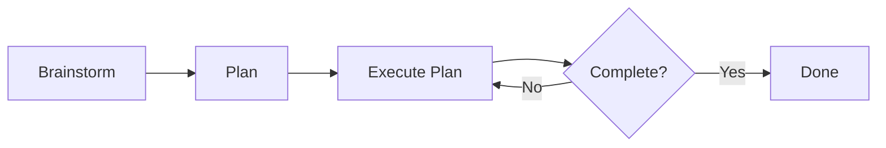

Ok.
Enough waxing poetic about AI.
Here's how I use Claude Code to build software.

<!-- more -->

??? tip "TL;DR - Just Want the Workflow?"

    **The BPE Loop (Brainstorm → Plan → Execute):**

    1. `/app-dev:brainstorm` — Discuss your idea, creates `spec.md`
    2. Review `spec.md` manually — fix any errors
    3. `/app-dev:plan` — Creates `plan.md` and `todo.md`
    4. Review `plan.md` manually — verify prompts make sense
    5. `/app-dev:execute-plan` — Implements one step
    6. Review code, commit, `/clear`, repeat step 5

    **Quick setup:** See the [Claude Code Quickstart](/tutorials/posts/004-claude-code-quickstart/) tutorial.

    **Want the full story?** Keep reading below.

## From AI Skeptic to AI Enthusiast

So it's no secret, I, like many of my colleagues, was very much an AI skeptic when it was first introduced.
The claims then (as they are now) were that this would "replace all Software Engineers" and people's eyes rolled so far back in their heads you could hear them pop. 
And for good reason.
Output of the early LLMs was questionable to say the least.
But as time has gone on, results got better and it became more difficult to ignore.
And like any curious person trying to avoid work on a Tuesday(1), I downloaded Claude Code(2) and tried it out.
From that moment, I was hooked.
I've always been a CLI person, and this was the UX I was looking for.
My productivity skyrocketed.
I dubbed 2025 "The Summer of Side Projects". 
Finally, I could achieve the throughput necessary to work through my massive backlog of projects.
I spent hours reading articles on optimizing `CLAUDE.md`, creating slash commands, everything I could to refine my process(3).
This is by far the most fun I've had writing code in a long time.
So much so that I couldn't contain my excitement.
I showed anyone who would listen: people at work, friends, community members, random strangers on the street(4).
Now I finally have the core process solidified enough that I can share what I've learned(5).
{ .annotate } 

1. You think this is an arbitrary day, but no, I looked up my commits, checked the date, then went back and found what day of the week it was. Buckle up. It's going to be one of _those_ types of blogs.
2. I will be abbreviating this to CC for the rest of the article.
3. One of the most impactful being [Harper Reed's Blog](https://harper.blog/2025/05/08/basic-claude-code/). I initially forked his CC setup and have iterated on it from there.
4. Most ran away screaming, but a few were interested.
5. And I look forward to Anthropic dropping a new feature the day after I publish this and rendering it obsolete. Seriously. They've done that to me like twice already.

Oh, and my manager asked me to.
So there's that.(1)
{ .annotate }

1. :wave: Dallas

## "Ya, but what have you _actually_ built with AI?"

Fair point.
Many people see posts online of people touting their productivity gains via AI but no one shares their work.
So here's what I've contributed to and built since I started using CC.

* [`fountain-py`](https://github.com/MasonEgger/fountain-py/tree/init-version)
    * My first AI project. A Python library to parse [Fountain](https://fountain.io/) syntax.
* A [`homedir` repo](https://github.com/MasonEgger/homedir)
    * I have long wanted to automate setting up my personal environment using Ansible. CC did it for me super quick.
    * I also love writing Python CLI tools. Now CC does that and installs them.
    * I'm constantly iterating on this repo, and this is where all my `.claude` files are.
* Knowledge Base via Obsidian
    * This one I obviously can't link to as it's my personal knowledge base, but I used CC to organize my Obsidian vaults into a format I actually use. I also record myself ranting about my day and have it fill in my daily journal entry with the transcript.
    * Also an [MCP Server](https://github.com/napcs/mcp-knowledge-base) I want to try.
* Temporal Course Ports - [Temporal 101 in Ruby](https://learn.temporal.io/courses/temporal_101/ruby/)
    * Porting courses at Temporal from one programming language to another is tedious. You have to learn the language, learn the subtle differences, change words from function to method or vice versa to sound idiomatic. With proper guidance, CC could do this in a fraction of the time
    * Other ports are in progress, and will be released soon
* Temporal Workshop Code and Customer Demos
    * I had to build out a workshop to build a CI/CD pipeline using Temporal to build and deploy to K8s. CC wrote all of it and helped me make exercises for it.
    * [Check it out](https://github.com/temporal-community/workshop-cicd-k8s-deployment) The various exercises are in branches.
* Various commits to [PyTexas](https://github.com/pytexas)
    * If you see a commit in these repos over the last 6 months, they weren't done by me, but AI. It's been great for automating monthly updates, creating schedules, run books, etc. for a community.

And that's just what I can publicly talk about and I can remember off the top of my head.
What's even _more_ impressive is what I've seen others accomplish with AI.
I recently watched the CTO of Temporal [Maxim Fateev](https://www.linkedin.com/in/fateev) use Temporal's internal study break and CC to accomplish in two weeks what would have taken teams of engineers months to do otherwise.(1)
{ .annotate }

1. Read his thoughts on what AI means for software engineering in his [recent blog](https://temporal.io/blog/what-will-ai-do-to-your-career).

So ya, people are building really cool shit with it.

## WARNING: READ BEFORE PROCEEDING

I'm about to deep dive into my entire workflow for CC.
This is what works for me after I have spent _hours_ using the tool.
So I want to put a few disclaimers/warnings before I proceed.

Before going any further, I will say that this is what has been successful **for me**.
If you go on Twitter you'll see 465,279,346,727,844,684,918,549,865 posts about AI, how it just destroyed some industry, and how if you use it _just this special way_ you'll become Supreme Overlord of Ganymede(1).
It's a **lot** to keep up with and everyone has their own process for getting AI to accomplish their goals.
And that's great!
I'm writing this blog to share what I've learned through my journey using CC for half a year, following certain trends, ignoring others, and most importantly of all, because my manager asked me to.
If your favorite tip or trick isn't mentioned in here, it doesn't mean it isn't good.
Given the firehose of AI information out there, there is a 99% chance I just haven't seen it yet.
{ .annotate }

1. Jupiter's largest moon. Also the largest moon in the solar system for our Jeopardy fans out there.


So I hope you learn something from this! If not, I promise to make it entertaining at least. Without any further ado, hold on to your butts.


## My Environment Setup - Vanilla CC

So first let's start with the foundation. 
I run CC solely in the terminal, either on iTerm2 or the Windows Terminal, depending on if it's my work or personal machine.
I use the [native installer for the OS now](https://code.claude.com/docs/en/overview), which is easier than maintaining an npm environment as I rarely touch JavaScript.
This is also now the recommended way, so there's that.

When developing I use the [plugin for VSCode](https://marketplace.visualstudio.com/items?itemName=anthropic.claude-code) to view the suggested diffs sometimes.
It mostly depends on if I remember to run `/ide` and if it's working that day. 
I do not use the VSCode plugin to run CC commands in the side bar. 
This gives too much of a Cursor vibe and I'm just not a fan of the UX.
I live in the command line, so having one screen as my terminal and the other as my editor is what feels most natural for me.
However, if you like having an all-in-one window with CC in your VSCode, then this plugin is for you.

And finally, I use `tmux` for managing different sessions and windows.
I tend to have a CC session running in one window, then multiple other windows for manually testing or tweaking things while working.
I very often will start a project in one session, then either come to a stopping point or need to work on something else, and detach the session and start a new one.
When I want to resume working on a project, I just re-attach the session. 

And that's it.
I don't use any AI task management tools like Beads or Gastown(1).
I don't use OpenCode or another harness.
This isn't for any deep reason, it's mostly that I don't find much value in switching between different provider models.
{ .annotate }

1. The opinion on these is very mixed, and until I find myself absolutely needing them I wont add them.

I've always been a minimalistic tool user, and my CC setup is no exception. 

## The BPE Loop

This is the foundation of my _entire workflow_.
The Brainstorm, Plan, Execute Loop(1).
And I'll be honest, this isn't anything new, or something I invented.
I discovered it in [Harper Reed's Blog](https://harper.blog/2025/05/08/basic-claude-code/) during the early days of my CC adventure and have since iterated on it until I got it where I wanted it.
But I'm constantly surprised how many people **don't** operate in this manner, so we're going to treat it like it's some _grand magical secret_ and not, you know, good software engineering practices(2).
{ .annotate }

1. BPE for short
2. Or maybe it was just my mom instilling in me "Do you have a plan? What's the plan? What's the backup plan?" from such an early age that I just plan out everything.

The mechanics of the loop are straightforward:

1. **Brainstorm** with the agent on your idea
2. Create a step-by-step **Plan** for implementing the project using your agent
3. **Execute** each step in the plan until the project is implemented.

Here's a visual representation of the Loop.



Look familiar?
It should, it's basically fucking [Waterfall](https://www.atlassian.com/agile/project-management/waterfall-methodology).
Now before you lose your lunch, hear me out.
Waterfall often gets a bad rap in the software engineering world because the process is so _miserably_ slow.
It's actually funny that we hate it, when other engineering disciplines use something similar all the time.
We can easily rewrite code to meet new requirements and not burn a fortune doing so.
Ever seen a bridge built using Agile?
No you have not(1).
But AI _greatly_ accelerates this.
We can update a spec in a few minutes.
Regenerate the plan if it's not working correctly.
The issues with Waterfall that people disliked are a non-issue in the age of AI.
This is another indicator that our industry is maturing(2).
{ .annotate }

1. A topic I discussed in length in the first part of this series [Part 1: We're Witnessing the Evolution of Software Engineering](014-software-engineering-evolution.md).
2. I would love to see a TV show where we try to apply Agile to other engineering practices. "So a bug report came in that all the pedestrians fell off the bridge into the raging waters below because we forgot to implement guardrails! We're releasing that in the nightly patch where we deploy a group of workers at 3am to upgrade the bridge to version 0.3.9!"

You may look at this and say "Damn that's a lot of process" for a fix that may take you five minutes.
True, and I don't use this for _everything_.

| Task | Prompts | BPE Loop |
| ---- | ------- | -------- |
| Greenfield project | ❌ | ✅ |
| Refactor or new feature on existing project | ❌ | ✅ |
| One off change or small task on existing project | ✅ | ❌ |

Each of these stages is a Command I've implemented, stored in my global `.claude/` directory so they're accessible in every session.
You can see them defined [in my GitHub](https://github.com/MasonEgger/homedir/tree/main/.claude/commands/app-dev).

### Brainstorm - `/app-dev:brainstorm`

The first step in the process is to brainstorm.
What am I trying to build?
What tools do I want to use?
What did I not consider?
The [brainstorm command](https://github.com/MasonEgger/homedir/blob/main/.claude/commands/app-dev/brainstorm.md) basically plays 20 questions with me.
I give it the details I have for an application to build, and then we focus in on what I want the app to do, features I may have forgotten, implementation details, etc.

??? abstract "`brainstorm` Command"

    ```md
    # Brainstorm Command

    Ask me one question at a time so we can develop a thorough, step-by-step spec for this idea. Each question should build on my previous answers, and our end goal is to have a detailed specification I can hand off to a developer who will implement using good TDD practices.

    Let's do this iteratively and dig into every relevant detail. Remember, only one question at a time.

    ## Critical Focus Areas

    **TDD Implementation Ready**: Ensure the spec includes requirements for YOUR application logic that can be converted into failing tests first. Focus on business rules, data validation, error handling, and custom algorithms that YOU will implement - not framework or library behavior. Think about what application-specific behaviors need verification.

    **Component Boundaries**: Identify clear, testable components that can be implemented independently and then integrated together. Each component should have well-defined inputs, outputs, and responsibilities.

    **Global Claude Config Integration**: Follow the established development patterns and preferences from the user's global Claude configuration (found in ~/.claude/CLAUDE.md and related files). Respect their preferred tools, coding standards, and project structure approaches.

    Focus on getting the technical details and component boundaries clear enough that the resulting spec can be broken down into implementable, testable steps that follow the user's established development workflow.

    The goal of this is NOT to implement the application or write a bunch of code, but to create a specification file that you will use later to create a plan. I will review this after and make manual changes. You may write _some_ code to illustrate specific points, but do not focus on that. Instead focus on making the specification usable for you to consume and plan with later. 

    Once we are done, save the spec as @spec.md

    Here's the idea:
    ```

This process can take a **looooong** time. 
If you look in my `ai-sessions/` directories in repos I've used this on, you'll see from the session documentation that these can take anywhere from half an hour to a few hours, depending on how complex the problem is and how long it takes me to consider its suggestions.
This isn't the AI churning away for a few hours on its own.
This is a dialogue and sometimes it brings up _very cogent points_ that I need to consider.

However, there is a hidden trap in a step like this, which is scope creep.
I often start planning out an idea and the brainstorming is churning along and then it asks a very useful question about a feature I hadn't considered.
I like the idea so we add it in, and now we're discussing that feature and it brings up _another_ totally valid point that adds _more_ complexity.
It's easy to trip down this rabbit hole and wind up with an application with **way** more features than you intended.
Lately I've taken to telling it "Yes that's a good feature, put it in a future features section and let's focus on the MVP."
This seems to fix the scope creep issue. 

Now once you're done with this step CC will put all your responses together and create a specification file `spec.md`.
This process can actually take several minutes.
I've often taken a break and come back to the spec file being written. 
I let it write it out and we're done right?


Nope!
Not in the slightest.
It's time to **review** the specification.
I meticulously comb through every line and make sure it is what I expected and want.
If it's wrong, I _manually_ change it.
It is **crucial** that this file is accurate.
This is the foundation of everything that will come after.
Any mistake here will be amplified and propagated across the entire project.
The upfront time here is worth it. 
Otherwise you're going to be chasing bugs around the entire time.

Finally, I use my [`/meta:session-summary`](https://github.com/MasonEgger/homedir/blob/main/.claude/commands/meta/session-summary.md) command to summarize what happened and create a record.
This command creates a session summary of what just happened and stores it in the `.ai-sessions/` directory of the code repo.
Next I use my [`/git:commit-msg`](https://github.com/MasonEgger/homedir/blob/main/.claude/commands/git/commit-msg.md) to create the commit message.
I commit `spec.md` and the sessions summary to git and finally run `/clear` to wipe the context window.
Now it's time to plan.

### Plan - `/app-dev:plan`

The next step is the planning stage. 
This command ingests the spec file we created and creates two markdown files as a result, `plan.md` and `todo.md`.
What is the difference between a plan and a spec?
`spec.md` details _what_ needs to be implemented.
`plan.md` specifies _how_ the implementation should be done.
And `todo.md` file details _what_ has actually been implemented. 

Now `todo.md` isn't anything special(1).
It's simply a todo list to keep track of what is being worked on.
You may be wondering "Why not just use the todo list functionality built in to CC?"
Well when I started, there was no plan mode 😝.
But also I like mine more.
A todo list persisted in git survives all sorts of crashes.
Sometimes I wipe out my `.claude/` directory on a fresh install.
Sometimes I work on a different machine.
I want consistency across all of my environments.
Oh, and I also think the way my `plan.md` and `todo.md` synchrony works better 🤷‍♂️.
{ .annotate }

1. Sorry `todo.md`. You're special to me 💙

But the _true_ magic of this command is what happens in `plan.md`.
When I first started my CC journey(1) I was given probably the best advice I've received regarding AI so far from my good friend [Moshe Zadka](https://www.linkedin.com/in/moshezadka/). 
{ .annotate }

1. Like day 1. I was at PyCon US and sat down with Moshe to get him to "teach me the secrets of Claude"

> "Claude is a better prompt engineer than you. Ask Claude how Claude would have Claude do it." - Moshe Zadka

This advice was mind blowing, and as it turns out, 100% right.
And then when I started exploring workflows and stumbled across the BPE loop, the plan stage did exactly this.
**It breaks down the spec into bite sized chunks, then asks Claude to come up with the prompts to achieve each stage.**

??? abstract "`plan` Command"

        # Plan Command

        Draft a detailed, step-by-step blueprint for building this project. Then, once you have a solid plan, break it down into small, iterative chunks that build on each other. Look at these chunks and then go another round to break it into small steps. Review the results and make sure that the steps are small enough to be implemented safely with strong testing, but big enough to move the project forward. Iterate until you feel that the steps are right sized for this project.

        From here you should have the foundation to provide a series of prompts for a code-generation LLM that will implement each step in a test-driven manner. Prioritize best practices, incremental progress, and early testing, ensuring no big jumps in complexity at any stage. Make sure that each prompt builds on the previous prompts, and ends with wiring things together. There should be no hanging or orphaned code that isn't integrated into a previous step.

        ## Testing Guidelines for Generated Prompts

        When specifying tests in RED phases, focus ONLY on application logic:

        **DO test:**
        - Business logic you're implementing
        - Data validation rules you define
        - Error handling you add
        - Custom algorithms or calculations
        - Integration between YOUR components

        **DO NOT test:**
        - Framework functionality (e.g., "Django can connect to database")
        - Third-party library behavior (e.g., "requests library makes HTTP calls")
        - Language features (e.g., "Python dicts work correctly")
        - Configuration loading (unless complex custom logic)
        - Trivial code (simple getters, setters, pass-through methods)

        **Examples:**
        - ❌ BAD: "Test that Django User model can be created" (tests Django)
        - ✅ GOOD: "Test that custom password validator rejects weak passwords" (tests YOUR logic)
        - ❌ BAD: "Test that database connection works" (tests framework)
        - ✅ GOOD: "Test that user registration creates audit log entry" (tests YOUR logic)

        ## Critical Requirements for Execute-Plan Compatibility

        **Each prompt must be structured as numbered sub-steps that execute-plan can follow sequentially:**

        ### Format for Each Step Prompt:
        ```
        ### Step X: [Descriptive Title]

        **NOTE**: [Any important context about existing implementation]

        ```text
        [Prompt for code-generation LLM with numbered instructions]:

        1. RED: Write [specific type] tests first:
        - Create/modify [exact file path]:
            - Test [specific scenario 1]
            - Test [specific scenario 2]
            - Test [specific edge case]

        Example RED phase (GOOD):
        1. RED: Write validation tests first:
            - Create tests/test_user_validation.py:
                - Test that custom password validator rejects passwords without special chars
                - Test that email validator rejects disposable email domains
                - Test that username validator blocks profanity

        Example RED phase (BAD - Don't do this):
        1. RED: Write model tests first:
            - Create tests/test_models.py:
                - Test that User model can be created  ← Testing Django, not your code
                - Test that database saves User correctly  ← Testing Django ORM
                - Test that email field stores email  ← Testing Django field behavior

        2. Document [specific component]:
            - Create/update [exact file path]
            - Document [specific behavior/rules]
            - Include [specific examples/configurations]

        3. GREEN: Write MINIMAL code to make tests pass:
            - Create [exact file path]
            - Implement [specific functionality]
            - Use [specific patterns/libraries]
            - Just enough to pass tests

        4. RED: Add integration tests:
            - Test [specific integration scenario]
            - Test [specific error conditions]

        5. GREEN: Wire up integration minimally

        6. REFACTOR: Improve [specific aspects]

        7. Update documentation with [specific updates]

        8. Verify meaningful test coverage of YOUR application logic and run `just check`
        ```

        ## Prompt Generation Requirements

        1. **Executable Instructions**: Each numbered sub-step must be a specific instruction that execute-plan can follow exactly, not general guidance

        2. **File Path Specificity**: Every prompt must specify exact file paths (e.g., "tests/test_activities/test_validation.py", not "test files")

        3. **Test Scenario Detail**: Each RED phase must list specific test scenarios to implement, not generic "write tests"

        4. **TDD Structure**: Every prompt must follow RED-GREEN-REFACTOR with clear phases

        5. **Sequential Dependencies**: Each prompt builds on previous prompts with no orphaned code

        6. **Integration Requirements**: Each prompt ends with wiring the new code into existing systems

        Make sure and separate each prompt section. Use markdown. Each prompt should be tagged as text using code tags. The goal is to output prompts that execute-plan can follow step-by-step, but context and architectural decisions are important as well.

        ## Output Format

        Store the plan in @plan.md with:
        - Current Status section showing implementation progress
        - Each step as a detailed prompt with numbered sub-instructions
        - Implementation Guidelines section
        - Success Metrics section

        Also create a @todo.md that:
        - Mirrors the plan.md structure with checkboxes
        - Tracks completion of each numbered sub-step
        - Can be updated by execute-plan as work progresses

        The spec is in the file called @spec.md

So CC takes the spec, decomposes the requirements to atomic units of implementation that MUST follow test-driven development, writes the prompts to achieve this, and then stores this in `plan.md` so it can be implemented later.
It pairs this plan with `todo.md`, which mirrors every step in `plan.md` to ensure we always have a checkpoint in the development process.


Now do you think I review these files?


**Of course!**(1)
Always 👏 review 👏 everything!👏
"But you said that Claude is better at prompting than you are why review them?"
That's actually a great question.
I review these files _not_ because I think I can write better prompts than Claude(2).
I review them because if I missed anything in the spec, it will become **glaringly apparent** in `plan.md`.
The prompt will ask for things to be done that just don't make sense. 
**OR** it will expose holes in my skills, `CLAUDE.md` files, and other sources I asked it to look from.
{ .annotate }

1. If you aren't seeing the pattern here yet pay closer attention. 
2. Although I am guilty of tweaking them. I can't help myself. 

For example, if I see in the prompt that it's trying to implement code in `__init__.py`, which is a **bad** practice and should be avoided, I know then that it didn't load my Python Skill, because I explicitly call this out as an anti-pattern(1).
If I catch this, I know that it'll be rampant in the rest of the plan.
I then may decide to just delete those details from the plan itself, or I may manually load my Python Skill and have CC go back over the spec file and make sure the specifications are to my standards.
And then if they are, I rerun the plan command and explicitly tell it to mind my standards(2).
So yes, check the plan.
It'll save you at least $20 in alcohol after CC keeps doing something you ask it not to and you opt to crack open the liquor cabinet(3).
{ .annotate }

1. This is kind of akin to the professor who's been teaching for 30 years and has the most **hyper specific rules** in their syllabus. It's because at one point someone did that thing and pissed them off and now it's a rule. Same with putting this in `__init__.py`.
2. In a perfect world they would just always load correctly, but if this is the worst thing that happens to me while using the magic box that accelerates me 50000000% I'll take it. 
3. Remember kids, don't drink and vibe!

Once you're satisfied, create a session summary, commit the code, and clear that context window!
It's time to let CC implement the application.

### Execute - `/app-dev:execute-plan`

And now we've arrived at the climax, the actual implementation of the project.
It took a while to get here, but now the hard part is over.
If you did the previous two steps properly, then having AI actually implement the project should be easy.

This phase of the BPE Loop is actually the only part that consistently loops.
I use my `execute-plan` command, which in turn will read the `todo.md` to determine what step in the plan is next, read the last session from `.ai-sessions/` for any relevant lessons learned that need to be carried over, read `plan.md` to get the prompt that needs to be executed, and begin execution.
And that's it.
Let it cook.

??? abstract "`execute-plan` command"

    ```md
    # Execute Plan Command

    1. Read @plan.md and @todo.md
        - These files complement each other. @todo.md should track the current state of the implementation of @plan.md
    2. Check to see if a directory named @.ai-sessions` exists
    1. If the directory doesn't exist, do nothing
    2. If the directory exists, list the files and find the most recent session summary and read it. This is a summary of the previous session and will contain detailed information about what work was completed, and lessons learned in the las session.
    3. Open @todo.md and select the first unchecked item to work on.
    4. **CRITICAL**: Open @plan.md and locate the specific step being implemented
        - Find the detailed numbered prompts for this step (e.g., "1. RED: Write tests...", "2. GREEN: Implement...")
        - Follow these prompts EXACTLY in the specified order
        - Do NOT deviate from the file paths, test scenarios, or implementation approach specified
    5. If you have any questions about the task at hand, ask the user.
    6. Implement the plan for this item as specified in @plan.md:
        - **Follow the exact numbered sub-steps** in the plan.md prompt
        - **Use the specific file paths** mentioned in the prompts
        - **Implement the exact test scenarios** described
        - Follow strict TDD procedures (RED-GREEN-REFACTOR as specified)
        - Write robust, well-documented code
        - Focus tests on YOUR application logic, not framework functionality
        - Skip testing trivial code, framework features, or library behavior
        - Verify that all tests and linting passes
        - Make sure the tests pass, and the program builds/runs
    7. **Update documentation as specified** in the @plan.md prompts for this step
    8. **CRITICAL** Update @todo.md and mark off the item that was completed
    9. Ask the user if there is anything else they want you to do or review for this session.

    ## Key Requirements:
        - **NEVER** skip or reorder the numbered steps in plan.md
        - **ALWAYS** use the exact file paths specified in the prompts
        - **FOLLOW** the RED-GREEN-REFACTOR cycle as outlined in each step
        - **COMPLETE** all documentation updates mentioned in the step
        - **VERIFY** all application logic is tested (not framework/library code)
        - Treat @plan.md prompts as **implementation instructions**, not suggestions
    ```

The fun thing about this loop is that it's _self correcting_. 
It's doing TDD!
So it will implement the tests first, write the code, and then run all the guardrail checks in the loop that's running.
And it is _constantly_ finding mistakes and fixing them(1), thus leading to more accurate code at the end of each iteration.
{ .annotate }

1. This is probably what has completely eroded my faith in one-shots. The damn thing makes mistakes just 30s apart, yet you let it cook for hours? Nope. No thank you.

Now the next part is optional, depending on the complexity of the task and how paranoid you are.
**Of course** you should review the code of each step before committing it.
But whether you do this for each step and review every line as it comes or if you just review it in the end will depend on you.
Personally, I find myself babysitting it a bit more and watching line by line, but I also just let it go sometimes.
The reason I babysit it is so if it starts going off the rails, I can correct it early rather than let it generate a metric ton of slop and then have to wade through it later.
For example, I once caught it trying to test my Docker config by writing Python unit tests. 
This is not what I wanted, but I was able to stop it before it went too far down the wrong path.
Luckily, as the models and CC has gotten better the amount I need to intervene is constantly decreasing. 
But there are days the model is just having a bad day and it needs its hand held.

Another thing I'll do during this phase is if I'm babysitting it and see it struggling to implement or fix something, I'll often Google what the issue is, find the solution, stop CC from running and give it the link.
This often yields great results and saves me time.

Once it has finished implementing a step I follow the same process every time:

1. Review the code again even if I reviewed it while it was running
    1. Big picture view instead of narrow view
2. Manually run the guardrails checks like testing and linting _again_.
    1. CC was running them during the building of the project, but it as has also lied to me before, so I check
3. Once I'm satisfied with the code I have it:
    1. Write a new session summary to `.ai-sessions/` using `/meta:session-summary`
    1. Update the local `CLAUDE.md` with lessons learned. I often do this by just running `/init`
    1. I double check to make sure that CC updated `todo.md` with the work it did. This is necessary for the next session.
    1. Generate a commit message using `/git:commit-msg`
    1. Commit the code
4. Once it's time to move on to the next step, I run `/clear` like it's shift change and bring in the next session. I then run `/app-dev:execute-plan` again and we go again!

And that's it. 
Preheat the oven to 350 degrees and cook for 30 minutes until done. 
If done _properly_ this yields high quality, maintainable results of an application that you understand.

## My CC Tool Belt

Now while the BPE loop is the core of my AI workflow, there are many other tools on my CC tool belt that I use.
And by the end of this you'll probably have this reaction.


??? warning "High level overview"

    These next sections are just going to be a high level overview of the various tools and how I use them.
    For an **even deeper dive** check out the next blog post in this series(1).
    { .annotate }
    
    1. What have I done? 😭 This was supposed to be one blog and now I might need to contact a publisher...

### `CLAUDE.md` Files

`CLAUDE.md` is a markdown file of instructions, rules, and preferences you want Claude to "remember" every session.
Most AI coding tools use something similar to this, often known as `AGENTS.md`.
You can define a global level `CLAUDE.md` in `~/.claude/CLAUDE.md` for the context you want loaded for _every_ session.
For example, mine contains sections defining the relationship between me and CC(1), my coding philosophy, and how it should ask for help.
You can view my global [`CLAUDE.md` in my `homedir` repo](https://github.com/MasonEgger/homedir/blob/main/.claude/CLAUDE.md).
{ .annotate }

1. There have been posts where people say if Claude "views you as a partner" it performs better. I have no idea if this is true, but again, it's working so I don't touch it.

There's also project level `CLAUDE.md` files, which store specific information at the root level of a project.
It scans the codebase and updates the project `CLAUDE.md` with insights it finds about the project.
How to run it, how to test it, what the project does, etc.
For project-level files, I run `/init` religiously before every commit.
Make sure it accurately reflects what the project is and _where it is going_.
The project `CLAUDE.md` is the first thing Claude reads in every session.
This will set the entire tone of your session.

### Commands

My primary way of interacting with CC is with commands.
Commands are custom prompts you trigger from within a CC session.
Every time I come up with a new repeatable workflow, my first instinct is to create a Command for it.
Treat them like hotkeys.
You can view my ever changing list of commands on my [GitHub](https://github.com/MasonEgger/homedir/tree/main/.claude/commands).

### Skills

[Skills](https://code.claude.com/docs/en/skills) are collections of instructions, resources, and tools that CC uses to conditionally load context when it determines you need them.
So when I'm working on a Python project, CC determines that I'm working on Python and loads [Python Skill](https://github.com/MasonEgger/homedir/blob/main/.claude/skills/python/SKILL.md) .
This skill defines my personal requirements for writing Python such as type hint requirements, toolchain preferences, and anti-patterns to avoid.

You can either write your own Skills, or use Skills that people write and publish.
I'm constantly looking around on GitHub for new Skills.

### MCP Servers

Oh joy, the favorite word of every tech bro in the valley for the last six months, MCP! 
MCP stands for Model Context Protocol, and is just a fancy way for AI to communicate with AI enabled services. 
For example, CC doesn't natively know how to charge something to my personal PayPal account, but with the PayPal MCP connection I could give it access to my account and have it make purchases for me(1). 
Think REST API, but for AI.
{ .annotate }

1. This still sounds like a recipe for disaster. I do a good enough job burning my own money I don't need AIs help.
 

Personally, I don't use MCP that much.
I have bash, and that covers 95% of things.
The ones I do enjoy: Temporal's knowledge base MCP server and the Playwright MCP server for testing web UIs.
However, recent improvements in how CC uses MCP is making me take another look at this.

### Subagents

Now to my least favorite feature, subagents. I know maaaany people who swear by these things, but I'm still hung up on the whole "Just let it cook and eat the dinner" idea. 
With subagents you offload a task to what amounts to a CC child process with it's own context window, and it comes back when it's done. 
You don't have control over it, you don't get to review anything until it's done.
That being said, I'm working on a copy-editor subagent using [`vale`](https://vale.sh/docs/cli), and CC Teams (Swarms) showed real potential for fan-out tasks.
So watch my blog for future posts as I probably change my mind here in a few months.

## Anticipating your responses

I can hear them now, so let's squash the comment section now.

### "That's a LOT of process for a simple fix isn't it?"

Yea.
It really is.
And for a quick fix, I don't use this.
I use the BPE loop for large projects, features being added, and something I'm going to spend actual time on.
But for small little fixes or updates to repos, I just use raw prompts.

For example, I'm constantly updating the [PyTexas 2026](https://pytexas.org/2026) website as the conference approaches.
This site is just a static site generator project.
Say I need to add a new sponsor to the sponsors page.
I copy in the logo file into the base directory, then prompt CC to update the sponsors page and move the logo file to the right location.
Works like a charm.

So don't think you _must_ use a process like this for everything.
It's a tool, not a silver bullet.
But from my experience, the BPE loop is the best way to build and maintain larger projects.

### "Do you really waste all your time watching it build?"

I don't view it as wasting time.
It's still generating at a rate far faster than I would. 
And I'm _learning_ while it's doing this.
I'm learning how to better tune my CC files.
What gaps I have.
What makes CC tick.
But I'm also learning more about coding.
CC will often do something and I'm like "Woa what is that?" so I stop it and ask it to explain it to me.
I've actually learned more new features about Python and other frameworks from watching CC than I have in the past few years of self implementation.
I tend to always grab for what I know.
CC grabs for what is _best_ so I get to learn.
And if I don't like it?
I tell it to fuck off and do it the way I want it done.
It's AI, not your mom.
You can tell it what to do.

### "This kinda takes the fun out of vibe coding."

Eh. 
Maybe.
If you enjoy sitting down, providing one prompt and hoping to get to success then ya, it does.
But if you're trying to build something meaningful that will survive the software engineering lifecycle for years to come, that style of "vibe coding" ain't gonna cut it.
But you know that.

### "Doesn't this make you INSERT_NEGATIVE_EMOTION_HERE?"

Fuck no.

I've never been more productive in my career!
I'm having so much fun!
The bottleneck on what I'm doing is no longer my ability to write code, but my attention span.
Do I have mild existential dread about what this means for the job market?
Also yes.
That's why I'm leveling up on the tooling of the future.
Change always happens.

And let's be real?
What will my outrage do?
Will the big AI companies stop moving forward because a sad boy in Texas is upset with them?
Not a snowball's chance in hell.
So I see it one of two ways.
Evolve or perish.
I know which one I'm choosing.

## Now Go Forth and Prosper!


Thanks for hanging in there.
I know this was long(1).
Hopefully you learned something.
If you read my other blogs, hopefully you're feeling optimistic about the future and not an overwhelming sense of dread.
I promise you, you're going to love this.
Seven months ago, I was staring at Claude Code the same way someone in 1972 might have stared at an HP-35 calculator.
Now?
That logarithm book is just a neat thing on a shelf(2).
Everyone who I've got started on programming this way loves it.
They feel inspired and ready to tackle the world.
And I wish the same for you.
{ .annotate }

1. If you think it took you a long time to read, imagine how long it took me to write. The answer is about a month.
2. Read [Part 1: We're Witnessing the Evolution of Software Engineering](014-software-engineering-evolution.md) for context if you haven't already.

!!! abstract "Part 4 of 5 of my `Brain Dump Ramblings on AI` blog series"

    Check out the other parts of this series:

    * Part 1 - **[We're Witnessing the Evolution of Software Engineering](014-software-engineering-evolution.md)** discusses the historical context and ongoing evolution of software engineering up to the advent of AI.
    * Part 2 - **[Code is Cheap, Don't Devalue Yourself](015-code-is-cheap.md)** discusses AI and it's impact on the software engineering discipline.
    * Part 3 - **[What I Found Actually Works with AI](016-ai-principles.md)** - The do's and don'ts that guide everything I do.
    * Part 5 - **[Skills, Plugins, and MCP Oh My!](018-claude-customize.md)** - A deep dive into Claude Code's customization features.


*[CC]: Claude Code
*[BPE]: Brainstorm, Plan, Execute


