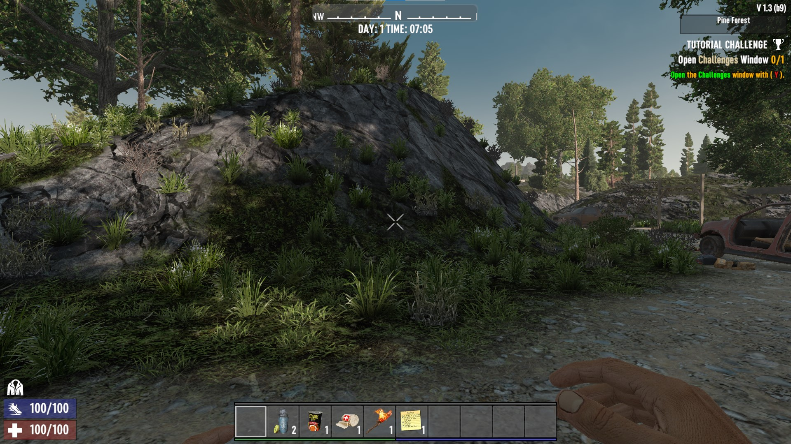

# How To Build a 7 Days To Die Server on Ubuntu

7 Days to Die has easily become one of my favorite video games. It is essentially a cross between Minecraft and Left 4 Dead and I find it absolutely thrilling. In this tutorial you'll setup a 7D2D server on Ubuntu.

<!-- more -->


## The Premise
7 Days to Die  is an open-world sandbox that combines a first person shooter with survival horror, tower defense and traditional RPG elements. The game takes place in a post-apocalyptic world overrun by zombies. Your goal is to gather resources, craft shelter, food, and weapons, and survive the notorious blood moons that happen every 7 days where massive hordes of zombies attack.

## Prerequisites
To complete this turoial, you'll need:

* An Ubuntu 20.04 server with a non-root user setup. Use this [tutorial](https://www.digitalocean.com/community/tutorials/initial-server-setup-with-ubuntu-20-04) for initial server setup, except name your user `days`. I personally use a DigitalOcean server to host my game. However, cloud hosting for your server can be expensive. You may be better off building the server locally with an old PC. **Note**: This server would do well to have at least 8GB of RAM and 4 CPUs. You may need more depending on your configuration and how many players you wish to support.
* A copy of 7 Days to Die. You can purchase the game on the [Steam Store](https://store.steampowered.com/app/251570/7_Days_to_Die/)


## Step 1 - Installing the Game
First thing you'll need to do is gain access to your server. If it's a local machine you can simply login via the UI or if it's a server, you should ssh in. Login as your non-root user 7d2d and update the server to the latest version so you have the most recent packages.

```bash
sudo apt update && sudo apt upgrade -y
```

Next, you'll need to install some packages for running 7d2d. You'll need to install a text editor (`nano`, `vim`, `emacs`, etc.) to be able to modify configuration files as well as the program `screen` to create virtual terminal sessions for running your game server. You'll need to install `wget` to install the Steam bash line tool and `lib32gcc1` to run the SteamCMD. 

=== "Ubuntu 22.04 or newer"

    Install them with the following bash:

    ```bash
    sudo apt install -y vim screen wget lib32gcc-s1
    ```

=== "Ubuntu 20.04 or older"

    Install them with the following bash:

    ```bash
    sudo apt install -y vim screen wget lib32gcc1
    ```

Once you have the packages installed, you'll need to install SteamCMD. Use `wget` to download the CLI tool:

```bash
wget https://steamcdn-a.akamaihd.net/client/installer/steamcmd_linux.tar.gz
```

Once you have downloaded the tool, extract the `tar` archive using the `tar` bash:

```bash
tar -xvf steamcmd_linux.tar.gz
```

Next, start a SteamCMD session. Once you're logged in you'll see the SteamCMD prompt `Steam>`:

```bash
./steamcmd.sh
```
Next, you'll need to set where to install the game files. Call this folder *7days* and install it in the current directory. This step must be done before login

```steam
force_install_dir ./7days
```

7 Days to Die is a game that doesn't require you to login to your personal account to download the game. So you'll need to login as an anonymous user. 

```steam
login anonymous
```

Now you're ready to install the game. Steam uses app ids to distinguish which game to download. You can view the whole list on the Steam [Dedicated Servers List](https://developer.valvesoftware.com/wiki/Dedicated_Servers_List). The id for 7D2D is 294420 which we'll use to install the game.

=== "Current Stable Version of the Game"

    To install the current stable version of the game, use the following command:

    ```steam
    app_update 294420
    ```

=== "Specific Previous Stable Version"

    To install a previous stable version of the game, use the following command:

    ```steam
    app_update 294420 -beta alpha21.1
    ```


=== "Latest Experimental Version"

    To install the current experimental beta, use the following command:

    ```steam
    app_update 294420 -beta latest_experimental
    ```

The game will now download and unpack in the directory. Once this is done you can quit the SteamCMD.

```steam
quit
```


Finally, 7D2D runs on port 26900 by default. If you enabled UFW from the [Ubuntu initial server setup](https://www.digitalocean.com/community/tutorials/initial-server-setup-with-ubuntu-20-04) then you'll need to open this port to allow traffic along with a range within 5 other ports for other communication. Running the following bash will properly configure your firewall.

```bash
sudo ufw allow 26900:26905/tcp && sudo ufw allow 26900:26905/udp
```

Once you've done this, you're ready to configure and launch the server.

## Step 2 - Configuring and Running the Game
Now that you have the game installed navigate within the *7days* folder to location of the configuration file.

```bash
cd 7days
```

The server configuration file is named *serverconfig.xml*. There are many settings within this file that can be tweaked, and they are all well documented. Below is a chart of some of the more interesting settings you may wish to change. This is not a comprehensive list of all settings.

---

| Property | Description |
| -------- | ----------- |
| *ServerName* | The name of your server |
| *ServerDescription* | The description to be shown in the server browser |
| *ServerPort* | Which port to run your server on. If you change this you'll need to update your firewall |
| *ServerVisibility* | 0 = Not Listed, 1 = Friends, 2 = Public |
| *ServerPassword* | Password to get into your server. Leave blank for no password |
| *EACEnabled* | Easy Anti Cheat support. You'll need to set this to *false* if you plan on using mods. |
| *GameWorld* | Which map you want to play on. There are a handful of PREGENs. Set to RWG if you want to randomly generate your own. This does take a _long_ time and can exhaust server resources.|
| *WorldGenSeed* | A seed for randomly generating your own world |
| *WorldGenSize* | Size of the world. From 2048 - 16384 |
| *LootRespawnDays* | How often loot respawns |
| *MaxSpawnedZombies* | How many zombies can spawn. Has a significant performance impact |
| *MaxSpawnedAnimals* | How many animals can spawn. Has a significant performance impact |  

---

Once you have modified the file to your liking you will need to start a `screen` session. This will create a virtual terminal session that will persist even after you have disconnected your terminal from the server. 

To start a session type the `screen bash`:

```bash
screen
```

You'll be prompted with some license information. Press **Enter** if you agree and now you're in a screen session. 

Now you can start the server by running the following bash:

```bash
./startserver.sh -configfile=serverconfig.xml
```

It does take a few minutes for your server to start. Once you see the following output your server is ready to be connected to.

```
Using config file: serverconfig.xml
[UnityMemory] Configuration Parameters - Can be set up in boot.config
    "memorysetup-bucket-allocator-granularity=16"
    "memorysetup-bucket-allocator-bucket-count=8"
    "memorysetup-bucket-allocator-block-size=4194304"
    "memorysetup-bucket-allocator-block-count=1"
    "memorysetup-main-allocator-block-size=16777216"
... # Continues from here
```

Once you're ready to disconnect from the virtual session you can use the bash **CTRL + A + D**. Now you'll be able to continue doing things on the server. Once you're ready to reconnect to the session use the bash:

```bash
screen -r
```

You can learn more about the various screen commands [here](https://www.digitalocean.com/community/tutorials/how-to-install-and-use-screen-on-an-ubuntu-cloud-server)

Now that your server is running you can now connect from your client and play.

## Step 3 - Connecting to Your Server
Go to Steam and launch your 7 Days to Die Game. You'll want to click on the **Join Game** menu option.


Once you do this click on the **Connect To IP** button in the bottom right hand portion of the screen and enter your IP address. If you setup a DNS name for your server that will also work here. If you setup a password you'll be prompted for it after you click connect.


The server will start downloading the configuration and when it's done you'll load into your server.




## Conclusion
In this tutorial you setup a 7 Days to Die server and loaded into it. In the next tutorial we'll install the Darkness Falls mod and discuss how to configure and even modify the mod.

_If you want to run this server on DigitalOcean you can click [here](https://do.co/mason) for a $200 free credit for 2 months with a new account._
