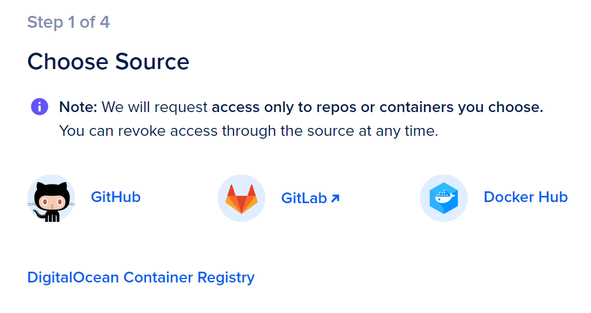
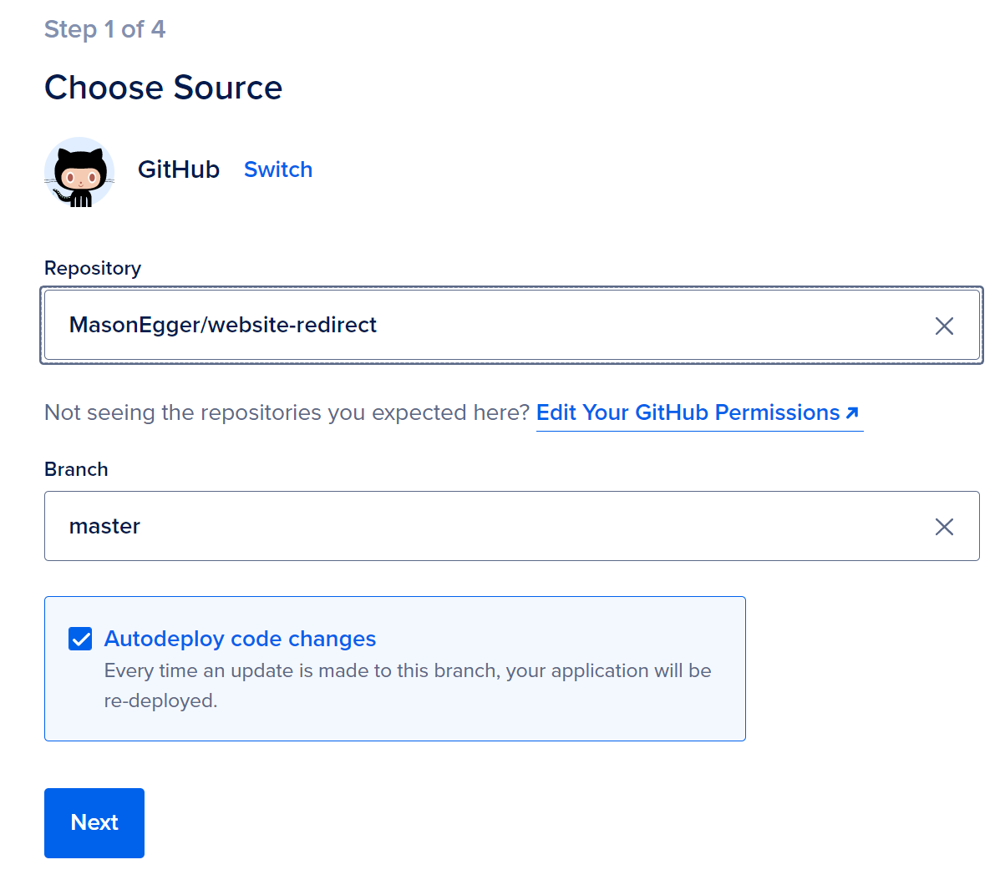
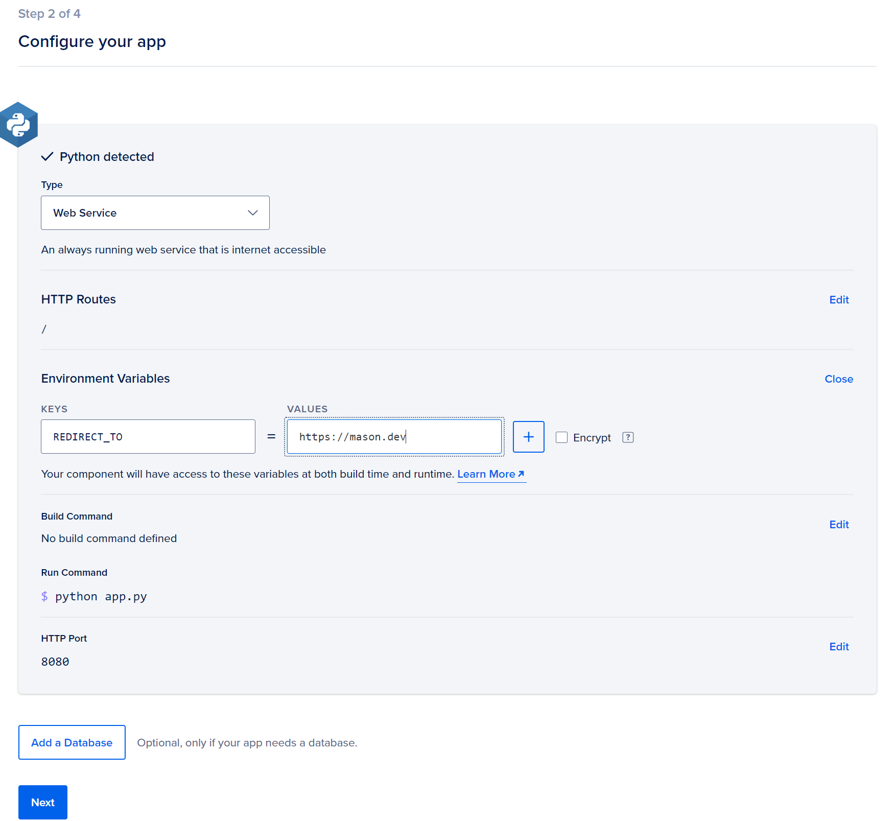
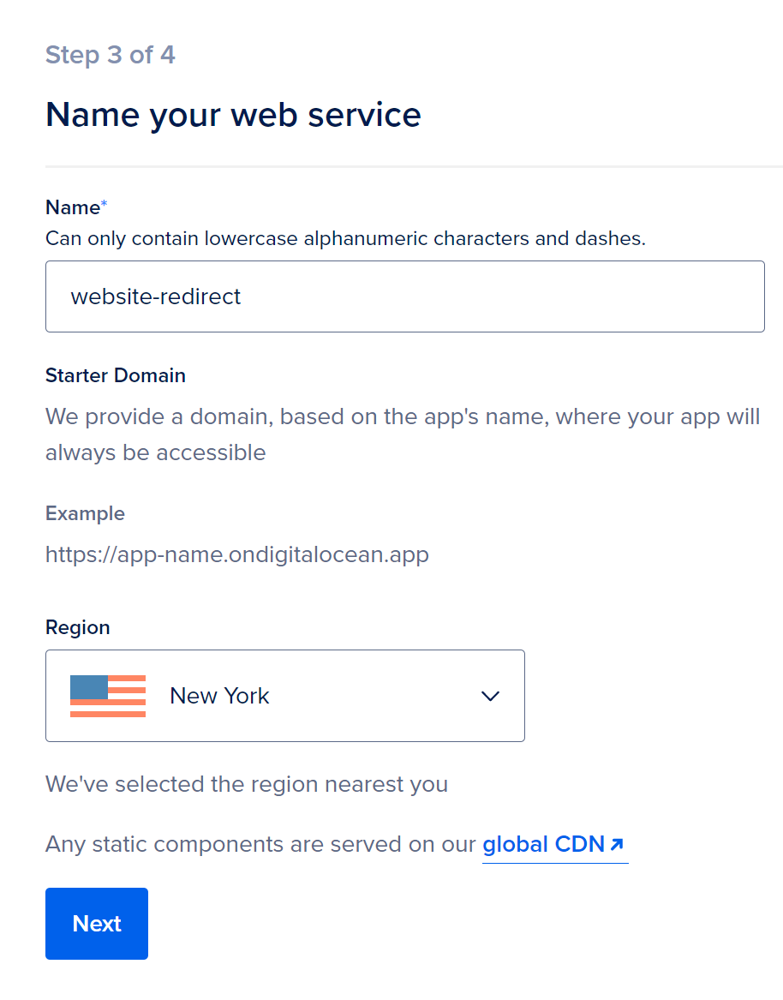
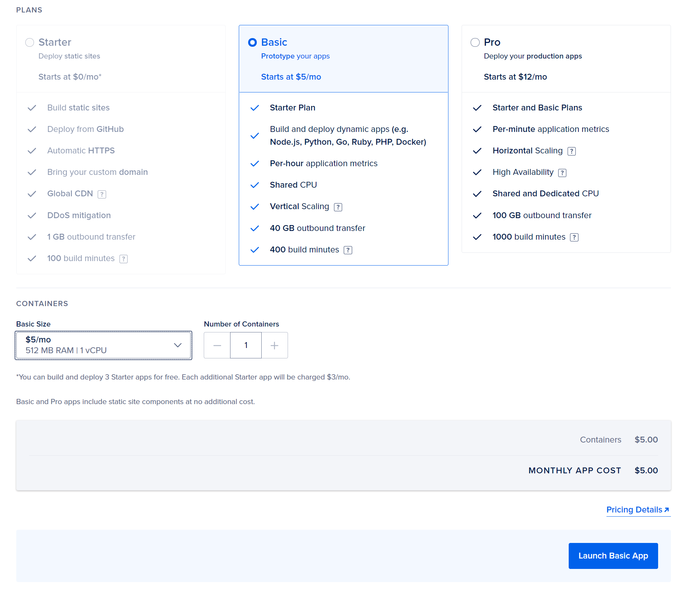
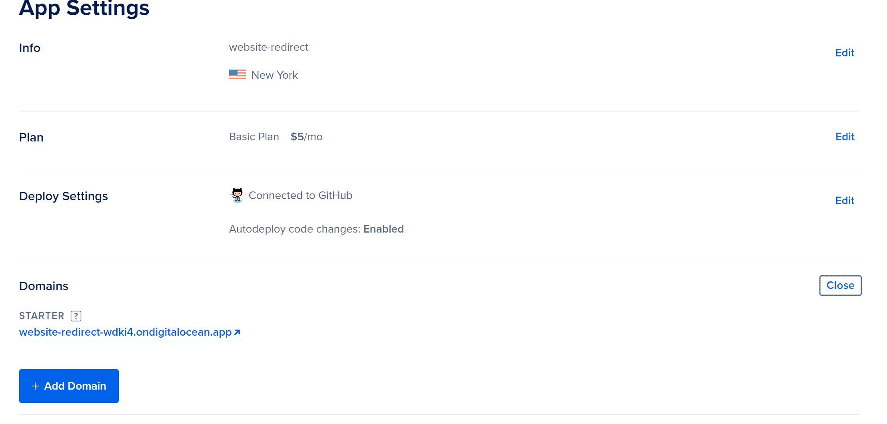
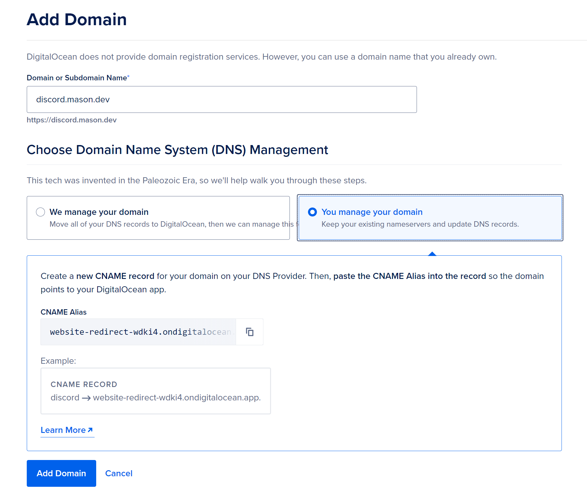

# Redirecting Web Traffic Using Flask

In this tutorial we'll use Flask and DigitalOcean's App Platform to redirect traffic from one URL to another.

<!-- more -->

## The Issue
I came about trying to solve this problem because I wanted to create a permanent link to my Discord server so people could join. Discord currently allows this kind of link to be created but it's a shortened bitly type link that isn't easy to remember. I wanted to be able to tell people "Hey, go to [discord.mason.dev](https://discord.mason.dev) to join my server" and they would be taken to this bitly type link, thus joining my server. 

## Possible Solutions
A simple solution to this would be simply to just use Nginx and perform a 301 redirect. I initially thought about doing this but it posed a few issues. The first was I knew I was going to deploy this application to DigitalOcean's App Platform and I was feeling _suuuuuper_ lazy and didn't want to write a Dockerfile. Let's be honest. This had nothing to do with App Platform. I was just being lazy. The second was I felt this was too simple. Everyone's done this a million times. I wanted to solve the problem in Python (I had delusions of adding more functionality to this app, silly Mason) so I was going to solve it in Python. 

## The Code
So I wrote a simple Flask app. Like, this app is only one function that's one line long. Flask has a `redirect` method so I'll just use that and for extra _spiciness_ I'll get the URL to redirect to from the environment variables. Woohoo for dynamic code ;) 

So here's the code.

```python
  
import os
import logging
from flask import Flask,redirect


app = Flask(__name__)

@app.route('/')
def hello():
    # Use the built in Flask redirect function to redirect the traffic
    # Adding the 301 code is a nice to have feature that makes web browsers
    # happy. 
    return redirect(os.environ.get("REDIRECT_TO", "https://mason.dev"), 
                    code=301)

if __name__ == '__main__':
    # Bind to PORT if defined, otherwise default to 5000.
    logger = logging.getLogger()

    # Set the log level to DEBUG. This will increase 
    # verbosity of logging messages
    logger.setLevel(logging.DEBUG)

    # Add the StreamHandler as a logging handler
    logger.addHandler(logging.StreamHandler())

    app.run(host='0.0.0.0', port=8080)
```

As you can see, there's nothing special about this code. It redirects the `/` route to wherever I want to redirect it to. That's it. No frills. No fluff. I actually think the logging section was a bit much here but writing that part is almost like auto pilot for my brain at this point.

## Deploying to App Platform
So now that I have this let's deploy it to DigitalOcean's [App Platform](https://docs.digitalocean.com/products/app-platform/).

The first thing I need to do is create a GitHub repo for it and upload it. If you haven't checked out [repo.new](https://repo.new) I recommend it. Seems like the theme of this blog is laziness and this really helps. 

Next, connect your GitHub account to App Platform. You'll have to specify which repositories you want App Platform to have access to and I tend to do this on an individual basis. You can just let it at all of them if you wanted. 

So go ahead and select GitHub (or Gitlab if that's where your code is)


Then select the repository you want to deploy from and a specific branch


App Platform uses Build Packs to detect what the app is, so it detected this was a Python app. Go ahead and add your environment variable `REDIRCT_TO` here otherwise it'll just redirect to my personal site.


Give your service a name. It's not terribly important but it helps keep things straight.


Select your compute plan. This would be the same price I would pay for a $5 Droplet with a lot less of the hassle so I like it. Once done launch your app.


It'll take a little bit for your app to build and deploy. Once it's done deploying for the first time you'll notice that you get a default URL that is the name of your app + a hash on the _ondigitalocean.app_ domain. If this works for you, great! You're done. But, if you want to use your own personal domain you'll have to do one more step.

Go to the **Settings** tab and scroll down to the **Domains** section. Here you'll click **Edit** to add a domain.


Add your domain that you want to redirect to, and it'll show you instructions for either managing the DNS record on DigitalOcean or your own DNS. Currently [mason.dev](https://mason.dev) is on a separate DNS provider and as is the theme of this blog, I'm too lazy to move it. So, I'll need the _Adding a CNAME_ instructions.


Once you've done this just wait a few minutes while your SSL certificate is setup and DNS to propagate. You'll see your new domain take the place of your old one and you're done!

## The Point
This was simple yet fun app to build and DigitalOcean's App Platform helped with that. While I knew how to do this via Nginx because I have past DevOps experience, I was feeling _really_ lazy the day I wrote this. So I wrote it in Python because even though it may not be the **best** solution that someone could come up with, it _is_ a solution that someone _will_ come up with. People tend to reach to languages they are familiar with when they have a problem they are trying to solve. The fact that App Platform made deploying this solution as simple as writing the code was is truly amazing. I can't wait for you to enable my laziness more in the future.
